# Introduction: Lolo Creek Watershed

```{r OverviewMap, echo=F, fig.cap='An overview of the Lolo Creek Watershed, a HUC-10 watershed within the subbasin of the Bitterroot River. Inset image shows where in Montana this watershed is located, just over the Montana-Idaho border. Purple points demonstrate potential riverscape locations that are accessible from major roads. These are the points I intend to visit for this project. ', out.width="90%"}
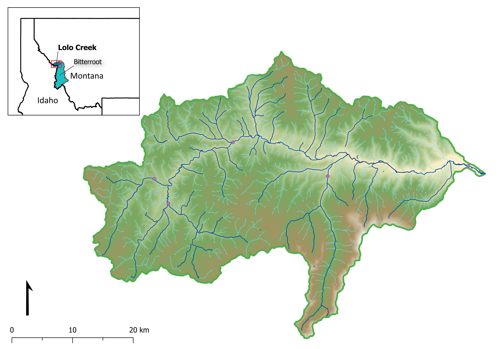
```

Lolo Creek watershed is located in Montana on the border with Idaho (Fig. \@ref(fig:OverviewMap)). The rivers and streams of the watershed all flow to the east from the peaks of the Bitterroot Mountains into the Bitterroot Valley, where it joins the Bitterroot River just south of its confluence with the Clark Fork River in Missoula. From Missoula, the Clark Fork flows north through the Rocky Mountains, eventually through the Pend Oreille River to the Columbia and the Pacific Ocean. 

## My Riverscapes

Within this watershed, I chose five potential riverscapes to focus on for my project, predominantly located on the main, West Fork Lolo Creek, as this creek is highly accessible, particularly at the top of the watershed where most land is Forest Service land, though a couple of points were chose just off the main branch to ensure a confined riverscape would be included. I've driven by this river many times on the way to the best accessible cross country skiing at the top of the watershed, and during those drives I've noted the steep granite peaks that characterize the whole watershed, leading to a deeply confined valley at the macro scale, and frequent stretches of sinuous channel across intermittent floodplains. At the base, access becomes more difficult, but still a spot of unconfined channel is accessible from Traveler's Rest State Park, which I've used for other assignments (e.g. [Module 5](Module5.html) and [Module 9](Module9.html)). 

## Climate, Flow Regime, and Geology of Lolo Creek Watershed

Lolo Creek Watershed is characterized by a strong precipitation gradient from the top of the watershed that has some of the most reliable snow close to Missoula and 1833 mm of annual precipitation, to the bottom of the watershed, which has 320 mm of annual precipitation. Combine that with the high slope of the watershed, and granite heavy geology, and it becomes clear that this area has a strong spring pulse of water as the snow melts at the top and works its way to the bottom (see [Module 4](Module4.html) for more of my assessment of the flow regime). 

```{r LoloPrecip, echo = F, fig.cap="Annual precipitation in the Lolo Creek watershed. ", warning=F, out.width="70%", fig.align="center"}
knitr::include_graphics("./images/Module4/LoloAnnualPrecip.jpg")
```

The geology of the watershed is made up of granitic material at the top of the watershed, transitioning into a mix of quartzite along the mainstem of Lolo Creek, with metasiltstone and argillite mixed in from the subcatchments to the north and south (Fig \@ref(fig:LoloGeology)). This makes sense with what I saw in my riverscapes - a lot of coarse material with clear water, particularly high in the watershed. As I traveled lower in elevation towards its outlet, the fine fraction increased to some degree, but still not dramatically.

```{r LoloGeology, echo = F, fig.cap="Geology of Lolo watershed, from the State Geologic Map Compilation (SGMC) Geodatabase of the Conterminous United States. Labels show one major lithology of each mapped unit. Additional major lithologies are listed in the datasource, but even just showing the first gives an idea of the kind of parent material that is found in Lolo Creek Watershed. ", warning=F, out.width="70%", fig.align="center"}
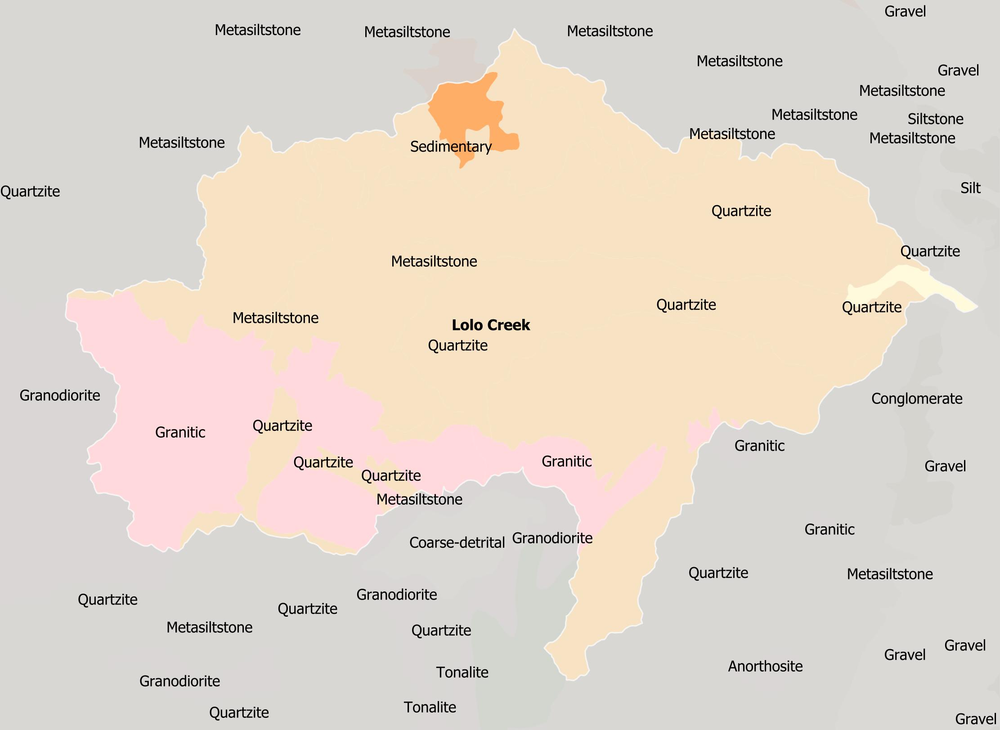
```

## Physiography and Vegetative Communities

Lolo Creek watershed is entirely within the Northwestern Forested Mountains Level I ecoregion and crosses two Level III ecoregions: Northern Forests and Idaho Batholith (Fig. \@ref(fig:LoloVeg)). The divide between these two ecoregions is roughly located around the geologic transition from granitic lithology to quarzite, argillite, and metasiltstone. The vast majority of the watershed is forested, with different flavors of forest, just as mixed montane, lodgepole pine, and mixed spruce-fir towards the headwaters (Fig. \@ref(fig:LoloVeg)). This contributes a significant amount of woody debris across the watershed, which was obvious in all of my riverscape visits. Down in the valley, there's intermittent shrubland, particularly in the lower portion of the watershed. It should also be noted that while the vegtation class shows as being fairly consistent in the high elevations, a major fire burned the southern portion of the watershed, likely contributing to more fine sediment at the lowest of the riverscapes I visited (Fig. \@ref(fig:LoloDisturb)). 

```{r LoloVeg, echo = F, fig.cap="Left: The Ecoregions from the EPA Ecoregional classification, showing the level III ecoregions, with dark green representing the Idaho Batholith, and the light green representing Northern Rockies. Right: Veg Type from LANDFIRE Existing Vegetation data. The vasg majority of the watershed is forested. ", warning=F, out.width="50%", fig.align="center", fig.show="HOLD"}
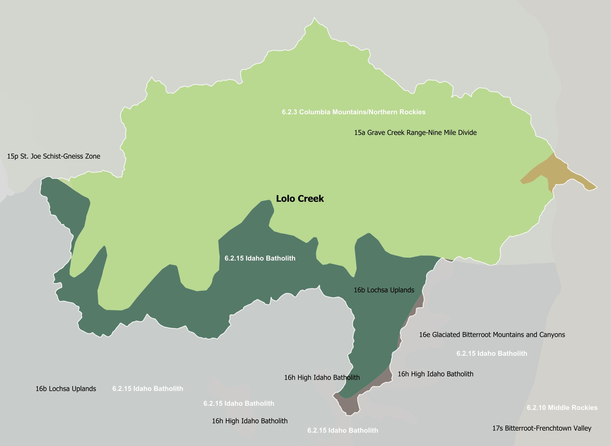
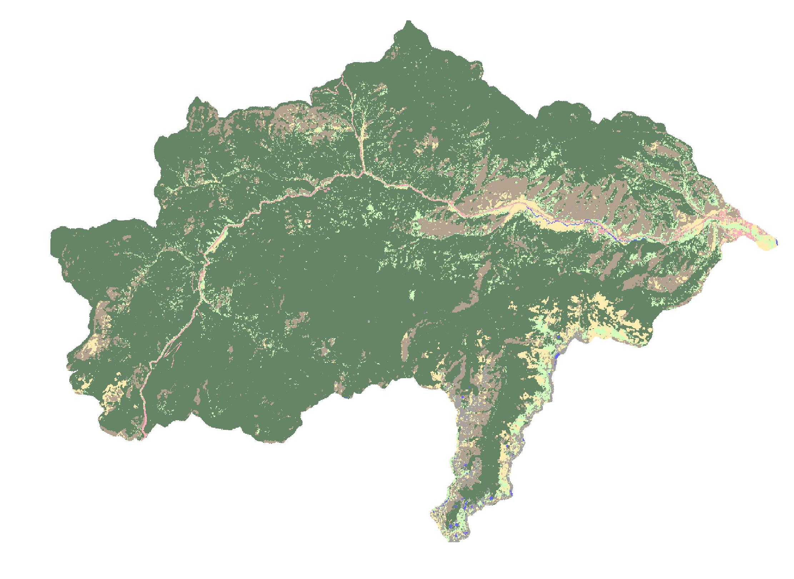
```

```{r LoloDisturb, echo = F, fig.cap="Historic Disturbance as noted in the LANDFIRE Historic Disturbance data. Black areas have no to minimal disturbance, while the red shows the area of the Lolo Peak Fire from 2017. This area is still recovering, with young trees just starting to provide significant cover. ", warning=F, out.width="70%", fig.align="center"}
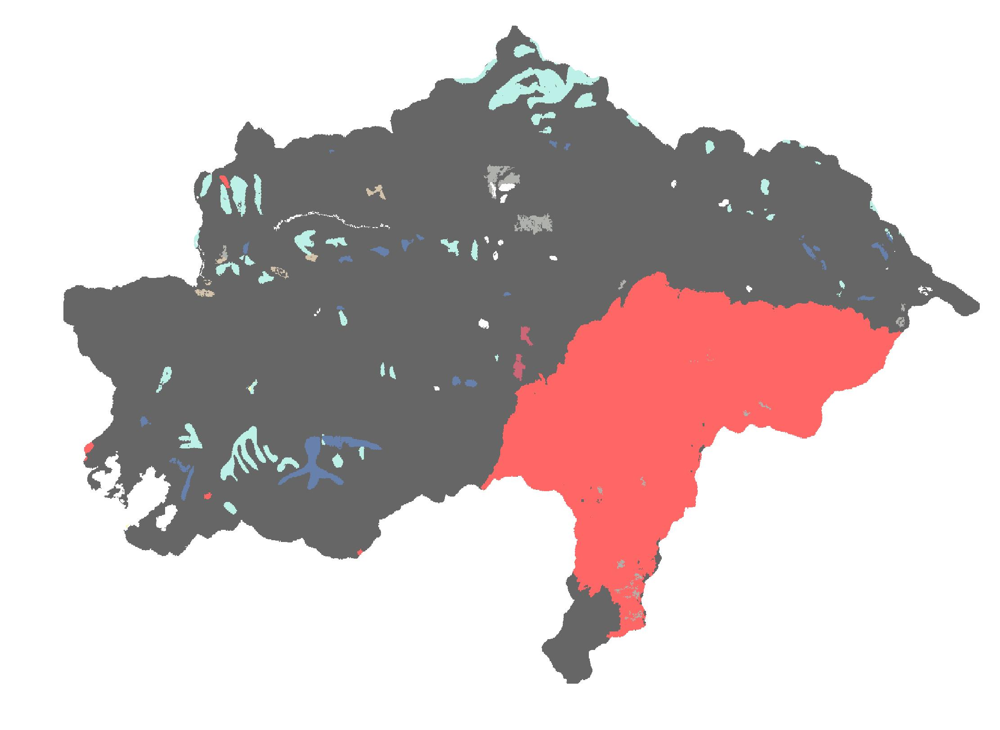
```

## (Select) Watershed Morphometrics

I calculated/measured some of the easiest morphometrics for Lolo Creek Watershed (). The method used were the same as what I did for Module 3. As a reminder: 

**Catchment Length**: I ensured the project was in UTM projection, then used the measurement tool to measure a straight line from the mainstem beginning to the catchment mouth. 

**Catchment Area**: I used the area in the attribute table of the Watershed layer. 

**Catchment Perimeter**: I calculated a perimeter for the watershed layer. 

**Circularity Ratio**: This is defined in my book as Catchment Area divided by the Area of a circle with the same circumference as the watershed perimeter. The area of a circle can be calculated from perimeter as circumference squared, divided by 4 pi. 

**Form Factor**: This calculation is defined as the catchment area divided by catchment length squared. 

**Catchment relief**: I used the maximum elevation in the project DEM minus the minimum elevation in the DEM, located at the catchment mouth. 

**Relief Ratio**: Catchment relief divided by catchment length, both in meters. 

**Drainage Density**: This was calculated as the total stream length from the attribute table of the drainage network (note this included Perennial, Intermittent and Ephemeral drainages), divided by the catchment area. 

My calculations are shown in the table below. The size, length, and perimeter ended up fairly similar to Logan River watershed, interestingly enough, with a slightly higher relief ratio and slightly higher drainage density. This indicates this watershed is less responsive to major storm events than Gold Creek, for example. It also has an average drop that is slightly higher than Logan River, but slightly lower than Gold Creek. This suggests that the differences between these two watersheds are going to be more based on the geology, vegetation, and climate more so than the watershed shape. 

```{r morphometrics, echo=F, tab.cap = "Catchment morphometrics for Lolo Creek watershed. "}
morph <- data.frame("Morphometric" = c("Catchment Length (m)", 
                              "Catchment Area", 
                              "Catchment Perimeter Length", 
                              "Circularity Ratio", 
                              "Form Factor", 
                              "Catchment Relief", 
                              "Relief Ratio", 
                              "Drainage Density", 
                              "Drainage Pattern"),
           "Value" = c("41.7 km (41,731 m))", 
                              "706.4 sq km (706,400,000 sq m)", 
                              "162.0 km (161,969 m)", 
                              "706.4 / ((162.0^2)/(4pi)) = 0.338", 
                              "706.4 / (41.7^2) = 0.406", 
                              "2786 - 961 = 1825 m", 
                              "1825 / 41731 = 0.043", 
                              "970 km / 706.4 km^2 = 1.37 km km^-2", 
                              "Dendritic"))

knitr::kable(morph)
```

I also created a longitudinal profile, and was surprised to find that it was much less interesting than the profile I completed for [Module 3](Module3.html) (Fig. \@ref(fig:LoloProfile)). Where Gold Creek and Logan watershed both had multiple interesting knickpoints and slope changes, there was really just one major transition at the top of the watershed. This big change did not coincide with a geologic or ecological transition, however, it did happen just below a transition in annual precipitation in a watershed that has a lot of snow during the winter right at the top. This watershed is most characterized by hard geology with low disturbance and fairly homogenous vegetative communities, likely explaining the fairly uneroded watershed. 

Concavity is calculated as: 
Concavity = 2A / H
Where A is the height difference between the profile at mid-distance and a straight line joining the end points of the profile and H is the total fall of the longitudinal profile. In this case, A would be around 150 m, and H is 672. Concavity equals 0.45, much lower than both Gold Creek and Logan River watersheds that I looked at in Module 3. This again confirms this watershed is eroding quite slowly. Below the initial precipitous drop, the slope of the mainstem Lolo is fairly even all the way to the mouth. 

```{r LoloProfile, echo = F, fig.cap="A longitudinal profile of the mainstem of Lolo Creek. This profile had few large knickpoints, and a lot more small knickpoints as confined sections gaveway to small valleys where the river could meander a big before plunging down another confined section. ", warning=F, out.width="70%", fig.align="center"}
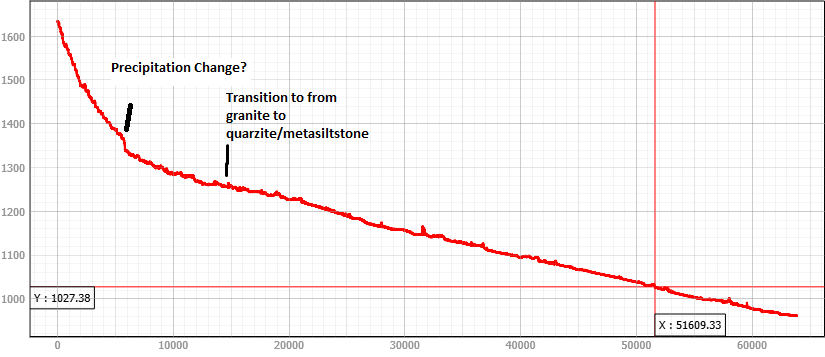
```

# Partly Confined Riverscape: East Fork Lolo Creek

The first location I "read" was at East Fork Lolo Creek. Below is a overview drawing of the reach, alongside available imagery (Fig. \@ref(fig:overviewelolo)). 

```{r overviewelolo, fig.show='hold', fig.cap='Overview representations of the East Fork Lolo Creek reach. On the left is my drawing from in the field and the right is imagery from OnX. ', out.width="45%", echo=F, fig.align='center'}
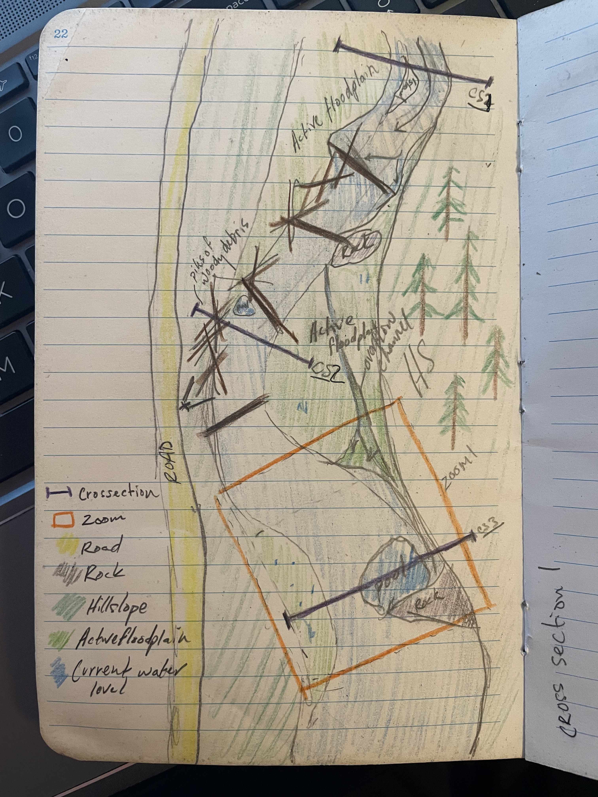
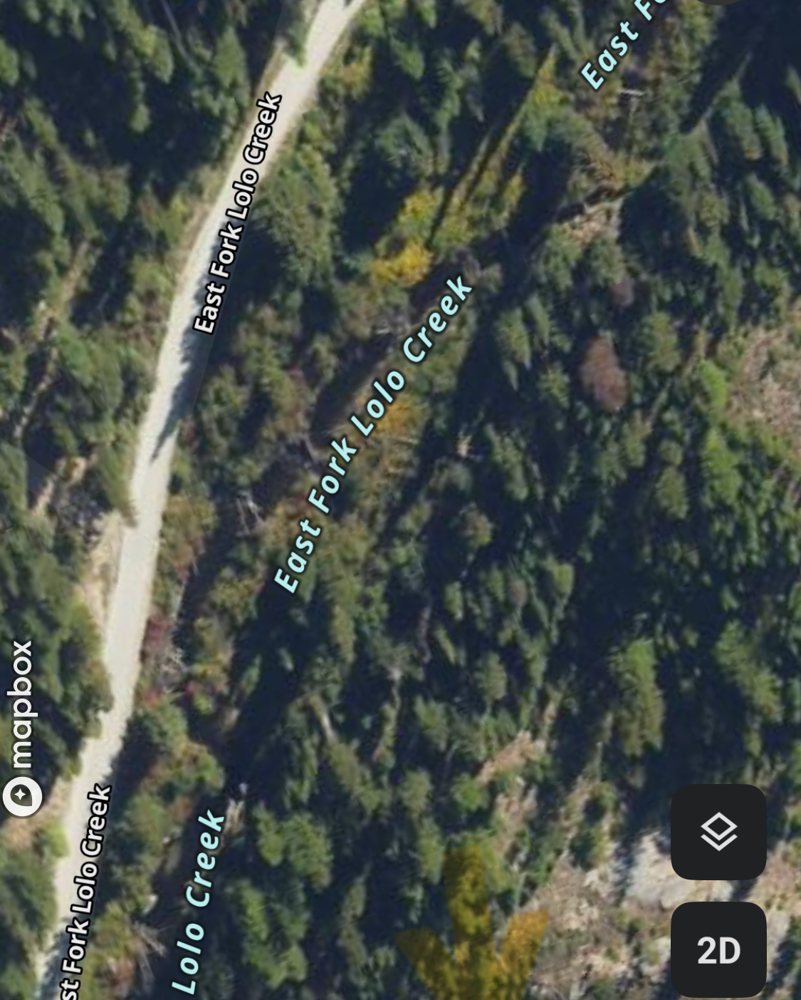
```

This section was my example of a partly confined stream, with characteristic intermittent floodplains showing up on alternating sides of the stream. These floodplains were small, forming in the tight turns as the active channel bounced back and forth between the road I was walking on and the steep hillslope across the valley from me. This section was loaded with woody debris, both crossing the channel and lining the banks, especially closest to the road - potentially woody debris added to the side to protect it from eroding into the road. 

In this reach, I first looked at three cross sections (Fig. \@ref(fig:rs1crosssections). Some consistencies popped out in all three spots. First, the dominance of coarse woody debris creating the river bends, lining the banks, and forming the floodplains. To get a good view of the river, I had to climb over and balance on one or more of the many trunks lining the side of the channel. Even standing away from the river on the floodplain, I could feel more woody debris forming the floodplain itself. Second was the presence of a small floodplain, usually on one side or the other. The floodplains were small, often with overflow channels cutting across them. 

```{r rs1crosssections, fig.show='hold', fig.cap='Three crosssections from my partially confined riverscape on East Fork Lolo Creek. Note the coarse woody material and large rocks creating the curves in the stream. ', out.width="33%", echo=F, fig.align='center'}
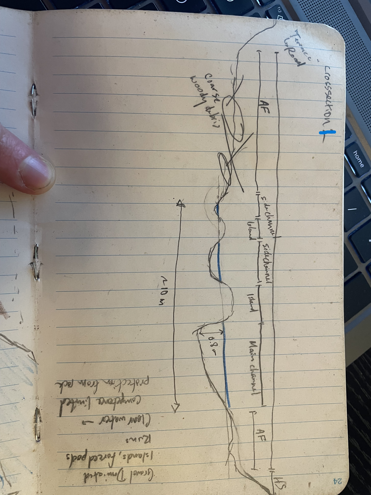
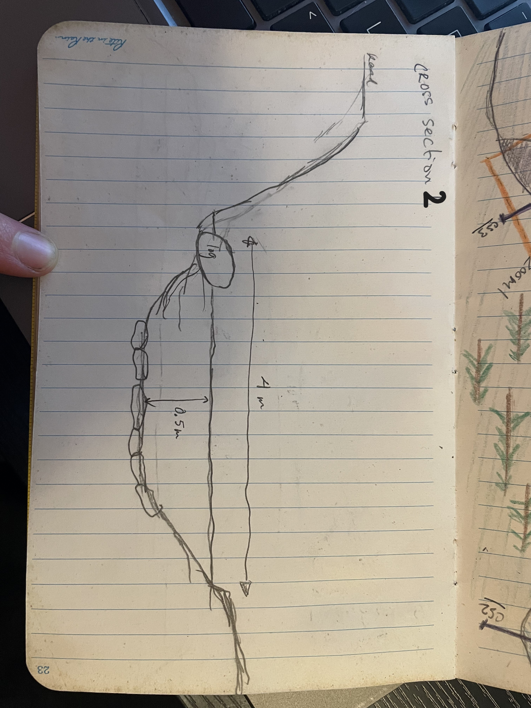
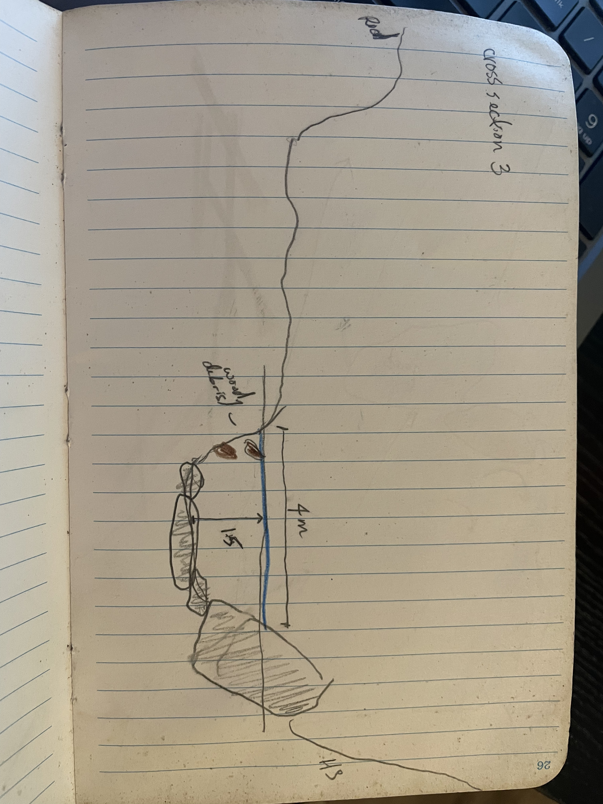
```

A few more features I noticed from Stage 1 & 2 of reading a landscape: 
- Dominant geomorphic features were aforementioned floodplains, vegetated bars where woody debris had gotten caught, further complicating the present features. 
- The bed was made up of cobbles with incredibly clear water. I think this stream is dominated by bedload. I'm not sure what sediments made up the islands and floodplains, because they were so covered by woody debris, but I would guess they were also quite coarse. 
- Vegetation on the floodplains was dominated by willow species. Willows were also vegetating the present islands, likely meaning the islands have been there for a while, building up sediment between coarser rock, and eventually growing vegetation. However, they also don't seem overly complicated, with multiple forces working and reworking what is available in new conglomerated shapes. These features likely formed from contemporary behavior rather than past history. 
- The road clearly restricts the river. This reach had no inactive terrace; the road was created where there used to be more river valley. The bank on the road side had also been built up and protected, with large cobble without the rounded edges I would expect in a river. I also wonder how much of the woody debris on the road side had been added to further protect that bank from eroding. 

I also took a little extra time to look at downstream section of this reach at cross section 3 (Fig. \@ref(fig:lolozoomed)). Here, the thalweg comes around the floodplain, and gets caught on a large boulder in the stream. This caused an eddy to form as some water hit the rock and carved out the bank in the opposite direction of the stream. The water was deeper here, with even coarser material making up the bed. This section had a lot of water moving through it, but also highlighted how few places the river had to go - it was deep, but now running into coarse boulders or bedrock at the bottom of the stream. It was carving into the far bank, but the hillslope went straight up from there. 

```{r lolozoomed, echo = F, fig.cap="A photo taken at the third cross section from the above drawing. The channel was deeper here, being limited in how far it could carve into the opposite bank. The boulder in the river forced a lot of changes to water movement, carving a pool in front of it and eroding into the opposite adjacent hillslope. Still, the yellow line indicates the proximity of the high slope hillslope. There is not a lot of space for this river to move and adjust. On the right is my drawing of this particular section. ", warning=F, out.width="50%", fig.align="center", fig.show='hold'}
knitr::include_graphics("./images/FinalProject/RS1_CS3_AnnotatedPicture.jpg")
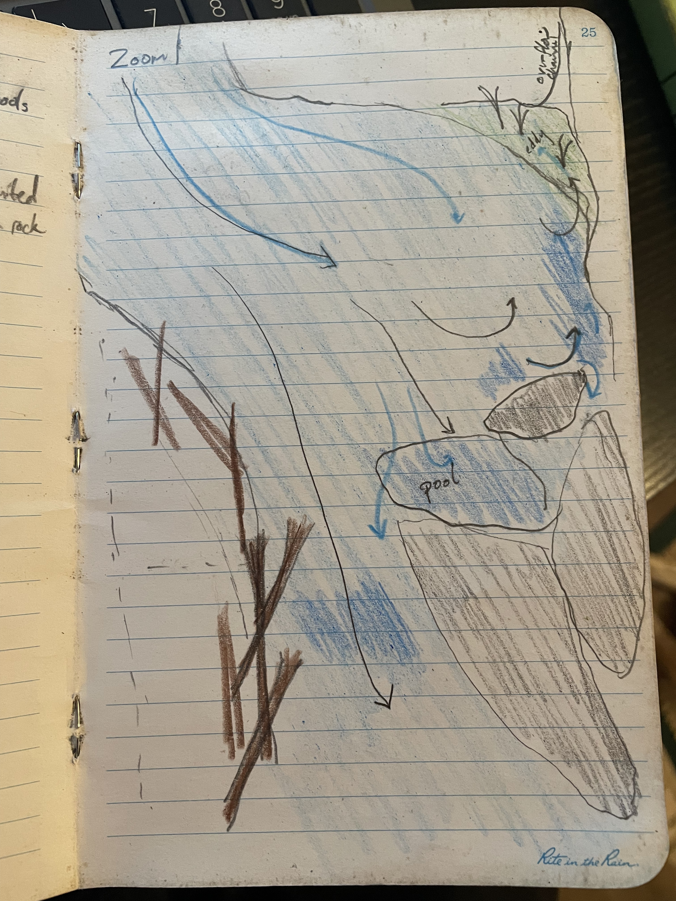
```

All of these observations allowed me to start to classify at the reach scale. This is a partly confined channel with discontinuous floodplain pockets. The channel had some low sinuosity. While there were occasional islands, I was visiting at a high flow, and I wonder if the stream is more often down to just one channel. 

This channel seems quite stable in its current form. While the stream power is high, the available sediment is dominated by a coarse fraction too big to be moved in lower flows. It appears to be competence limited, unable to pickup the sediment making up its banks. It appears to be adjusting laterally for the most part. High flows likely happen during spring runoff, when the majority of sediment movement occurs as well, carving into the hillslopes slowly, with sudden releases of finer material from the hillslopes, but for the most part, I expect the water runs quite clear and sediments are moved along the channel bottom slowly. 

# Confined Riverscape: Granite Creek

My confined riverscape was the second reach I visited. It was located on Granite Creek, on the North side of Lolo Creek. My original location ended up being much like my partly confined riverscape I visited first, forcing me to keep driving up stream until the floodplains disappeared and stream flow was characterized more by cascades than runs. Below is my overview drawing and imagery of this reach. 

```{r overviewgranite, fig.show='hold', fig.cap='Overview drawing of Granite Creek reach and photo taken looking upstream at the location of cross section 1. ', out.width="45%", echo=F, fig.align='center'}
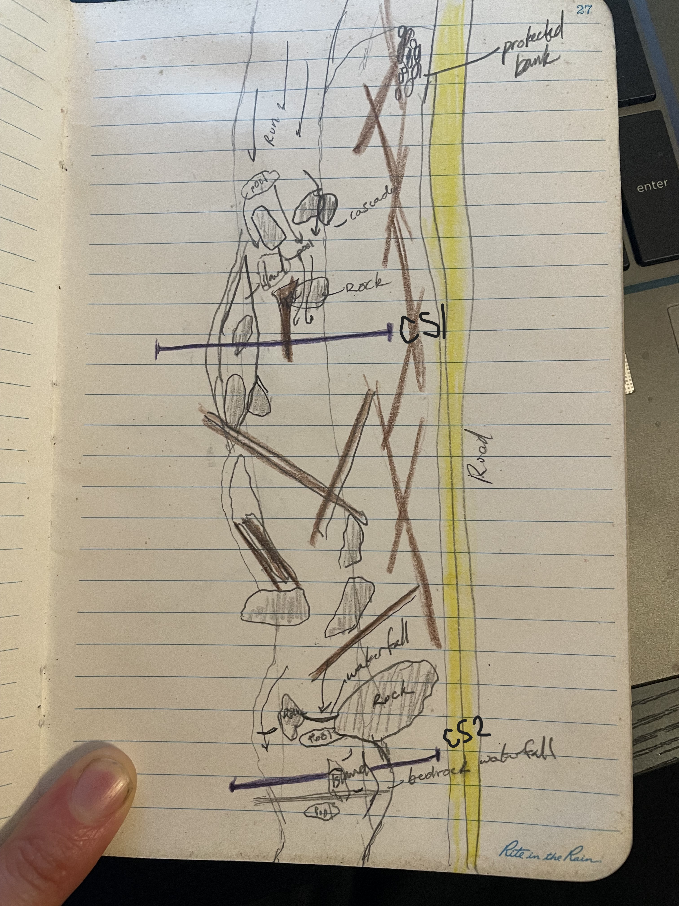
knitr::include_graphics("./images/FinalProject/RS2_OverviewPhoto.jpg")
```

I focused in on two cross sections for this reach. In both, the hillslope went directly up straight from the stream bank, quickly transitioning from willow dominated vegetation to upland conifers. The road, much like in the first reach, was built up to one side, and where the channel was directly adjacent to the road, large, angular rocks and cut down trees lined the stream bank ensuring any meanders wouldn't degrade into the road. The bed of this reach was made up of large cobble and boulders. In the second cross section, large boulders were nearly half or more the width of the stream itself, creating cascades where the channel couldn't wash out or degrade the boulders with its flow. 

I also considered how this reach would look different at different flows. At the time I visited, the stream seemed near or at bankfull, with the water coming up to just under the rooting vegetation on the banks. At lower flows, the boulders and cobbles would increasingly stick out from the water surface, causing the channel to lose velocity as the relative roughness increased. Those cobbles would offer little coarse material the stream was competent enough to carry. At really high flows, some of the smallest coarse material might start to be rolled down the channel. With this area occurring in a fairly linearly shaped subcatchment, its unlikely to have really sudden high flow events. Rather, the channel would slowly increase flows in the spring, as slowly melting snow gradually contributed to the watershed. With snow being a dominant precipitation and the hillslope being covered with trees, erosion from the hillslopes likely happens quite slowly. 

```{r crosssection1granite, fig.show='hold', fig.cap='Overview drawing and photo of cross section 1. Yellow line demonstrates the placement of where the cross section was taken. While an island is present here, the growth of conifers on them indicate that they are not regularly inundated with water. ', out.width="45%", echo=F, fig.align='center'}
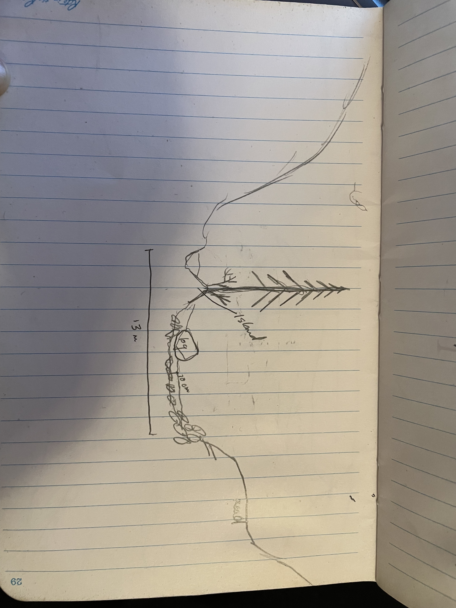
knitr::include_graphics("./images/FinalProject/RS2_CS1_Photo.jpg")
```

```{r crosssection2granite, fig.show='hold', fig.cap='Overview drawing and photo of cross section 2. ', out.width="45%", echo=F, fig.align='center'}
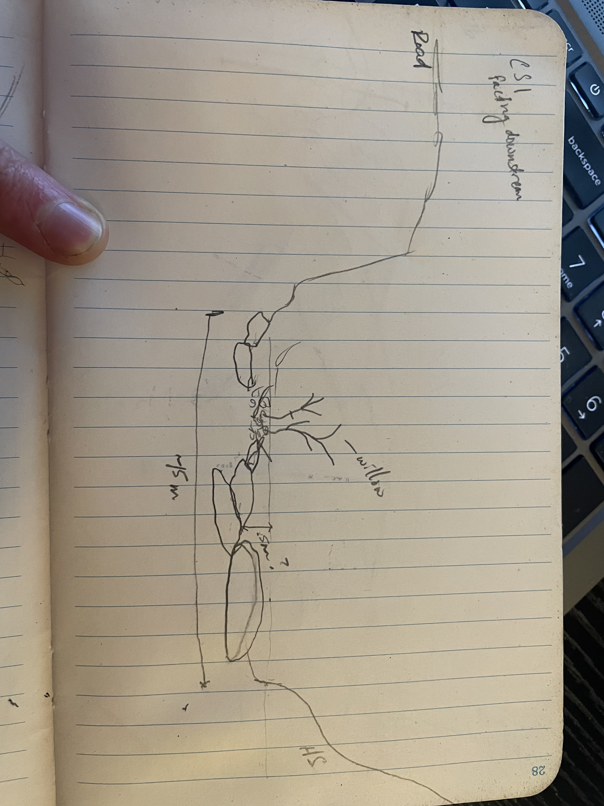
knitr::include_graphics("./images/FinalProject/RS2_CS2_Photo.jpg")
```

In terms of geomorphic surfaces, this reach still had a lot of runs, but cascades and rapids were intermixed (Fig. \@ref(fig:cascades)). I could see ridges of boulders, creating channel-spanning ridges in the water surface as water flowed over it. While the other reach had coarse woody debris crossing the channel, in this channel any logs were oriented parallel to the channel. Only boulders were stable enough to hold back water in the fast moving current. There were channels in this channel, but no loose gravel was available on their edges. Their entire exposed banks were stabilized by growing vegetation. Where they existed, a large boulder usually existed either on the downstreams side to support them, as in the rapids section, or on the upstream side, protecting them from the highest velocity portion of the channel (Fig. \@ref(fig:island)). 

```{r cascades, echo = F, fig.cap="A section of rapids appearing as boulders and bedrock form channel-spanning ridges for the water to spill over. ", warning=F, out.width="70%", fig.align="center"}
knitr::include_graphics("./images/FinalProject/RS2_cascades.jpg")
```

```{r island, echo = F, fig.cap="This island highlighted in purple is protected from erosion by the bedrock or very large boulder embedded in the stream upstream of it. This island also has several large boulders downstream. It's stable enough that old conifers have been able to thrive on the island. ", warning=F, out.width="70%", fig.align="center"}
knitr::include_graphics("./images/FinalProject/RS2_Island.jpg")
```

Out of curiosity, I did put together a quick profile for Granite Creek (Fig. \@ref(fig:GraniteProfile)). Where I looked at the stream, the channel had just come out of a relatively flat section. With the similarity to my first stop, I'm curious what it would have looked like a little higher, where the slope is higher, and the jumps in elevation come out more strongly. In general, one pattern that stands out to me is that high in the profile, there are a long series of flat sections followed by big jumps and then flat, and then another jump. I wish I had gone up here, but I'm guessing this pattern demonstrates random sudden erosional events in particular areas, producing a series of jumps along the profile. This also might make sense for this watershed, given it's granite lithology. Granite tends to break up slowly, and even then only in larger chunks.

```{r GraniteProfile, echo = F, fig.cap="A longitudinal profile of Granite Creek. The redlines in the graph show where my reach occured in this profile. ", warning=F, out.width="70%", fig.align="center"}
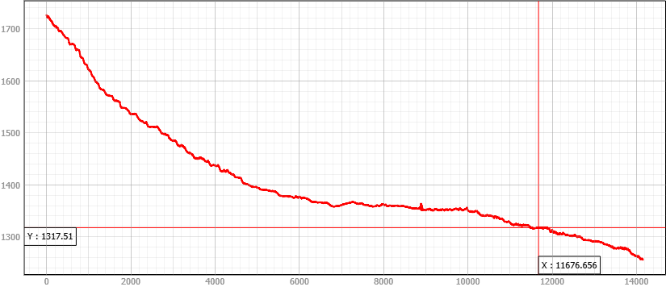
```

This river is a steep headwater stream (though it would have been more so higher up in the profile). It has one, occasionally two channels, with low sinuosity. Bed material size was boulder dominated with some sections of cobble. In highflow events, it adjusts vertically, with very little ability to adjust laterally. It generally seems quite stable, though it probably leans towards being erosion dominated, which erosional events requiring very high flow to move the very coarse bed material, and very few inputs from upstream.

# Unconfined Riverscape: West Lolo Creek at Traveler's Rest State Park

I was not able to complete a third site visit for this project, due to limited time availability. However, my reach from [Module 5](Module5.html) is in an unconfined valley setting at the bottom of Lolo Creek Watershed. I will use the observations and cross sections I drew for that module to make a few observations about this laterally unconfined stretch of river. Here are a few key notes:

- That reach had dramatically smaller bed material, with most of the bed being a fine cobble with some zones of gravel. 
- Islands were made up of the same material, with little vegetation growing on them. They look to be regularly reworked as they accumulate material from higher in the watershed. This stretch of stream seems to have more regular pockets of erosion and deposition along the channel - a bank-attached bar developing in one area, as a curve in the channel carves into the bank upstream. 
- There was significantly less coarse woody debris, and it tended to be deposited/concentrated in piles. It seems likely that the majority of the time, the stream power is not enough to move them. But high flow events will push them to particular points all at once. 
- Geomorphic units were made up of riffles and pools, with some runs as well. Bank-attached bars and mid channel bars were also observed. 
- This reach adjusts laterally - there were many bends in the river. On the floodplain were side channels that either mark historic channels, or provide a place for overflow during high flow events. 
- Floodplain was available above the channel itself. Hillslopes can be seen in some background photos, but around the river is flat floodplain and terrace. 
- Cross sections show a much higher width to depth ratio and 

Another spot I briefly stopped was at Earl Tennant Campground. Here's it's clear a major re-routing project is underway, because the imagery on google maps shows a stream that is no longer matching its current state. 

```{r EarlTennantImagery, echo = F, fig.cap="This is the area for my last quick stop. The purple shows the course of the river I visited. The imagery shows channel reworking underway. ", warning=F, out.width="70%", fig.align="center"}
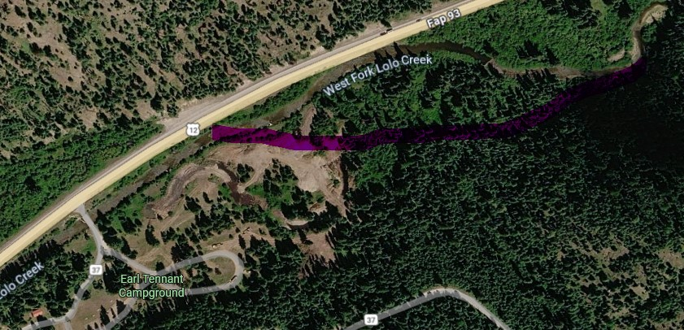
```

This section also had some more similar characteristics to Traveler's Rest, with a wide floodplain, bank-attached bars, and a series of riffles and pools (Fig \@ref(fig:EarlTennantQuickStop)). This was also a spot where I saw the finest sediment, and the clearest sediment sorting, with coarser materials developing in riffles and coarse sand and fine gravel depositing downstream of them. I didn't have time to do a full read here, but the stop was worth the time to just see a different example of a less confined section of Lolo Creek. 

```{r EarlTennantQuickStop, fig.show='hold', fig.cap='A couple photos looking upstream (left) and downstream (right) at Earl Tennant Campground.This was just a quick stop, but it had some of the finest sediments of any of my visits as well as clear sediment sorting. ', out.width="45%", echo=F, fig.align='center'}
knitr::include_graphics("./images/FinalProject/EarlTennantUpstream.jpg")
knitr::include_graphics("./images/FinalProject/EarlTennantDownstream.jpg")
```

# Bringing it all together

In looking at these reaches together, along with the information I was able to summarize about the catchment overall, I can see a couple major defining factors in determining how this catchment works. First is it's lithology - extremely hard, impermeable rock make up the majority of the watershed, leading to steep profiles with sediment that doesn't fine into sand over the course of is 63 kilometers. These steep slopes keep the river highly connected to the surrounding hillslopes, without historic terraces and inactive floodplains to separate them. 

This may also have to do with the low degree of human disturbance in this watershed compared with others across the west. While the Lolo Creek Valley has intermittent pockets where some people have settled or had cattle, the majority of the watershed is on forest service land, with logging roads and road building being the main disturbance otherwise. These roads likely are a big source of sediment, particularly considering that the naturally available parent material of the watershed is fairly resistant to weathering. 

In the three reaches I was able to visit, I could see the classic pattern of river diversity as I moved down the longitudinal profile. I saw a source zone in Granite Creek, where boulders and cobbles must (very) slowly break into the material that moves downstream. In East Fork Lolo Creek, I saw a transfer zone, where slightly finer cobbles were both eroding and depositing to create intermittent floodplains on alternating sides of the river. Finally, I've been looking at an accumulation zone, where cobble from upstream stretches is deposited to form bank-attached and mid island bars. The classic riffle and pool pattern also showed strongly here. 

In this catchment, looking for spots along the mainstem Lolo Creek, I was struck by the regular pattern of steep confined section followed by open meanering valley, followed by another strictly confined section. looking at the profiles, I had expected to see this pattern come out really obviously. Instead, the pattern of opening valleys and confined stretches is so regular that the whole profile has few knickpoints that stand out. After completing this assignment, I think this is because of the lithology of this watershed - Just as I saw a step pattern high in Granite Creek, so to is happening at a much larger spatial and temporal scale across this whole catchment - with the decades and centuries of river carving only intermittent and relatively narrow pockets of unconfined meandering river. 

```{r lolomeander1, fig.show='hold', fig.cap='Two photos from Google Earth showing one meandering section (left) just downstream from a more confined section (right). ', out.width="45%", echo=F, fig.align='center'}
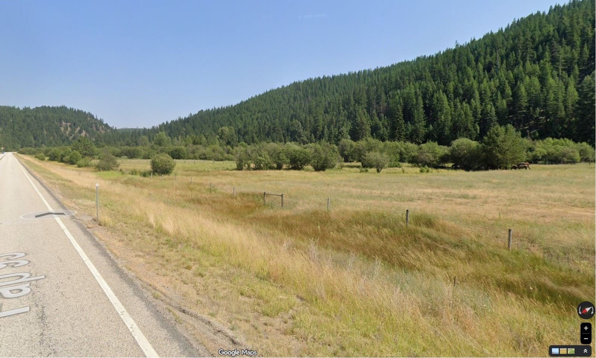
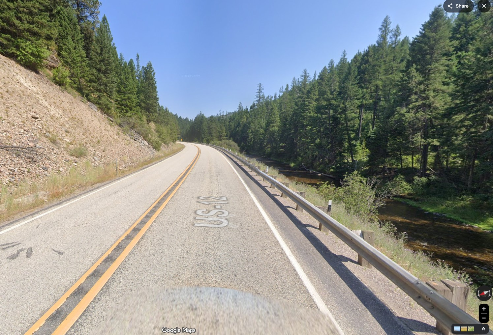
```

```{r lolomeander2, fig.show='hold', fig.cap='Another example of the pattern of opening floodplain into confined section of the mainstem Lolo Creek along Highway 12. Two photos from Google Earth showing one meandering section (left) just downstream from a more confined section (right). ', out.width="45%", echo=F, fig.align='center'}
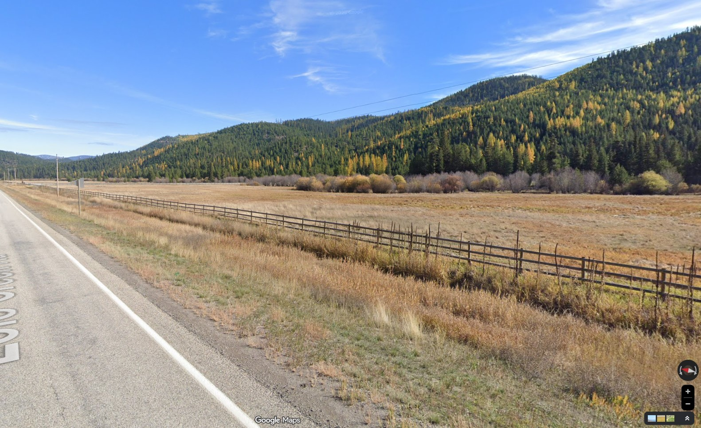
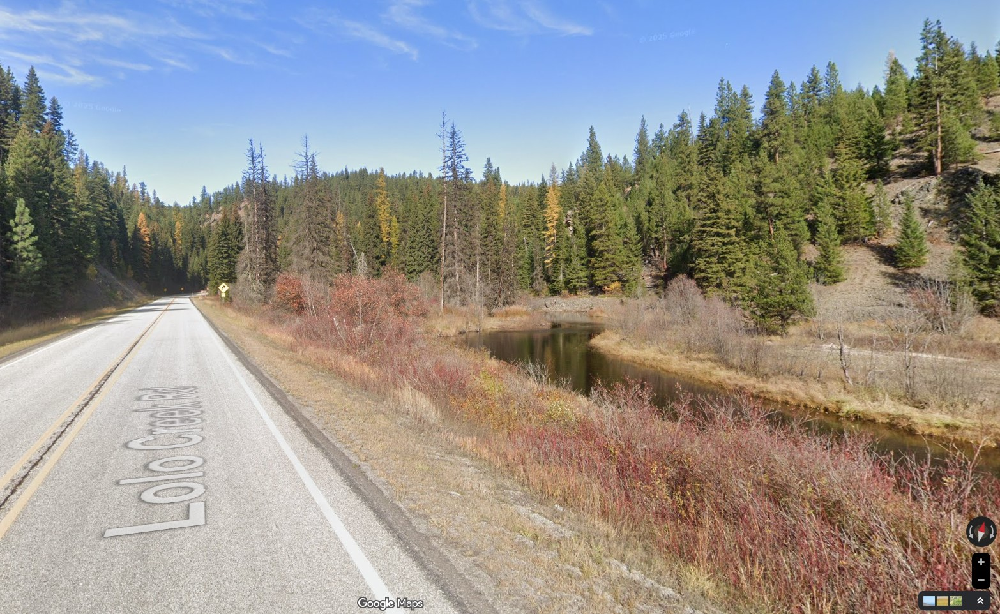
```