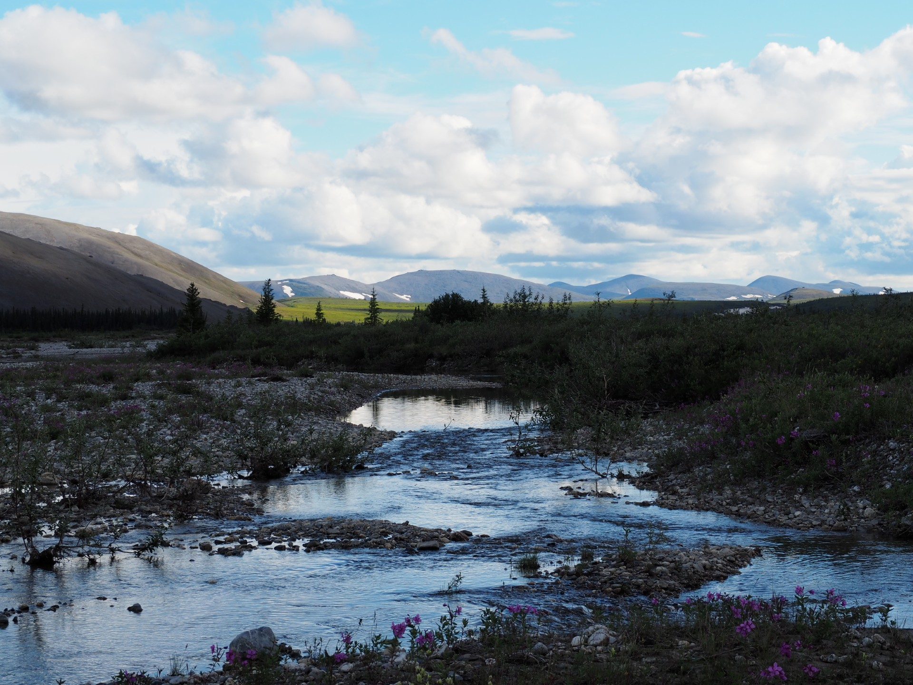
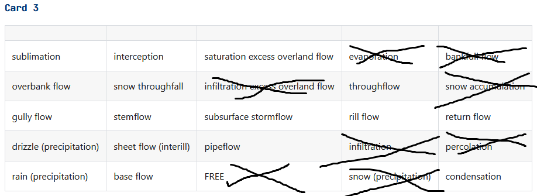
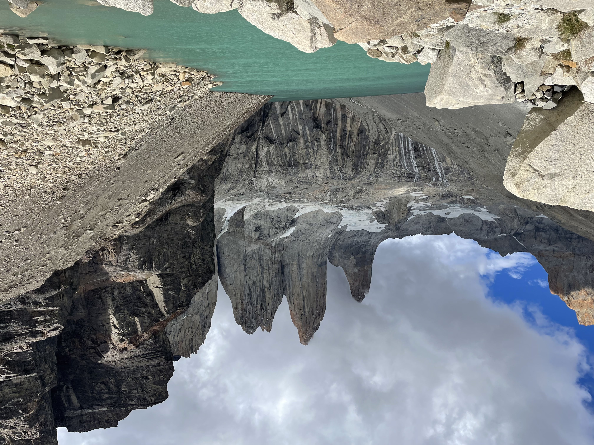
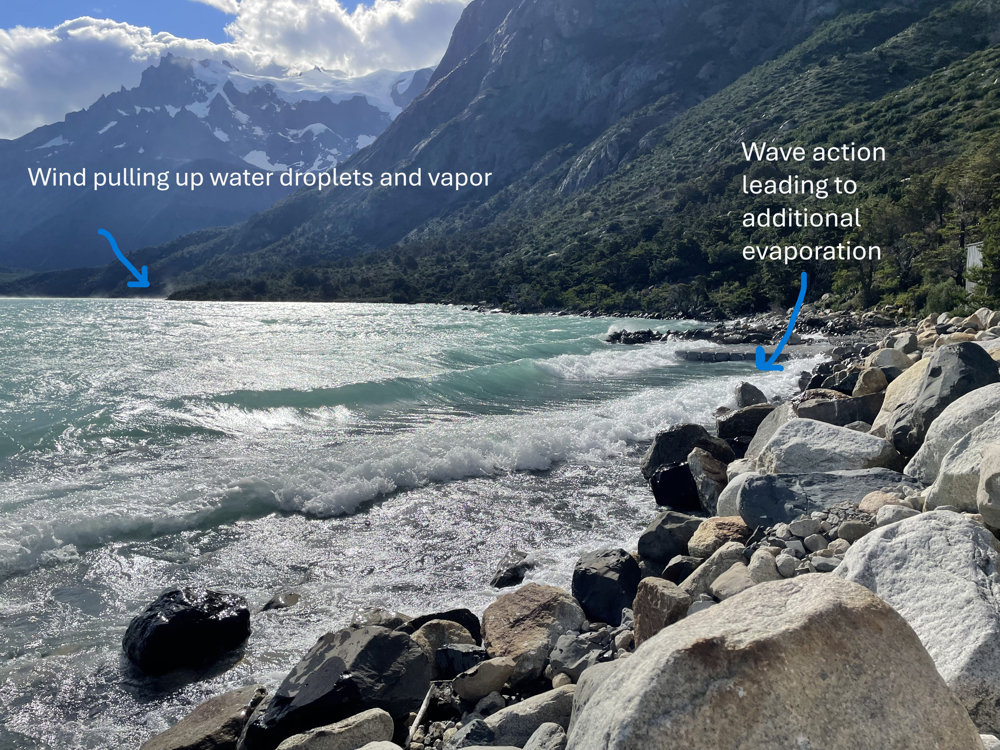
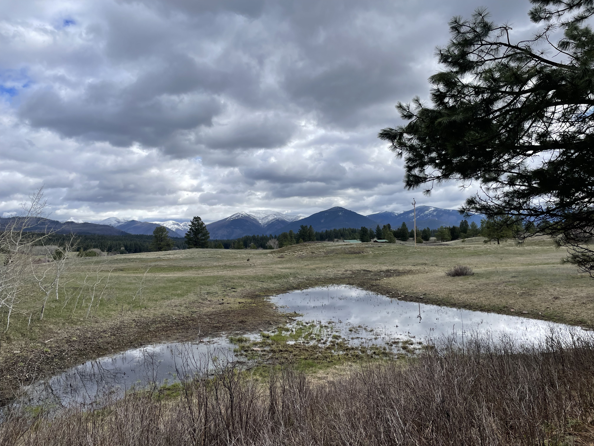
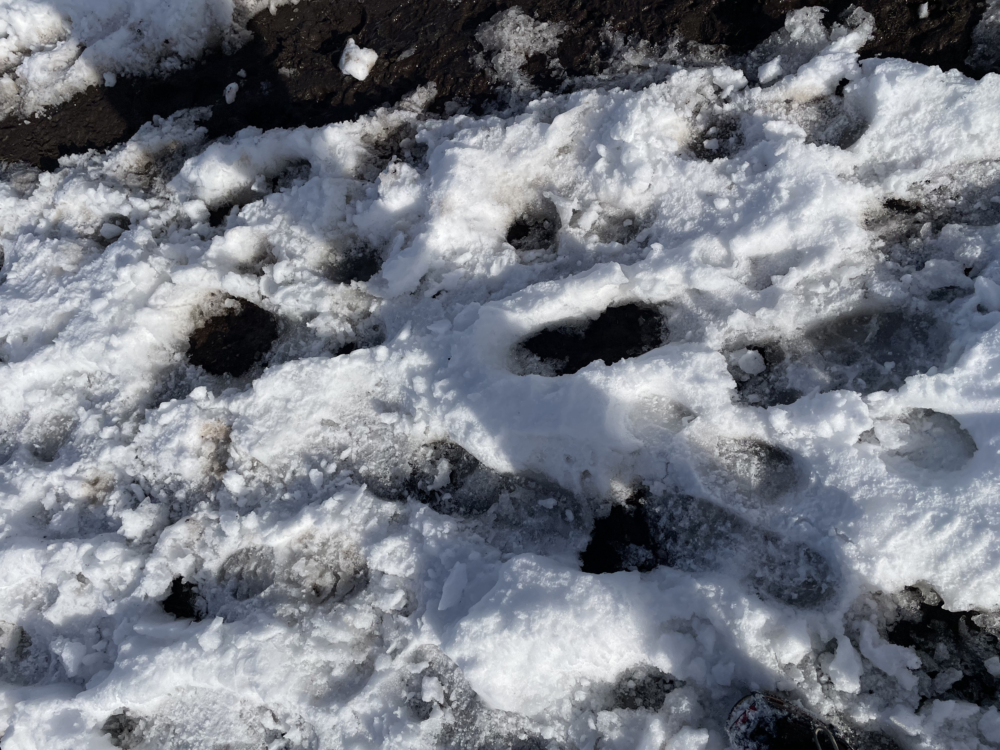

# Introduction
I'm a wetland ecologist just trying to figure out how to create a website. 

# Module 1: Geomorphic Analysis of River Systems
Now I need to find a river closer to home. 

# Module 4: Hydrology Bingo! 

Here's where I'll take notes on observed processes. Below is the bingo board I've chosen (Fig. \@ref(fig:bingoblank)).

```{r bingoblank, echo = F, fig.cap="Ruth's selected bingo card!", out.width = "100%"}

```


## Infiltration Excess Overland Flow

On my recent trip to Las Torres del Paine in Chile, I saw infiltration excess overland flow at the base of Las Torres themselves. Infiltration excess overland flow happens when the precipitation rate (in this case snowmelt) is occurring faster than the infiltration capacity of the soil or bedrock, causing water to runoff that surface.  In this photo and a video, see how the water flowing from the snowmelt leaves trails along the granite (Fig. \@ref(fig:infiltrationexcess)). Granite is not a very porous rock and the slope is steep. I imagine very little infiltration is happening here. 

```{r infiltrationexcess, echo = F, fig.cap="See how the snowmelt runs off the rocks at the base of Las Torres. It's unable to penetrate into the granite, so it runs off instead. ", out.width="70%", fig.align='center'}

```


```{r infiltrationexcessvid, echo = F, fig.cap="See how the snowmelt runs off the rocks at the base of Las Torres. It's unable to penetrate into the granite, so it runs off instead. ", warning=F, fig.align='center'}
library(voice)
embed_video(src = "./images/Notebook/LasTorresVideo.mp4", type = "mp4")
```

## Evaporation

Evaporation is the process by which water changes phases into a gas, and is taken up into the air and transported elsewhere. On my recent trip to Patagonia, we had some sunny days that likely resulted in evaporation from the large lakes up into the atmosphere. On one particularly windy day, I could see clouds of water being taken up into the air (Fig. \@ref(fig:evaporation)). The wind was also resulting in a lot of waves along the edges of this lake. While what I can see in the photo below is actually still water droplets, wind evens like this also likely result in some water actually changing into a gas, as the surface area of the water increases. 

```{r evaporation, echo = F, fig.cap="The power of the wind can be seen in the clouds it was whipping up and the waves on the shoreline. Both of these processes will result in higher surface area on the water droplets and evaporation. ", out.width="70%", fig.align='center'}

```


```{r evaporationvid, echo = F, fig.cap="Watch the wind whip up water droplets into the air. Some of these likely evaporate into water vapor. ", warning=F, fig.align='center'}
library(voice)
embed_video(src = "./images/Notebook/WindyDay.mp4", type = "mp4")
```

## Percolation

Percolation is the process of water transfering from the subsurface soil to groundwater, as it flows through soil pores downward. I conducted a wetland site visit where there were a couple depressions where water had accumulated. This water can only escape through percolation, as the water slowly drains downward into the groundwater below. 

```{r percolation, echo = F, fig.cap="Water in the surrounding hills gathered into this depression, where it has no other escape but to percolate downward. While percolation is slow (causing the water to accumulate in the first place), it will certainly happen as this surface water infiltrates into the soil and downward to groundwater. ", out.width="70%", fig.align='center'}

```

## Infiltration

Infiltration is the process of water moving into the soil via soil pores, saturating the soil. During my site visit, I dug a quick soil pit. Here I can see the infiltration in action, as the water moves downward from the soil surface to the water table. In the bottom of my pit was free water, where the soil was draining into from the surface. 

```{r infiltration, echo = F, fig.cap="From the sheen on the soil pores, we can tell that this soil, while not fully saturated, has had water from the ground surface above infiltrated into the soil pores of this soil core. ", out.width="70%", fig.align='center'}
knitr::include_graphics('./images/Notebook/Infiltration.jpg')
```

## Snowfall

Snowfall is one type of precipitation by which water is transferred from the atmosphere to the ground. Walking around downtown, it began to snow, see the video below. This snow landed on the sidewalk, where it likely did not infiltrate, but rather ran off into nearby stormdrains. This water eventually likely flows into the Clark Fork River nearby. 

```{r snowfall, echo = F, fig.cap="See how the snowflakes were falling in downtown Missoula! With all the concrete around, infiltration is not likely. More likely, this snow will melt on the sidewalk and runoff into nearby stormdrains. ", warning=F, fig.align='center'}
embed_video(src = "./images/Notebook/Snowfall.mp4", type = "mp4")
```

## Snow accumulation

Snow accumulation occurs when ground and air temperatures are low enough that the water dropping as snow cannot melt to then infiltrate into the soil or runoff. Instead, it accumulates, to become a latent source of water to the soil, groundwater, and nearby rivers. After the snow began to fall one evening, it accumulated overnight, where I found it covering the trails at Blue Mountain. This snow then melted off later in the season producing an early spring runoff. 

```{r accumulation, echo = F, fig.cap="Snowfall from the night before accumulated on the Blue Mountain trails the next morning. With all the warm weather we've had, it didn't accumulate long. ", out.width="70%", fig.align='center'}

```