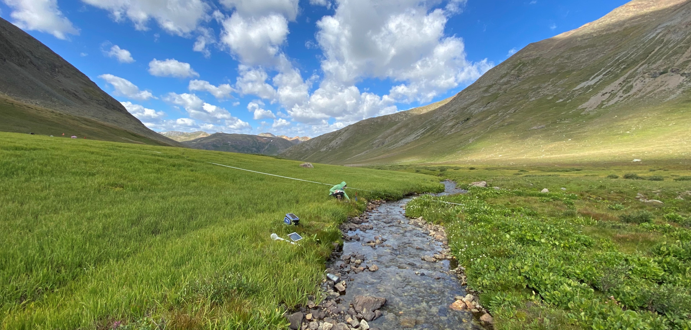

```{r packages, include = F}
library(ggplot2)
library(tidyverse)
library(kableExtra)
library(plotly)
library(leaflet)
library(rgdal)
```

```{r, data to load, include = F}
summarydata <- "./DataSummaries"
allplotchar <- read.csv("./DataSummaries/RawData/PlotCharacterization.csv", stringsAsFactors = F)
allheader <- readRDS(paste("./DataSummaries/TallFiles", "header.Rdata", sep = "/"))
allmetricsall <- read.csv(paste(summarydata, "ALL_AllMetrics.csv", sep = "/"), stringsAsFactors = F)

alldata <- left_join(allheader%>%
                       select(PlotID:FieldOffice), 
                     allplotchar%>%
                       select(PlotID, PlotKey, WetlandType, HydroGeoType, CowardinAttribute, PlotLayout))%>%
  left_join(., 
            allmetricsall)
states <- readOGR(paste0("C:/Users/rwhit/OneDrive - Colostate/CNHP/BLMprojectdesigns/other/tl_2017_us_state.shp"), 
                  layer = "tl_2017_us_state", GDAL1_integer64_policy = TRUE)
```


# Summary {.tabset .tabset-fade .tabset-pills}

In 2020, the Bureau of Land Management (BLM) in partnership with Colorado Natural Heritage Program (CNHP) implemented a second pilot season testing a new Riparian and Wetland Monitoring protocol, commonly referred to as "Lentic AIM". The Lentic AIM 2020 pilot project was carried out by a team including CNHP staff, BLM staff, and seasonal field crews. During 2020, three field crews sampled 64 sites across three western states (Colorado, Utah, and Idaho), with a bonus four sites sampled by district office staff in the Prineville District in Oregon. This document provides a way to look closely at the data collected and the metrics calculated from the data to aid in the interpretation of those data.  

```{r sampling map, echo = F, message=F, out.width = "100%", out.height= "550px", fig.cap="Plots sampled across four states during the 2020 field season." }
leaflet::leaflet(allplotchar) %>%
    leaflet::addTiles() %>%
    leaflet::setView(lat = 41,
                     lng = -113, 
                     zoom = 6) %>%
    addProviderTiles(providers$Esri.WorldTopoMap)%>%
    addPolylines(data = states, color = "grey", opacity = 1, weight = 2)%>%
    leaflet::addCircles(lng = allplotchar$Easting, lat = allplotchar$Northing, weight = 10, fillOpacity = 0.8, opacity = 0.8, fill = T)%>%
  leaflet::addScaleBar()

```

## Sample Design 

The goal of the 2020 sample design was different for each of the three states sampled. For Colorado, we built on the sampling completed in 2019 to sample more sites distributed across the Northwest and Rocky Mountain Districts. These consisted of both targeted sites selected by BLM staff, as well as randomly selected sites left over from designs run for the 2019 sampling season. In Utah, only targeted sites were sampled to allow for efficient sampling while we wait for wetland mapping updates due in the coming years. In Idaho, we used a mixed sampling approach. Random designs in the Boise District were confined to allotments with upcoming permit renewals, while the design in the Idaho Falls District was run across the two field offices of interest. In addition to this random sampling, BLM staff also requested a roughly equal number of Targeted sites to be sampled during the 2020 field season. 

For landscape-scale random site selection, we used the U.S. Fish and Wildlife Service's National Wetland Inventory (NWI) to identify all vegetated wetlands on BLM land as the master sample frame. We then used a generalized random tessellation stratified (GRTS) sample design in the R statistical software 'spsurvey' package to select spatially-balanced, random sites from the NWI sample frame. In Colorado, points were stratified by district based on the proportion of BLM-managed wetland acreage in that district and by size to ensure the inclusion of both small and large wetlands. In Idaho, the sites were stratified by field office and size to ensure equal sampling across each of the four target field offices and the inclusion of both large and small wetlands. 

The goal of random sampling was to locate and sample wetlands that may not have been identified by BLM in the past and to test the field protocol on a variety of wetland types and conditions. An additional goal was to better understand the mapping available, particularly in Idaho, where Lentic AIM sampling had never been done before. Because creating a statistically valid population estimate was a lower priority, we did not hold ourselves to strict adherence of the sample point order, which is usually important for implementing a GRTS sample design.

```{r plots by office, echo=F, results='asis'}
plotsbyoffice <- allheader%>%
  group_by(AdminState, DistrictOffice, FieldOffice, SamplingApproach)%>%
  count()%>%
  pivot_wider(names_from = SamplingApproach, values_from = n)%>%
  mutate(Total = sum(c(ProbabilityBased, Targeted), na.rm = T))%>%
  ungroup()%>%
  add_row(AdminState = "UT", DistrictOffice = "Total", FieldOffice = "", summarise(., across(where(is.numeric), ~sum(.,na.rm = T))))

knitr::kable(plotsbyoffice[2:6], format = "html", row.names = F, caption = "Lentic sites sampled in 2020 categorized by District and Field Offices", booktabs = T, linesep = "") %>% 
  kable_styling(latex_options = "HOLD_position")%>%
  pack_rows(index = table(plotsbyoffice$AdminState[1:17]))%>%
  row_spec(18, bold = T)
```

## Wetland Types Sampled 

In total, our field crews sampled 18 sites in Colorado, 25 in Utah, and 21 in Idaho. Additionally, four sites were sampled in Oregon by Prineville District Office Staff. The most commonly sampled wetland type in both Colorado (6) and Idaho (10) was Springs and Seeps, followed by Riparian Shrublands in Colorado (5) and Vegetated Drainageways (often called Swales) in Idaho (5). In Utah, the most common wetland type was Wet or Mesic Meadows (7), followed by Vegetated Drainageways (5) and Marshes (5).
```{r WetlandType by state table, echo = F, results='asis'}
WetlandTypebyState <- allplotchar%>%
  group_by(StateCode, WetlandType)%>%
  count()%>%
  pivot_wider(names_from = StateCode, values_from = n)%>%
  mutate(Total = sum(c(CO,ID,OR,UT), na.rm = T))%>%
  ungroup()%>%
  add_row(WetlandType = "Total", summarise(., across(where(is.numeric), ~sum(.,na.rm = T))))

knitr::kable(WetlandTypebyState, format = "html", row.names = F, caption = "Lentic sites sampled in 2020 categorized by General Wetland Type. ", booktabs = T, linesep = "") %>% kable_styling(latex_options = "HOLD_position")%>%
  row_spec(7, bold = T)
```

## Plot Layout

The Riparian and Wetland AIM protocol allows for four different plot layout designs, depending on the shape and size of the wetland or riparian area being sampled: a __spoke__ layout with three transects radiating from a central point, a __transverse__ layout for long, medium-width sites between 25 and 60 m wide, a __diagonal__ layout for long, narrow sites less than 25 m wide, and a __linear__ layout for long, extremely narrow sites less than 2 m wide. 35 of the sites sampled in 2020 allowed for the default layout, but in Colorado and Idaho, diagonal and transverse layouts were used almost as often as the default spoke, demonstrating the need for alternative layouts. 

```{r plot layout by state, echo = F, results='asis'}
PlotLayoutbyState <- allplotchar%>%
  group_by(StateCode, PlotLayout)%>%
  count()%>%
  pivot_wider(names_from = StateCode, values_from = n)%>%
  mutate(Total = sum(c(CO,ID,OR,UT), na.rm = T))%>%
  ungroup()%>%
  add_row(PlotLayout = "Total", summarise(., across(where(is.numeric), ~sum(.,na.rm = T))))

knitr::kable(PlotLayoutbyState, format = "html", row.names = F, caption = "Lentic sites sampled in 2020 categorized by plot layout. ", booktabs = T, linesep = "") %>% kable_styling(latex_options = "HOLD_position")%>%
  row_spec(5, bold = T)
```

# Data Management and Analysis {.tabset .tabset-fade .tabset-pills}

Metric calculations have been completed for all sites sampled in 2020 across all methods and are now available on the BLM National AIM Sharepoint. Also available are site summaries, placing calculated metrics along side photos and descriptive information provided by the crew. Metrics provided reflect the types of information that can be calculated from AIM data, however, the Riparian and Wetland AIM Team is still working to understand what these metrics could indicate about the sites sampled. A thorough review of all data collected during the pilot phase of the Riparian and Wetland AIM program is ongoing. Until more information can be provided about the interpretation of the data, this document can be used to understand the distribution of the metrics calculated across all the sites sampled during the 2020 season. __Because sample designs did not follow a statistically rigorous sampling order, these distributions cannot be used to extrapolate trends across riparian wetland areas on BLM lands, but rather to understand the range of values from this specific set of sites we sampled. __

For the purposes of metric calculations, the species list used and the classifications found in that species list are based on a national list, first exported directly from USDA Plants. This means that duration, growth habit, and native/non-native status classifications were performed at a national level. Noxious designations and C-Values were determined at the state level, and included all noxious classifications based on the Administrative State. Importantly, Oregon noxious species and C-values have not yet been incorporated into the species list. Wetland Indicator Statuses were determined based on the Level III Ecoregion in which the plot was located. 

## Community Metrics {.tabset .tabset-fade .tabset-pills}

Community metrics are calculated based on a species list, either from Species Inventory or a list of species hit during LPI. Below explore the metrics calculated based on the full Species Inventories of sites sampled in 2020. 

### Community Metrics by State
 
Use the dropdown box to select the cover metric you wish to explore and click on the graph as needed to zoom in.
```{r adminstate and community metrics, echo = F, warning=F, out.width="100%"}
Commitems <- list(list(label = "Species Richness", 
                   args = list(list(visible = c(T, F, F, F, F, F, F, F, F, F, F, F)))),
              list(label = "Mean C-Value", 
                   args = list(list(visible = c(F, T, F, F, F, F, F, F, F, F, F, F)))),
              list(label = "Percent Native", 
                   args = list(list(visible = c(F, F, T, F, F, F, F, F, F, F, F, F)))),
              list(label = "Count Noxious", 
                   args = list(list(visible = c(F, F, F, T, F, F, F, F, F, F, F, F)))),
              list(label = "Percent Hydrophyte", 
                   args = list(list(visible = c(F, F, F, F, T, F, F, F, F, F, F, F)))),
              list(label = "Percent HydroFAC", 
                   args = list(list(visible = c(F, F, F, F, F, T, F, F, F, F, F, F)))),
              list(label = "Percent Forb", 
                   args = list(list(visible = c(F, F, F, F, F, F, T, F, F, F, F, F)))),
              list(label = "Percent Graminoid", 
                   args = list(list(visible = c(F, F, F, F, F, F, F, T, F, F, F, F)))),
              list(label = "Percent Shrub", 
                   args = list(list(visible = c(F, F, F, F, F, F, F, F, T, F, F, F)))),
              list(label = "Percent Tree", 
                   args = list(list(visible = c(F, F, F, F, F, F, F, F, F, T, F, F)))),
              list(label = "Percent Annual", 
                   args = list(list(visible = c(F, F, F, F, F, F, F, F, F, F, T, F)))),
              list(label = "Percent Perennial", 
                   args = list(list(visible = c(F, F, F, F, F, F, F, F, F, F, F, T))))
)

statecommplot <- ggplotly(ggplot(alldata) +
    geom_boxplot(aes(y = CommunitySppInvRichness, x = AdminState))+
    geom_boxplot(aes(y = CommunitySppInvMeanC.Value, x = AdminState))+
      geom_boxplot(aes(y = CommunitySppInvPctNative, x = AdminState))+
      geom_boxplot(aes(y = CommunitySppInvCountNoxious, x = AdminState))+
      geom_boxplot(aes(y = CommunitySppInvPctHydrophyte, x = AdminState))+
      geom_boxplot(aes(y = CommunitySppInvPctHydroFAC, x = AdminState))+
      geom_boxplot(aes(y = CommunitySppInvPctForb, x = AdminState))+
      geom_boxplot(aes(y = CommunitySppInvPctGraminoid, x = AdminState))+
      geom_boxplot(aes(y = CommunitySppInvPctShrub, x = AdminState))+
      geom_boxplot(aes(y = CommunitySppInvPctTree, x = AdminState))+
      geom_boxplot(aes(y = CommunitySppInvPctAnnual, x = AdminState))+
      geom_boxplot(aes(y = CommunitySppInvPctPerennial, x = AdminState))+
    xlab("Administrative State") + ylab("Community Composition Metric") + 
      scale_y_continuous(n.breaks = 11) + 
    theme_bw() + theme(panel.border = element_blank(), panel.grid.major = element_blank(),
panel.grid.minor = element_blank(), axis.line = element_line(colour = "black"), axis.text = element_text(size = 12, color = "black"), text = element_text(size = 16)))%>%
  layout(
    yaxis = list(range = c(0, 110)),
    boxmode = "group",
    showlegend = T, 
    updatemenus = list(list(buttons = Commitems, yanchor = 'bottom', font = list(size = 12)))
  )%>%
  style(visible = "legendonly")

statecommplot
```

### Community Metrics by Wetland Type

Use the dropdown box to select the cover metric you wish to explore and click on the graph as needed to zoom in.
```{r community metrics by wetland type, echo = F, warning=F, out.width="100%"}
wetlandtypecommplot <- ggplotly(ggplot(alldata) +
    geom_boxplot(aes(y = CommunitySppInvRichness, x = WetlandType))+
    geom_boxplot(aes(y = CommunitySppInvMeanC.Value, x = WetlandType))+
      geom_boxplot(aes(y = CommunitySppInvPctNative, x = WetlandType))+
      geom_boxplot(aes(y = CommunitySppInvCountNoxious, x = WetlandType))+
      geom_boxplot(aes(y = CommunitySppInvPctHydrophyte, x = WetlandType))+
      geom_boxplot(aes(y = CommunitySppInvPctHydroFAC, x = WetlandType))+
      geom_boxplot(aes(y = CommunitySppInvPctForb, x = WetlandType))+
      geom_boxplot(aes(y = CommunitySppInvPctGraminoid, x = WetlandType))+
      geom_boxplot(aes(y = CommunitySppInvPctShrub, x = WetlandType))+
      geom_boxplot(aes(y = CommunitySppInvPctTree, x = WetlandType))+
      geom_boxplot(aes(y = CommunitySppInvPctAnnual, x = WetlandType))+
      geom_boxplot(aes(y = CommunitySppInvPctPerennial, x = WetlandType))+
    xlab("General Wetland Type") + ylab("Community Composition Metric") + 
      scale_y_continuous(n.breaks = 11) + 
    theme_bw() + theme(panel.border = element_blank(), panel.grid.major = element_blank(),
panel.grid.minor = element_blank(), axis.line = element_line(colour = "black"), axis.text = element_text(size = 12, color = "black"), text = element_text(size = 16), axis.text.x = element_text(angle = 25)))%>%
  layout(
    yaxis = list(range = c(0, 110)),
    boxmode = "group",
    showlegend = T, 
    updatemenus = list(list(buttons = Commitems, yanchor = 'bottom', font = list(size = 12)))
  )%>%
  style(visible = "legendonly")

wetlandtypecommplot
```

## Cover Metrics {.tabset .tabset-fade .tabset-pills}

Cover metrics are calculated from LPI pin drops and can either show absolute cover (i.e. the proportion of the plot covered by a given plant or plant group) or relative cover (i.e. the proportion of the vascular species hits made up by a given plant or plant group). Two sets of boxplots are shown here, grouping the data either by Administrative State, or Wetland Type. 

### Cover Metrics by Administrative State

Use the dropdown box to select the cover metric you wish to explore and click on the graph as needed to zoom in.
```{r adminstate x percent foliar cover, echo = F, warning=F, out.width="100%"}
items <- list(list(label = "PercentFoliarCover", 
                   args = list(list(visible = c(T, F, F, F, F, F, F, F, F, F, F, F, F)))),
              list(label = "PercentBasalCover", 
                   args = list(list(visible = c(F, T, F, F, F, F, F, F, F, F, F, F, F)))),
              list(label = "TotalAbsoluteCover", 
                   args = list(list(visible = c(F, F, T, F, F, F, F, F, F, F, F, F, F)))),
              list(label = "RelativeNativeCover", 
                   args = list(list(visible = c(F, F, F, T, F, F, F, F, F, F, F, F, F)))),
              list(label = "Absolute Noxious", 
                   args = list(list(visible = c(F, F, F, F, T, F, F, F, F, F, F, F, F)))),
              list(label = "Relative Hydrophyte", 
                   args = list(list(visible = c(F, F, F, F, F, T, F, F, F, F, F, F, F)))),
              list(label = "Relative HydroFAC", 
                   args = list(list(visible = c(F, F, F, F, F, F, T, F, F, F, F, F, F)))),
              list(label = "Relative Forb", 
                   args = list(list(visible = c(F, F, F, F, F, F, F, T, F, F, F, F, F)))),
              list(label = "Relative Graminoid", 
                   args = list(list(visible = c(F, F, F, F, F, F, F, F, T, F, F, F, F)))),
              list(label = "Relative Shrub", 
                   args = list(list(visible = c(F, F, F, F, F, F, F, F, F, T, F, F, F)))),
              list(label = "Relative Tree", 
                   args = list(list(visible = c(F, F, F, F, F, F, F, F, F, F, T, F, F)))),
              list(label = "Relative Annual", 
                   args = list(list(visible = c(F, F, F, F, F, F, F, F, F, F, F, T, F)))),
              list(label = "Relative Perennial", 
                   args = list(list(visible = c(F, F, F, F, F, F, F, F, F, F, F, F, T))))
)

statecoverplot <- ggplotly(ggplot(alldata) +
    geom_boxplot(aes(y = PercentFoliarCover, x = AdminState))+
    geom_boxplot(aes(y = PercentBasalCover, x = AdminState))+
      geom_boxplot(aes(y = TotalAbsoluteCover, x = AdminState))+
      geom_boxplot(aes(y = RelativeNativeCover, x = AdminState))+
      geom_boxplot(aes(y = AbsoluteNoxiousCover, x = AdminState))+
      geom_boxplot(aes(y = RelativeHydrophyteCover, x = AdminState))+
      geom_boxplot(aes(y = RelativeHydroFACCover, x = AdminState))+
      geom_boxplot(aes(y = RelativeForbCover, x = AdminState))+
      geom_boxplot(aes(y = RelativeGraminoidCover, x = AdminState))+
      geom_boxplot(aes(y = RelativeShrubCover, x = AdminState))+
      geom_boxplot(aes(y = RelativeTreeCover, x = AdminState))+
      geom_boxplot(aes(y = RelativeAnnualCover, x = AdminState))+
      geom_boxplot(aes(y = RelativePerennialCover, x = AdminState))+
    xlab("Administrative State") + ylab("Percent Cover") + 
      scale_y_continuous(n.breaks = 20) + 
    theme_bw() + theme(panel.border = element_blank(), panel.grid.major = element_blank(),
panel.grid.minor = element_blank(), axis.line = element_line(colour = "black"), axis.text = element_text(size = 12, color = "black"), text = element_text(size = 16)))%>%
  layout(
    yaxis = list(range = c(0, 120)),
    boxmode = "group",
    showlegend = T, 
    updatemenus = list(list(buttons = items, yanchor = 'bottom', font = list(size = 12)))
  )%>%
  style(visible = "legendonly")

statecoverplot
```

### Cover Metrics by Wetland Type

Use the dropdown box to select the cover metric you wish to explore and click on the graph as needed to zoom in.
```{r wetland type x percent foliar cover, echo = F, warning=F, out.width="100%"}
wetlandtypecoverplot <- ggplotly(ggplot(alldata) +
    geom_boxplot(aes(y = PercentFoliarCover, x = WetlandType))+
    geom_boxplot(aes(y = PercentBasalCover, x = WetlandType))+
      geom_boxplot(aes(y = TotalAbsoluteCover, x = WetlandType))+
      geom_boxplot(aes(y = RelativeNativeCover, x = WetlandType))+
      geom_boxplot(aes(y = AbsoluteNoxiousCover, x = WetlandType))+
      geom_boxplot(aes(y = RelativeHydrophyteCover, x = WetlandType))+
      geom_boxplot(aes(y = RelativeHydroFACCover, x = WetlandType))+
      geom_boxplot(aes(y = RelativeForbCover, x = WetlandType))+
      geom_boxplot(aes(y = RelativeGraminoidCover, x = WetlandType))+
      geom_boxplot(aes(y = RelativeShrubCover, x = WetlandType))+
      geom_boxplot(aes(y = RelativeTreeCover, x = WetlandType))+
      geom_boxplot(aes(y = RelativeAnnualCover, x = WetlandType))+
      geom_boxplot(aes(y = RelativePerennialCover, x = WetlandType))+
    xlab("General Wetland Type") + ylab("Percent Cover") + 
      scale_y_continuous(n.breaks = 20) + 
    theme_bw() + theme(panel.border = element_blank(), panel.grid.major = element_blank(),
panel.grid.minor = element_blank(), axis.line = element_line(colour = "black"), axis.text = element_text(size = 12, color = "black"), text = element_text(size = 16), axis.text.x = element_text(angle = 25)))%>%
  layout(
    yaxis = list(range = c(0, 120)),
    boxmode = "group",
    showlegend = T, 
    updatemenus = list(list(buttons = items, yanchor = 'bottom', font = list(size = 12)))
  )%>%
  style(visible = "legendonly")

wetlandtypecoverplot
```

## Height Metrics {.tabset .tabset-fade .tabset-pills}

### Height Metrics by State

Use the dropdown box to select the cover metric you wish to explore and click on the graph as needed to zoom in.
```{r heights by adminstate, echo = F, warning=F, out.width="100%"}
heightitems <- list(list(label = "Average Herbaceous Height", 
                   args = list(list(visible = c(T, F, F, F)))),
              list(label = "Average Woody Height", 
                   args = list(list(visible = c(F, T, F, F)))),
              list(label = "Average Litter/Thatch Depth ", 
                   args = list(list(visible = c(F, F, T, F)))),
              list(label = "Average Water Depth", 
                   args = list(list(visible = c(F, F, F, T))))
)

stateheightplot <- ggplotly(ggplot(alldata) +
                              geom_boxplot(aes(y = AvgHerbaceousHeight, x = AdminState))+
                              geom_boxplot(aes(y = AvgWoodyHeight, x = AdminState))+
                              geom_boxplot(aes(y = AvgLitterThatchDepth, x = AdminState))+
                              geom_boxplot(aes(y = AvgWaterDepth, x = AdminState))+
                              xlab("Administrative State") + ylab("Height (cm)") + 
                              scale_y_continuous(n.breaks = 40) + 
                              theme_bw() + theme(panel.border = element_blank(), panel.grid.major = element_blank(),
panel.grid.minor = element_blank(), axis.line = element_line(colour = "black"), axis.text = element_text(size = 12, color = "black"), text = element_text(size = 16)))%>%
  layout(
    yaxis = list(range = c(0, 120)),
    boxmode = "group",
    showlegend = T, 
    updatemenus = list(list(buttons = heightitems, yanchor = 'bottom', font = list(size = 12)))
  )%>%
  style(visible = "legendonly")

stateheightplot
```

### Height Metrics by Wetland Type

Use the dropdown box to select the cover metric you wish to explore and click on the graph as needed to zoom in.
```{r heights by Wetland Type, echo = F, warning=F, out.width="100%"}
wetlandtypeheightplot <- ggplotly(ggplot(alldata) +
                              geom_boxplot(aes(y = AvgHerbaceousHeight, x = WetlandType))+
                              geom_boxplot(aes(y = AvgWoodyHeight, x = WetlandType))+
                              geom_boxplot(aes(y = AvgLitterThatchDepth, x = WetlandType))+
                              geom_boxplot(aes(y = AvgWaterDepth, x = WetlandType))+
                              xlab("General Wetland Type") + ylab("Height (cm)") + 
                              scale_y_continuous(n.breaks = 40) + 
                              theme_bw() + theme(panel.border = element_blank(), panel.grid.major = element_blank(),
panel.grid.minor = element_blank(), axis.line = element_line(colour = "black"), axis.text = element_text(size = 12, color = "black"), text = element_text(size = 16), axis.text.x = element_text(angle = 25)))%>%
  layout(
    yaxis = list(range = c(0, 120)),
    boxmode = "group",
    showlegend = T, 
    updatemenus = list(list(buttons = heightitems, yanchor = 'bottom', font = list(size = 12)))
  )%>%
  style(visible = "legendonly")

wetlandtypeheightplot
```

## Annual Use Metrics {.tabset .tabset-fade .tabset-pills}

Annual use and woody use data was collected every 2.5 m on each transect. Soil alteration was determined as the presence or absence of an alteration (e.g., hoof print, foot print, or wheel track) intercepting one or more of five lines within a 42 by 50 cm quadrat. Stubble height was measured as the average leaf height of a tuft of graminoids located within a 15-cm radius circular area placed along the transect. For each tuft, technicians indicated a dominant graminoid species and whether 25% or more of the leaves had been grazed. Woody use was determined on the first individual of each riparian woody species encountered within a 2-m by 2.5-m quadrat on the transect. Use is placed into one of 5 categories corresponding to midpoints on an even scale from 0 to 100%. Individuals with over 50% of this year’s growth above 1.5 m were counted as NA or Not Available.

### Annual Use Metrics by State

Use the dropdown box to select the cover metric you wish to explore and click on the graph as needed to zoom in.
```{r annual use by adminstate, echo = F, warning=F, out.width="100%"}
useclassitems <- list(list(label = "Average Soil Alteration", 
                   args = list(list(visible = c(T, F, F, F, F)))),
              list(label = "Average Stubble Height (cm)", 
                   args = list(list(visible = c(F, T, F, F, F)))),
              list(label = "Percent Grazed Graminoids", 
                   args = list(list(visible = c(F, F, T, F, F)))),
              list(label = "Percent Woody Not Available", 
                   args = list(list(visible = c(F, F, F, T, F)))),
              list(label = "Average Woody Use Class", 
                   args = list(list(visible = c(F, F, F, F, T))))
)

stateuseplot <- ggplotly(ggplot(alldata) +
                              geom_boxplot(aes(y = AvgSoilAlteration, x = AdminState))+
                              geom_boxplot(aes(y = AvgStubbleHeight, x = AdminState))+
                              geom_boxplot(aes(y = PctGrazed, x = AdminState))+
                              geom_boxplot(aes(y = PctWoodyNotAvailable, x = AdminState))+
                              geom_boxplot(aes(y = AvgWoodyUseClass, x = AdminState))+
                              xlab("Administrative State") + ylab("Annual Use Metric") + 
                              scale_y_continuous(n.breaks = 40) + 
                              theme_bw() + theme(panel.border = element_blank(), panel.grid.major = element_blank(),
panel.grid.minor = element_blank(), axis.line = element_line(colour = "black"), axis.text = element_text(size = 12, color = "black"), text = element_text(size = 16)))%>%
  layout(
    yaxis = list(range = c(0, 120)),
    boxmode = "group",
    showlegend = T, 
    updatemenus = list(list(buttons = useclassitems, yanchor = 'bottom', font = list(size = 12)))
  )%>%
  style(visible = "legendonly")

stateuseplot
```

### Annual Use Metrics by Wetland Type

Use the dropdown box to select the cover metric you wish to explore and click on the graph as needed to zoom in.
```{r annual use by Wetland Type, echo = F, warning=F, out.width="100%"}
wetlandtypeuseplot <- ggplotly(ggplot(alldata) +
                              geom_boxplot(aes(y = AvgSoilAlteration, x = WetlandType))+
                              geom_boxplot(aes(y = AvgStubbleHeight, x = WetlandType))+
                              geom_boxplot(aes(y = PctGrazed, x = WetlandType))+
                              geom_boxplot(aes(y = PctWoodyNotAvailable, x = WetlandType))+
                              geom_boxplot(aes(y = AvgWoodyUseClass, x = WetlandType))+
                              xlab("Administrative State") + ylab("Annual Use Metric") + 
                              scale_y_continuous(n.breaks = 40) + 
                              theme_bw() + theme(panel.border = element_blank(), panel.grid.major = element_blank(),
panel.grid.minor = element_blank(), axis.line = element_line(colour = "black"), axis.text = element_text(size = 12, color = "black"), text = element_text(size = 16), axis.text.x = element_text(angle = 25)))%>%
  layout(
    yaxis = list(range = c(0, 120)),
    boxmode = "group",
    showlegend = T, 
    updatemenus = list(list(buttons = useclassitems, yanchor = 'bottom', font = list(size = 12)))
  )%>%
  style(visible = "legendonly")

wetlandtypeuseplot
```

## Hummocks Metrics {.tabset .tabset-fade .tabset-pills}

Data collection on hummocks is intended to characterize the physical structure of hummocks within the plot and to help detect changes due to livestock use, erosion, hydrologic modification, and/or changes in the biotic community over time. Hummock methods are a contingent method, and only occur in a small portion of Riparian and Wetland AIM plots. In 2020, 19 sites had one or more hummocks measured along transects. 

### Hummocks Metrics by State

Use the dropdown box to select the cover metric you wish to explore and click on the graph as needed to zoom in.
```{r hummocks by adminstate, echo = F, warning=F, out.width="100%"}
hummockitems <- list(list(label = "Count", 
                   args = list(list(visible = c(T, F, F, F, F)))),
              list(label = "Average Hummock Height (cm)", 
                   args = list(list(visible = c(F, T, F, F, F)))),
              list(label = "Average Hummock Width (cm)", 
                   args = list(list(visible = c(F, F, T, F, F)))),
              list(label = "Average Hummock Slope (deg)", 
                   args = list(list(visible = c(F, F, F, T, F)))),
              list(label = "Average Hummock Veg Cover", 
                   args = list(list(visible = c(F, F, F, F, T))))
)

statehummockplot <- ggplotly(ggplot(alldata) +
                              geom_boxplot(aes(y = CountHummocks, x = AdminState))+
                              geom_boxplot(aes(y = AvgHummockHeight, x = AdminState))+
                              geom_boxplot(aes(y = AvgHummockWidth, x = AdminState))+
                              geom_boxplot(aes(y = AvgHummockSlope, x = AdminState))+
                              geom_boxplot(aes(y = AvgHummockVegCover, x = AdminState))+
                              xlab("Administrative State") + ylab("Hummock Metric") + 
                              scale_y_continuous(n.breaks = 30) + 
                              theme_bw() + theme(panel.border = element_blank(), panel.grid.major = element_blank(),
panel.grid.minor = element_blank(), axis.line = element_line(colour = "black"), axis.text = element_text(size = 12, color = "black"), text = element_text(size = 16)))%>%
  layout(
    yaxis = list(range = c(0, 40)),
    boxmode = "group",
    showlegend = T, 
    updatemenus = list(list(buttons = hummockitems, yanchor = 'bottom', font = list(size = 12)))
  )%>%
  style(visible = "legendonly")

statehummockplot
```

### Annual Use Metrics by Wetland Type

Use the dropdown box to select the cover metric you wish to explore and click on the graph as needed to zoom in.
```{r hummocks by Wetland Type, echo = F, warning=F, out.width="100%"}
ggplotly(ggplot(alldata) +
                              geom_boxplot(aes(y = CountHummocks, x = WetlandType))+
                              geom_boxplot(aes(y = AvgHummockHeight, x = WetlandType))+
                              geom_boxplot(aes(y = AvgHummockWidth, x = WetlandType))+
                              geom_boxplot(aes(y = AvgHummockSlope, x = WetlandType))+
                              geom_boxplot(aes(y = AvgHummockVegCover, x = WetlandType))+
                              xlab("Administrative State") + ylab("Hummock Metric") + 
                              scale_y_continuous(n.breaks = 30) + 
                              theme_bw() + theme(panel.border = element_blank(), panel.grid.major = element_blank(),
panel.grid.minor = element_blank(), axis.line = element_line(colour = "black"), axis.text = element_text(size = 12, color = "black"), text = element_text(size = 16), axis.text.x = element_text(angle = 25)))%>%
  layout(
    yaxis = list(range = c(0, 40)),
    boxmode = "group",
    showlegend = T, 
    updatemenus = list(list(buttons = hummockitems, yanchor = 'bottom', font = list(size = 12)))
  )%>%
  style(visible = "legendonly")
```