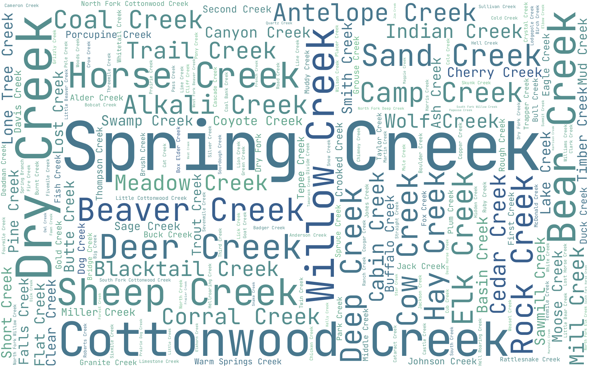
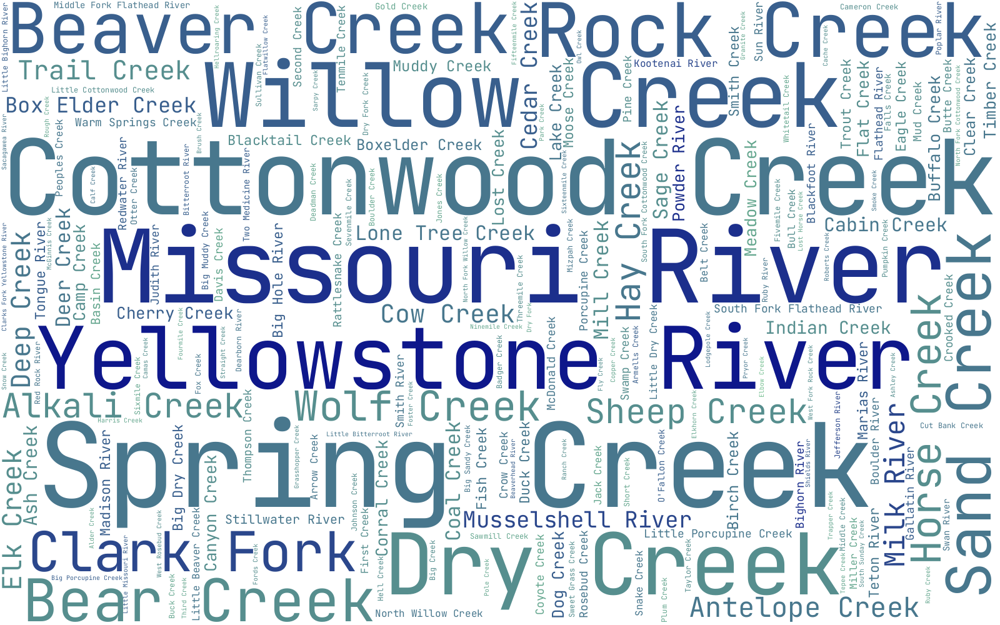
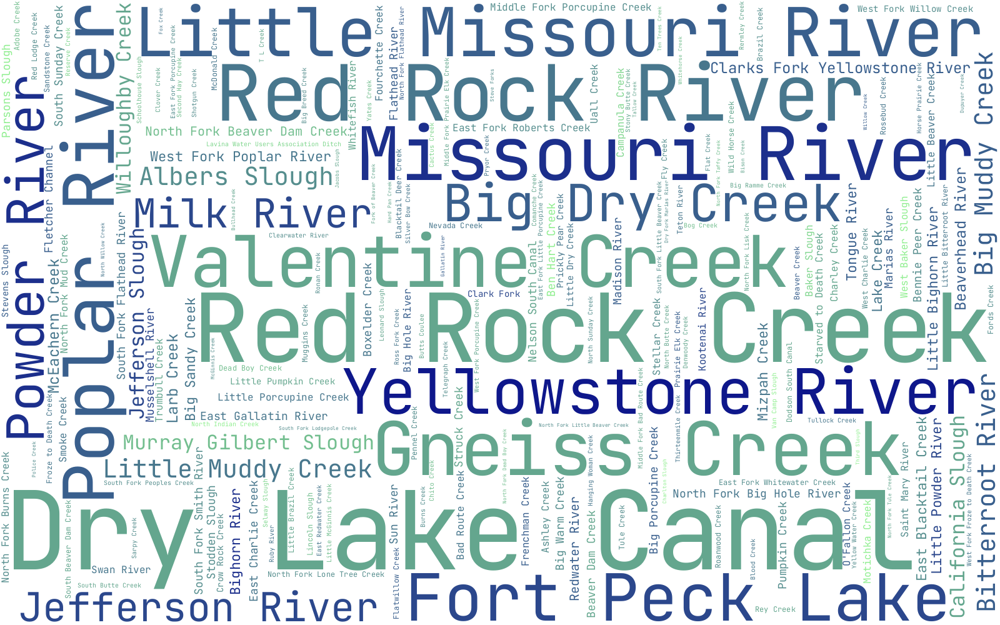

# Introduction

# Regional River Diversity: Montana

# River Diversity by Name

Below is the word cloud associated with Montana rivers. The most common name was Spring Creek, with Dry Creek, Cottonwood Creek, and Bear Creek also being fairly common (Fig. \@ref(fig:bycount)). By length, the longest river lengths were Spring Creek and Cottonwood Creek, but Missouri River and Yellowstone River also stood out (Fig. \@ref(fig:bylength)). Dry Lake Canal was the largest area per unit length (Fig. \@ref(fig:byarea)). 

```{r bycount, echo=F, fig.cap='Most common stream names by count. ' , out.width='80%'}

```

```{r bylength, echo=F, fig.cap='Most common stream names by count. ' , out.width='80%'}

```

```{r byarea, echo=F, fig.cap='Most common stream names by count. ' , out.width='80%'}

```
