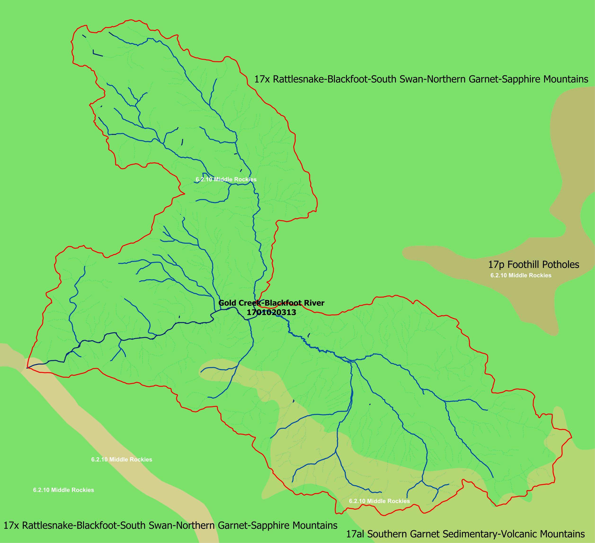

# Introduction

Below is information on catchment-level controls on two watersheds: Logan River in northeastern Utah, and the Gold Creek-Blackfoot River Watershed just east of Missoula, Montana. 

## Methods

For each watershed, I used various layers contained in the geopackage of the Riverscapes project, including PRISM climate data, geology layers, LANDFIRE vegetation descriptions and ecoregions as defined by the US EPA. When calculating Morphometrics, the following measurement methods were used: 

**Catchment Length**: I ensured the project was in UTM projection, then used the measurement tool to measure a straight line from the mainstem beginning to the catchment mouth. 

**Catchment Area**: I used the area in the attribute table of the Watershed layer. 

**Catchment Perimeter**: I calculated a perimeter for the watershed layer. 

**Circularity Ratio**: This is defined in my book as Catchment Area divided by the Area of a circle with the same circumference as the watershed perimeter. The area of a circle can be calculated from perimeter as circumference squared, divided by 4 pi. 

**Form Factor**: This calculation is defined as the catchment area divided by catchment length squared. 

**Catchment relief**: I used the maximum elevation in the project DEM minus the minimum elevation in the DEM, located at the catchment mouth. 

**Relief Ratio**: Catchment relief divided by catchment length, both in meters. 

**Drainage Density**: This was calculated as the total stream length from the attribute table of the drainage network (note this included Perennial, Intermittent and Ephemeral drainages), divided by the catchment area. 

# Logan River Watershed: 1601020303

The Logan River Watershed is located in the Wasatch Mountains on the border of Utah and Idaho, just west of Bear Lake in Utah. It starts in the forested mountains and descends into the city of Logan, UT (Fig. \@ref(fig:LoganLocation)). 

{#fig:LoganLocation}

## Watershed description

### Climate

Logan River watershed has a mean annual precipitation ranging from 431 to 1351 mm per year and a mean temperature ranging from 2 to 9 °C. The minimum temperature is -2°C in the highest elevation portions of the watershed, while the maximum temperature is 16 in the lowest portion. 

### Geologic Setting

The geology of the watershed is characterized by highly water-soluble parent material such as dolomite, dolostone, and limestone. These materials will be particularly susceptible to chemical weathering. There is some sandstone as well, which will be more resistant to chemical erosion, but will still result in physical weathering into sandy material as opposed to more mixed load. The majority of the geologic setting is made up of older sedimentary rock, largely from the early Paleozoic era. At the very base of the watershed, the parent material is much younger, consisting of unconsolidated deposits from the shoreline of Lake Bonneville. 

### Dominant Vegetative Communities

The majority of the watershed is made up of closed- and open-canopy, forested areas, with a mix of dominant communities such as Rocky Mountain Aspen Forest and Woodland, Subalpine Spruce-Fir Forest, and dry-Mesic Montane mixed conifer forests. At lower elevations, the forest gives way to sagebrush steppe. At the lower end of the watershed, the foothills are characterized by Pine and Juniper dominated open forests, before descending further into Big Sagebrush shrubland. The lowest area of the watershed is developed, intermixing low to high intensity development and hay and crop fields. 

### Physiographic Setting

The majority of the watershed is located in the Wasatch and Uinta Mountains Level III ecoregion, which is part of the Northwestern Forests Level 1 ecoregion. The outlet of the river then descends down the foothills into the Malad and Cache Valley ecoregion within the North American Deserts Level I ecoregion (Fig. \@ref(fig:LoganEcoregions)).

{#fig:LoganEcoregions}

## Longitudinal Profile

{#fig:LoganProfile}

Above is the profile of the mainstem Logan River Fig. \@ref(fig:LoganProfile)). The Logan River base control today is the Cutler Reservoir at 1,344 m or 4,409 ft. 13,000 years ago, the base control would have been Lake Bonneville, then at an elevation of 1,494 m or 4,901 ft. The length of the mainstem Logan River is about 84 km. 

Concavity is calculated as: 
Concavity = 2A / H
Where A is the height difference between the profile at mid-distance and a straight line joining the end points of the profile and H is the total fall of the longitudinal profile. In this case, A would be around 342 m, and H is 1118. Concavity equals 0.612. 

There are a series of knickpoints that show up in the river profile. Working from the top of the watershed down, I first observed a few valleys with large beaver dam complexes that may be causing a few bumps in the profile. The larger knickpoint I observed coincided with a distinct change to the geology where unconsolidated glacial deposits show up, leading me to guess a glacier was present in this spot at one point. For the rest of the profile, beaver dams or the Third Dam, a hydroelectric dam, explain knickpoints. There's one section that seems to level out a little, and coincides with a particularly sinuous section of the river and a change in the geology from Glacial deposits to Limestone, but I'm not totally sure what's happening here or if it's a knickpoint. See my knickpoints labelled in the profile below.

{#fig:LoganProfileKnickpoints}

## Catchment morphometrics

```{r morphometrics, echo=F, tab.cap = "Catchment morphometrics for Logan River watershed. "}
loganmorph <- data.frame("Morphometric" = c("Catchment Length (m)", 
                              "Catchment Area", 
                              "Catchment Perimeter Length", 
                              "Circularity Ratio", 
                              "Form Factor", 
                              "Catchment Relief", 
                              "Relief Ratio", 
                              "Drainage Density", 
                              "Drainage Pattern"),
           "Value" = c("43.5 km (43,485 m))", 
                              "646.6 sq km (646,600,000 sq m)", 
                              "172.4 km (172,403 m)", 
                              "646.6 / ((172.4^2)/(4pi)) = 0.273", 
                              "646.6 / (43.5^2) = 0.342", 
                              "3041 - 1344 = 1697 m", 
                              "1697 / 43485 = 0.039", 
                              "810 km / 646.6 km^2 = 1.25 km km^-2", 
                              "Dendritic"))

knitr::kable(loganmorph)
```


## Stream Order

Logan River is a 4th order stream. Looking at other streams in the watershed, Temple Fork is a 3rd order stream. Beaver Creek is a 2nd order stream. This watershed generally appears to follow the Hortonian rules of stream order: there are exponentially more first order streams compared with second, third, and fourth. The length of first order streams is much smaller than the higher order, and the catchment area appears to increase with stream order. 

# Gold Creek-Blackfoot River: 1701020313

The Gold Creek-Blackfoot River Watershed is located in Western Montana, just east of Missoula. This location is upstream of where the Blackfoot River joins the Clark Fork to enter the Missoula valley through Hell Gate Canyon.  (Fig. \@ref(fig:GoldCreekLocation)). The watershed has an odd shape, with two lobes, or subcatchments, each feeding into the Blackfoot River. The northern lobe contains Gold Creek and all its tributaries, and the southern lobe contains Union Creek. 

{#fig:GoldCreekLocation}

## Watershed description

### Climate

The Gold Creek-Blackfoot watershed has a mean annual precipitation ranging from 366 to 1561 mm per year and a mean temperature ranging from 2 to 7 °C, however, the two subcatchments show somewhat distinct climates. The Gold Creek subcatchment has higher precipitation at the top of it's catchment, around 1200-1500mm per year, while the Union Creek Catchment is much drier, maxing out around 740 mm per year. Temperature is much more consistent across the catchment, with annual minimums and maximums the same throughout (~-2 °C minimum and 14 °C maximum). Compared with Logan River, it appears to have more consistent temperature throughout the watershed, likely due to it's lower elevational gradient. 

### Geologic Setting

The geology of the watershed is fairly consistent throughout, with metamorphic parent material largely coming from the Precambrian era. One area of the southern Union Creek subcatchment is sedimentary rock that's much more recent (Phanerozoic). Major rock types are Quartzite, Argillite, and metasiltstone. These are all generally going to be much harder rocks compared with Logan River Watershed. These rocks tend to be difficult to break, and when they do, they break into large pieces. This means this watershed will likely have more narrow valleys with angular cobbles deposited only with large flood events. 

### Dominant Vegetative Communities

The major dominant vegetative communities include Northern Rocky Mountain Dry-Mesic Mixed Conifer forest, Lodgepole pine forest at the highest elevations, and mixed montane shrubland, particularly on slopes with a southern aspect. The Union Creek subcatchment  also has a large amount of Ponderosa Pine woodland and savanna in the center, surrounding large amounts of crop and hayfields in the area closest to Union Creek. Along the Blackfoot River, Ponderosa Pine woodland and savannah dominates the north slopes, while more mixed montane conifer forest is found on the southern slopes. 

```{r Differences_gold_creek, echo=F, message=F, warning=F, fig.caption = "The two subcatchments within the Gold Creek-Blackfoot Catchment have strong differences between their annual precipitation (b) and dominant vegetation (c). Hillshade also shown (a) for reference. "}
library(cowplot)
library(ggplot2)

gchillshade <- ggdraw() + draw_image("./images/Module3/GoldCreekHillshade.jpg")
gcprecip <- ggdraw() + draw_image("./images/Module3/GoldCreekAnnualPrecip.jpg")
gcdomveg <- ggdraw() + draw_image("./images/Module3/GoldCreekDominantVeg.jpg")

threemaps <- plot_grid(gchillshade, gcprecip, gcdomveg, labels = c("a", "b", "c"), nrow = 1)
ggsave("./images/Module3/CombinedGoldCreekMaps.jpg", threemaps, units = "in", height = 3, width=8)

knitr::include_graphics("./images/Module3/CombinedGoldCreekMaps.jpg")
```

In summary, the watershed has some strong differences between the two subbasins contained within it \@ref(fig:Differences_gold_creek)). 

### Physiographic Setting

The entirety of the watershed is within the Middle Rockies level III ecoregion, predominately in the Rattlesnake-Blackfoot-SouthSwan-Northern Garnet-Sapphire Mountains Level IV ecoregion, with a small inclusion of the Southern Garnet Sedimentary-Volcanic Mountains (Fig. \@ref(fig:GoldCreekEcoregions)).

{#fig:GoldCreekEcoregions}

## Longitudinal profile

{#fig:GoldCreekProfile}

Above is the profile of Gold Creek and it's junction with the Blackfoot River just before flowing into the Clark Fork River (Fig. \@ref(fig:GoldCreekProfile)). The base control of Gold Creek occurs at it's junction with the Blackfoot River at around 1051 m. This watershed shows another baselevel control at the mouth of the Blackfoot River, at an elevation of 990 m. This baselevel is controlled by the Clark Fork River. The length of the Gold Creek-Blackfoot River section is 46 km. 

Concavity is calculated as: 
Concavity = 2A / H
Where A is the height difference between the profile at mid-distance and a straight line joining the end points of the profile and H is the total fall of the longitudinal profile. In this case, A would be around 300 m, and H is 790 m. Concavity equals 0.759. 

There are a series of knickpoints along the profile. In the Blackfoot River section, there used to be a series of dams in this area to support the local mill in Bonner, MT, but those were removed  in 2007. I can't tell where precisely they all used to be, but there are a few knickpoints in this section that are likely due to mills and dams on this stretch. Higher up, there's a knickpoint that coincides with a road crossing. Potentially that road crossing is limiting some flow. Higher still, there are a few more knickpoints, but the origin is less clear. I wonder if the hard rock parent material results in a few knickpoints where the rock is extra hard to erode. 

## Catchment morphometrics

```{r morphometrics_gold_creek, echo=F, tab.cap = "Catchment morphometrics for Gold Creek-Blackfoot watershed. "}
goldcreekmorph <- data.frame("Morphometric" = c("Catchment Length", 
                              "Catchment Area", 
                              "Catchment Perimeter Length", 
                              "Circularity Ratio", 
                              "Form Factor", 
                              "Catchment Relief", 
                              "Relief Ratio", 
                              "Drainage Density", 
                              "Drainage Pattern"),
           "Value" = c("24.4 km (24,397 m)", 
                              "582.4 sq km (582,400,000 sq m)", 
                              "164.3 km (164,292 m)", 
                              "582.4 / (164.3^2/4pi) = 0.271", 
                              "582.4 / (24.4^2) = 0.98", 
                              "2330 - 990 = 1340 m", 
                              "1340 / 24397 = 0.055", 
                              "= 849 km / 582 km^2 = 1.46 km km^-2", 
                              "Dendritic"))

knitr::kable(goldcreekmorph)
```

## Stream Order

Gold Creek is a Third Order stream by the time it hits the Blackfoot River, as is Union Creek that joins the Blackfoot just after the Gold Creek junction. The Blackfoot River is at minimum a fourth order stream, but it may be higher, depending on the Blackfoot tributaries higher up in the Blackfoot River watershed. 

# Watershed comparison

The two watersheds investigated here have many differences between them. The Logan River is found at a higher elevation and has a larger elevational gradient, meaning the contrast in climate is stronger between the highest portions of the watershed and the lowest. The mean, maximum and minimum temperatures are fairly similar for the two watersheds at the watershed scale, but where Gold Creek has fairly similar climate throughout, the Logan River has the lowest temperatures only occurring at the highest elevations and the lowest temperatures only occurring at the lowest elevations. 

A major source of contrast is the underlying geology. Where the Logan River has highly erodible and highly water-soluble parent materials, the Gold Creek watershed is characterized by extremely hard metamorphic rocks. I would expect, then, to see major differences in some of their morphometrics, however, they ended up fairly similar. Circularity ratios were both quite low, especially compared to numbers from the book. Gold Creek appeared somewhat shorter, but its circularity ratio probably ended up close to Logan due to its additional lobe. Logan had a slightly larger catchment area and a much greater length. These resulted in different form factors (0.34 in Logan vs. 0.97 in Gold Creek), but according to numbers from the book, these are both on the really low side, far below the "low" example provided - 4. The drainage density was slightly higher in Gold Creek - 1.46 km km^-2 compare with 1.25 in Logan. This is the opposite of what I'd expect based on the underlying geology. I'm not sure if this is telling me that these two watersheds are still fairly similar in the broad spectrum of watersheds in the world. 

