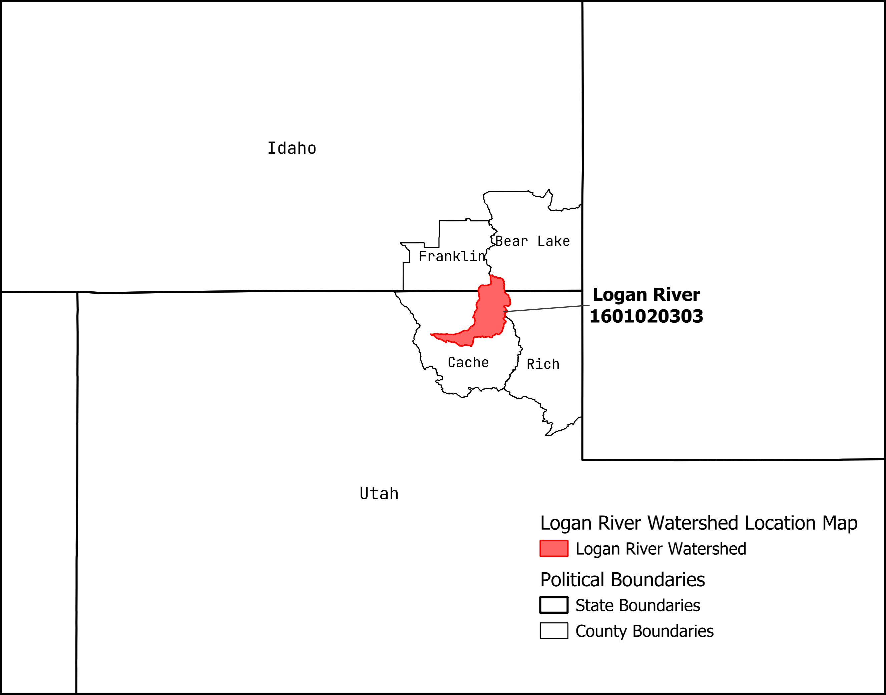
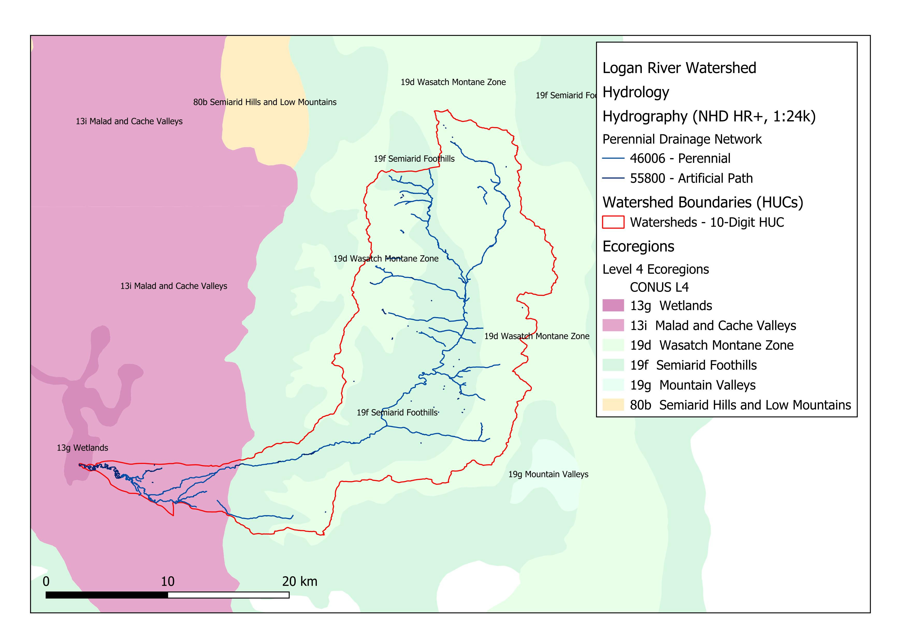

# Introduction

## Methods

# Logan River Watershed: 1601020303

The Logan River Watershed is located in the Wasatch Mountains on the border of Utah and Idaho, just west of Bear Lake in Utah. It starts in the forested mountains and descends into the city of Logan, UT (Fig. \@ref(fig:LoganLocation)). 

{#fig:LoganLocation}

## Watershed description

### Climate

Logan River watershed has a mean annual precipitation ranging from 431 to 1351 mm per year and a mean temperature ranging from 2 to 9 °C. The minimum temperature is -2°C in the highest elevation portions of the watershed, while the maximum temperature is 16 in the lowest portion. 

### Geologic Setting

The geology of the watershed is characterized by highly water-soluble parent material such as dolomite, dolostone, and limestone. These materials will be particularly susceptible to chemical weathering. There is some sandstone as well, which will be more resistant to chemical erosion, but will still result in physical weathering into sandy material as opposed to more mixed load. The majority of the geologic setting is made up of older sedimentary rock, largely from the early Paleozoic era. 

### Dominant Vegetative Communities

The majority of the watershed is made up of closed- and open-canopy, forested areas, with a mix of dominant communities such as Rocky Mountain Aspen Forest and Woodland, Subalpine Spruce-Fir Forest, and dry-Mesic Montane mixed conifer forests. At lower elevations, the forest gives way to sagebrush steppe. At the lower end of the watershed, the foothills are characterized by Pine and Juniper dominated open forests, before descending further into Big Sagebrush shrubland. The lowest area of the watershed is developed, intermixing low to high intensity development and hay and crop fields. 

### Physiographic Setting

The majority of the watershed is located in the Wasatch and Uinta Mountains Level III ecoregion, which is part of the Northwestern Forests Level 1 ecoregion. The outlet of the river then descends down the foothills into the Malad and Cache Valley ecoregion within the North American Deserts Level I ecoregion (Fig. \@ref(fig:LoganEcoregions)).

{#fig:LoganEcoregions}

## Longitudinal Profile

## Catchment morphometrics

## Stream Order

# Gold Creek-Blackfoot River: 1701020313

## Watershed description

## Longitudinal profile

## Catchment morphometrics

## Stream Order

# Watershed comparison