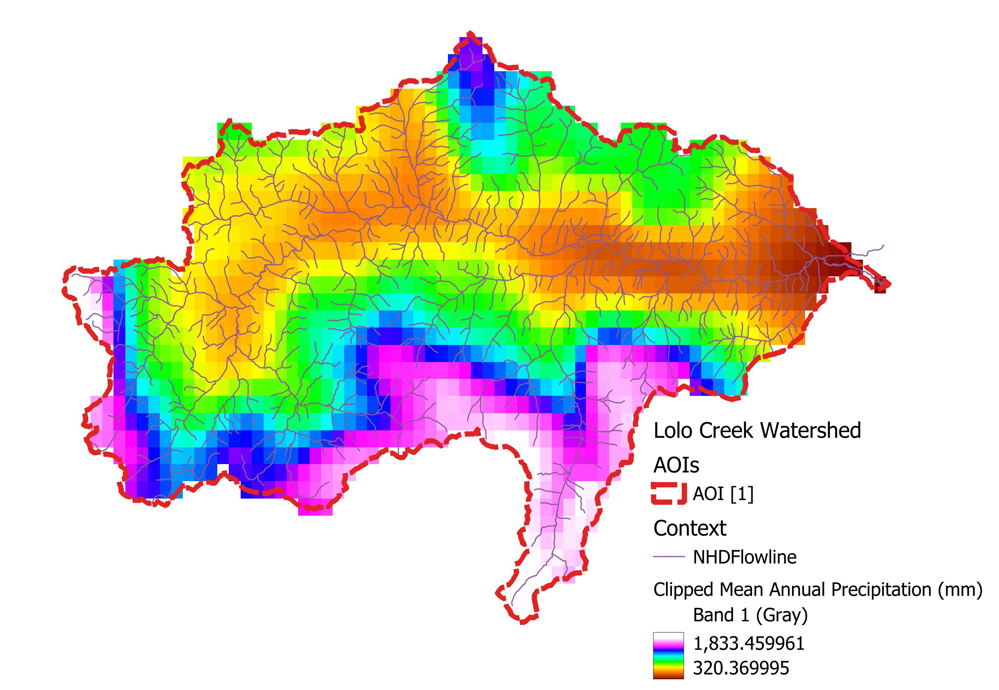
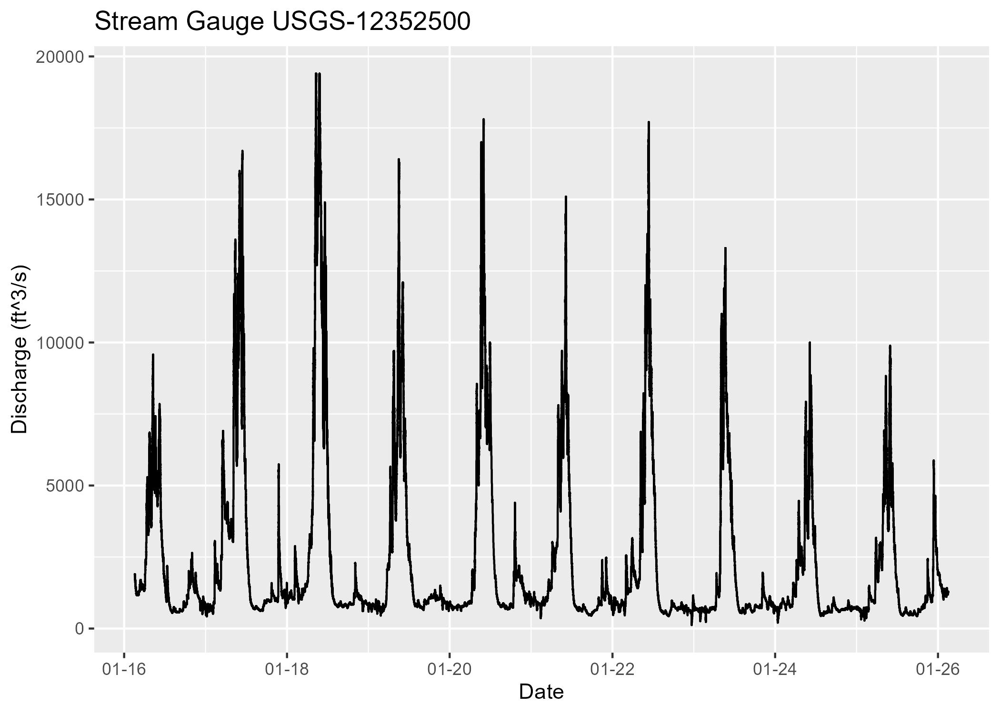
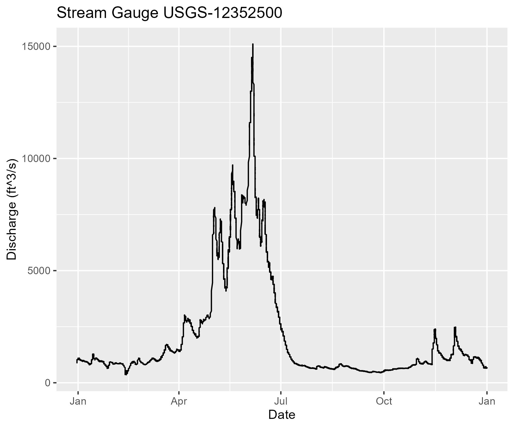

# Introduction

For this module, I chose to focus on the Lolo Creek watershed, located south and east of Missoula and right on the border with Idaho in the Bitterroot Mountains. 

# Basin Characteristics

Basic characteristics calculated manually, such as average elevation, slope, and average temperature precipitation, all came out very close to the numbers provided by the basin characteristics from the catchment delineation tool. Average elevation calculated across the watershed was 1591 m or 5220 ft (basin characteristic: 5223 ft). Average slope was 14.7°, or 36.5% according to the catchment tool. 62% of the catchment had a slope above 30% and 22% was above 50% slope. Average annual precipitation was 947 mm, and average mean temperature was 4.48 °C (39°F from the tool).

{#fig:LoloPrecip}

Based on this information and what I've observed driving up to Lolo pass to go skiing, I would expect the hydrology to be highly driven by snowfall and then melt, largely occurring in the highest elevation areas of the watershed. There's a fairly clear divide in the precipitation (Fig. \@ref(fig:LoloPrecip)), with the valley getting 500 mm per year and the highest portions of the watershed with 3 times that much. With a fairly high slope across the watershed, and underlying geology dominated by harder, less permeable rocks, I imagine there's a lot of runoff in this watershed.

# Stream Gauge Data

Stream gauge data also didn't seem to pull from the Riverscapes QRiS project, but I was able to access the data using a package in R to pull data from 2017 until 2026, see below. 

```{r streamgauge, echo = F, fig.cap="Discharge from Stream Gauge USGS-12352500, located on the Bitterroot several miles north of the junction with Lolo Creek. ", warning=F}
library(ggplot2)
# library(dataRetrieval)
# library(tidyverse)
# gauget1 <- read_waterdata_continuous(monitoring_location_id = "USGS-12352500", parameter_code = "00060", properties = c("value", "time", "unit_of_measure"), time = "2023-02-18T00:00:00Z/2026-02-17T00:00:00Z")
# gauget2 <- read_waterdata_continuous(monitoring_location_id = "USGS-12352500", parameter_code = "00060", properties = c("value", "time", "unit_of_measure"), time = "2020-02-18T00:00:00Z/2023-02-17T00:00:00Z")
# gauget3 <- read_waterdata_continuous(monitoring_location_id = "USGS-12352500", parameter_code = "00060", properties = c("value", "time", "unit_of_measure"), time = "2017-02-18T00:00:00Z/2020-02-17T00:00:00Z")
# gauget4 <- read_waterdata_continuous(monitoring_location_id = "USGS-12352500", parameter_code = "00060", properties = c("value", "time", "unit_of_measure"), time = "2016-02-18T00:00:00Z/2017-02-17T00:00:00Z")
# 
# gaugedata <- bind_rows(gauget1, gauget2, gauget3, gauget4)

# gaugeplot <- ggplot(gaugedata) +
#   geom_line(aes(x = as.Date(time), y = value)) +
#   xlab("Date") + ylab("Discharge (ft^3/s)") +
#   ggtitle("Stream Gauge USGS-12352500") +
#   scale_x_date(date_labels = "%m-%y")
# ggsave("./images/Module4/StreamGauge10yrPlot.jpg", gaugeplot, units = "in", width = 7, height = 5, dpi = 300)
# 
# gaugeplot21 <- ggplot() +
#   geom_line(data = gaugedata%>%filter(time<"2022-01-01" &time>"2020-12-31"), aes(x = as.Date(time), y = value)) +
#   xlab("Date") + ylab("Discharge (ft^3/s)") +
#   ggtitle("Stream Gauge USGS-12352500") +
#   scale_x_date(date_labels = "%b")
# ggsave("./images/Module4/StreamGauge2021.jpg", gaugeplot21, units = "in", width = 6, height = 5, dpi = 300)


```

During this time, the highest recorded discharge was 19,400 cubic feet per second on May 5, 2018. The lowest was 120 cubic feet per second on December 22nd, 2022. This means the highest discharge is 162 times that of the lowest discharge. As predicted, there does appear to be a seasonal peak discharge occurring in the late spring. Frequently fall rains seem to create additional peaks in the late fall, often in November. We can see this better if we just zoom into one year. The below is data from 2021, year that looks roughly representative of the years in the 10-year dataset. 

```{r gauge1year, echo = F, fig.cap="Discharge from Stream Gauge USGS-12352500 in 2021, located on the Bitterroot several miles north of the junction with Lolo Creek. A distinct peak is seen in the late spring during snowmelt runoff. Additional peaks show up in the fall, likely due to seasonal storms. "}

```

## Translating Stream Gauge data back to Lolo Creek

Below are the images for baseflow and a typical flood across the Lolo Creek Watershed. 

```{r floodmodels, echo=F, fig.cap="Predictions of baseflow (a) and typical flood (b) discharge across the Lolo Creek Watershed. "}
library(cowplot)

baseflow <- ggdraw() + draw_image("./images/Module4/LoloBaseflow.png")
flood <- ggdraw() + draw_image("./images/Module4/LoloTypicalFlood.png")

plot_grid(baseflow, flood, labels = c("a", "b"))
```

This roughly agrees with what I would assume - many channels have low or no flow in typical conditions, but they become "activated" under typical flood conditions. First order streams are more likely to have very low flow, while the 5th order mainstem of Lolo Creek has much higher discharge, even under baseflow conditions. Looking closely at a reach of the mainstem of Lolo Creek, close to where it connects with the Bitterroot river and upstream of the gauge location, the values range from Qlow of 90 cfs to 1725 cfs. So the low is still quite a bit lower than the low of the Bitterroot River 2016 - 2026, and the high of Lolo is also less than 10% the high of the Bitterroot. That all makes sense to me.

I did try comparing reaches with similar drainage areas, one on the southern side and one on the northern side, to see if precipitation would play a factor, but they had very similar Qlow and Q2's. I'm guessing the model takes the drainage area into account, but not the precipition trends of that subbasin. 

# Uploading to Data Exchange

The resulting files of this analysis can be found in my [Lolo Riverscape]
(https://data.riverscapes.net/p/d9837286-e4cb-4fde-97a7-816f0505088a/) project on the Riverscapes Data Exchange. 

