# Introduction

For this assignment, I visited Lolo Creek, less than a mile from its confluence with the Bitterroot River. This particular area is located within Traveler's Rest State Park, just west of Lolo, MT (Fig. \@ref(fig:maps)). 

```{r maps, echo=F, fig.cap='Maps showing the location of Traveler\'s Rest State Park in the Bitterroot Valley in Western Montana. The map on the right shows the more precise point on Lolo Creek that I conducted my hydraulics assignment. ' , fig.show='hold', out.width=c('29%','71%')}

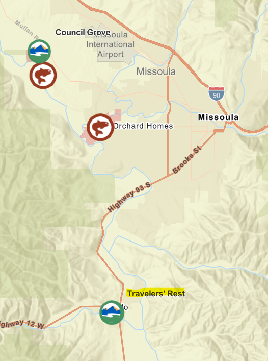
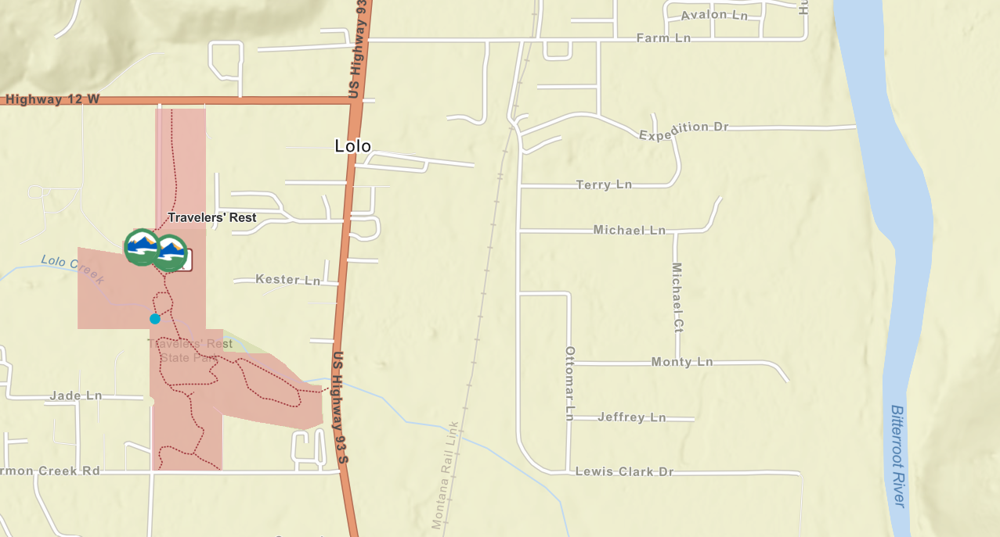
```

Here is a video of the reach, just to give a quick overview of what I'll be describing below!

```{r overviewvid, echo = F, warning=F, fig.align='center'}
library(voice)
embed_video(src = "./images/Module5/Lolo Overview.mp4", type = "mp4", width = 650)
```

# Field Sketch

```{r planformsketch, echo = F, fig.cap="Planform sketch of the whole reach. A second planform sketch was completed for the area shown by a box with a dotted line. ", out.width="70%", fig.align='center'}
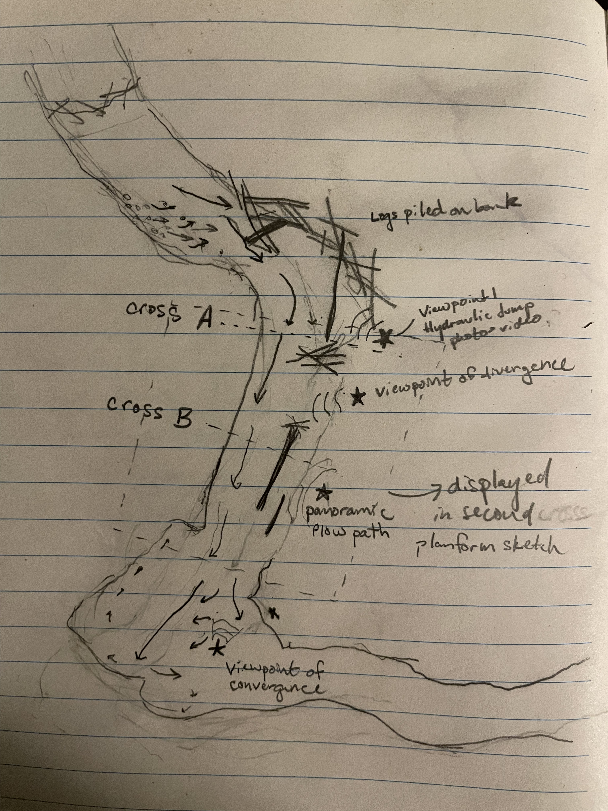
```

```{r planformcloseup, echo = F, fig.cap="Here\'s a closeup of the middle, more straight section of my first planform sketch. This shows the flow paths", out.width="70%", fig.align='center'}
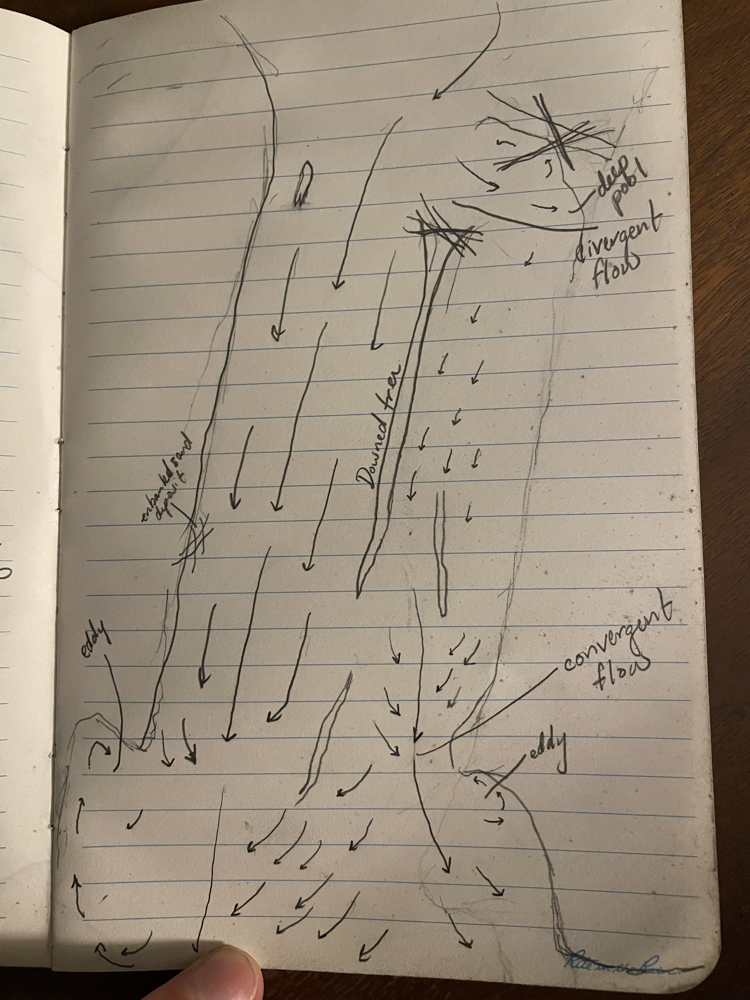
```

# Hydraulic conceptual examples

## Flow Direction

Below is one example of flow direction in a particularly busy section (Fig. \@ref(fig:FlowDirection)). Here we have the fastest moving water shown in red, getting faster as water previously separated from the central channel joins the flow. Just downstream, this fast moving channel flows directly into the bank, as the channel turns an acute angle to the left. This produces the slow moving eddy furthest from the viewer, with water moving extremely slowly in the opposite direction of the main channel. 

```{r FlowDirection, echo = F, fig.cap="Flow direction annotated on this section of stream. The fastest moving water is shown in red. Orange is medium speed, slowed down by high channel roughness, but kept moving by the higher slope. Finally, an eddy is produced just off to the left, where the fast moving channel collides with the streambank. ", out.width="70%", fig.align='center'}
knitr::include_graphics('./images/Module5/FlowDirection.jpg')
```

Here's another example, showing a larger portion of the reach above the previous photo (Fig. \@ref(fig:FlowDirectionChannel)). That same fast moving section is again shown in red. On either side of that fast moving channel, the water is slightly slower, with lower depth, and less discharge. I also show the contrast between that area on the other side of a downed tree, with the area of the channel closest to me, where flow moves much slower, due to interrupted flow caused by the roots of the downed tree crossing the channel. The channel is extremely deep here, but water moves very slowly. 

```{r FlowDirectionChannel, echo = F, fig.cap="Flow direction annotated on this section of stream. The fastest moving water is shown in red. Orange is medium speed, slowed down by high channel roughness, but kept moving by the higher slope. Finally, an eddy is produced just off to the left, where the fast moving channel collides with the streambank. ", out.width="100%", fig.align='center'}
knitr::include_graphics('./images/Module5/FlowDirection_LongerReach.jpg')
```

## Areas of convergent, divergent, and uniform flow

This reach had a lot of curves and a lot of uneven sides with enbanked log structures or a log in the middle of the river. This led to many areas of convergent and divergent flow, with relatively few areas with uniform flow. 

One area of divergent flow occurred around a long tree fallen parallel to the river, with the large root ball on the upstream side. Where flow came down from above and hit the roots, the flow split, pushing some flow into a (convergent) area of flow where water moved quickly downstream, and another portion into the bank. The area on the side of the channel where I was standing had incredibly slow flow and remained disconnected from flow on the other side of the channel for the length of the tree (Fig. \@ref(fig:divergentflow))

```{r divergentflow, echo = F, fig.cap="An area of divergent flow: the flow above this tree diverged strongly as it hit the root ball. ", out.width="70%", fig.align='center'}
knitr::include_graphics('./images/Module5/DivergentFlow.jpg')
```

Continuing downstream, the top of the tree in the stream had several branches, continuing the slow moving and spread out flow, until the branches ended, the streambank on the rightside of the photo below cut in, and the riffle starting below forced several flowstreams back into one stream moving much more quickly in this particular area (Fig. \@ref(fig:convergentflow)). 

```{r convergentflow, echo = F, fig.cap="An area of convergentflow flow: the streambank and the emerging riffle concentrated the flow here into a faster moving area of the stream. ", out.width="70%", fig.align='center'}
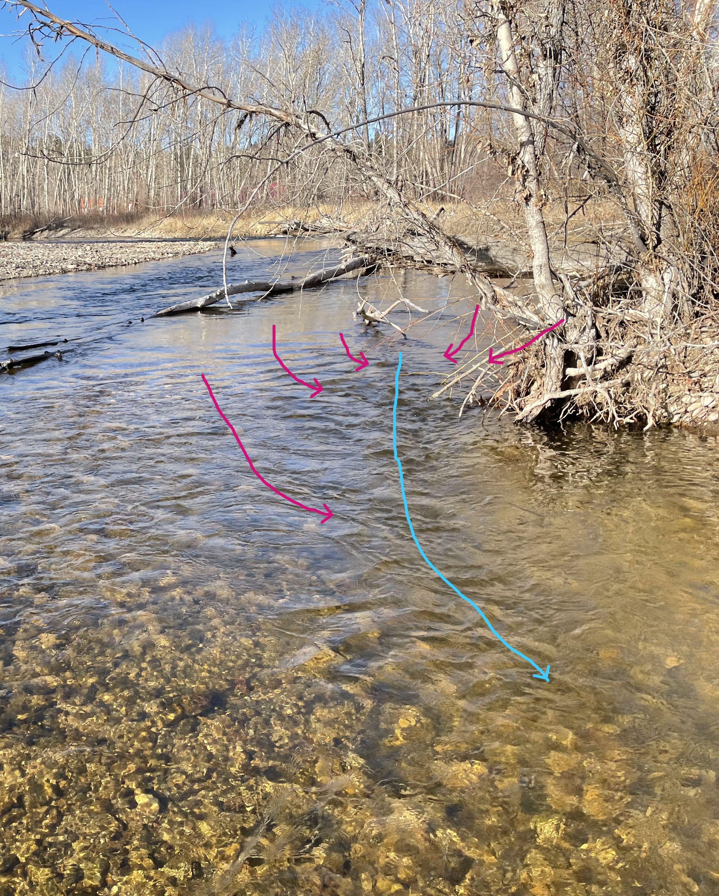
```

There were relatively few areas in this particular reach where I was seeing uniform flow. I took a picture further downstream, after the second bend captured in my reach diagram, looking upstream towards that bend, Here, the channel depth appeared fairly consistent, with few rocks or logs poking out and few bends to the channel (Fig. \@ref(fig:uniformflow)). This is the area most likely to have uniform flow. 

```{r uniformflow, echo = F, fig.cap="This area is much simpler than the main reach I looked at. Here is the most likely place to find uniform flow. ", out.width="70%", fig.align='center'}
knitr::include_graphics('./images/Module5/UniformFlow.jpg')
```

## Flow separation and reattachment

Here's another annotation of flow divergence and convergence (Fig. \@ref(fig:flowseparation)). Again, Around the branches of the downed tree, there were areas (marked in orange) where the flow separated. As the flow converged again, it showed a reattachment zone, where the curvature of the bank guided the diverged flow back into a faster moving channel. This faster run then had a clear flow seam as it flowed past the bank as it cut in again (red). This incut bank then had an eddy where the water began to flow in the opposite direction (green). 

```{r flowseparation, echo = F, fig.cap="Flow separation and reattachment zone shown in dark and light orange, respectively. A flow seam is seen in red between the faster moving water and the eddy closer to the bank (green). ", out.width="70%", fig.align='center'}
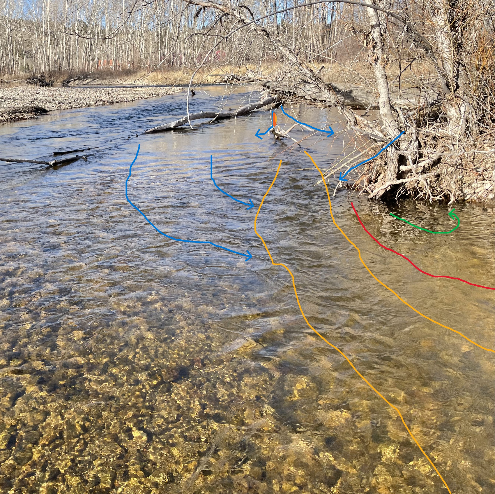
```

## Flow Types

There were quite a few examples of different flow types. Starting right at the top, the photo below is annotated with five different flows (Fig. \@ref(fig:flowtypes)). The reach I focused on starts with smooth surface flow just after a full channel obstruction (yellow). This section appears (from afar) to be quite deep before heading over a shallow riffle with unbroken standing waves pointing upstream (orange) (Fig. \@ref(fig:flowtypes2)). This riffle is directed straight into a side-channel obstruction, which is abrupt enough to cause the waves to break and show a brief rapid (purple). From here, the water had a nice run where ripples could be seen traveling downstream with a symmetrical arch (blue). As this water slowed down and crossed a floating log, surface movement became scarcely perceptible above a deep pool (red).

```{r flowtypes, echo = F, fig.cap="So many flow types could be seen in this one stretch of stream. ", out.width="70%", fig.align='center'}
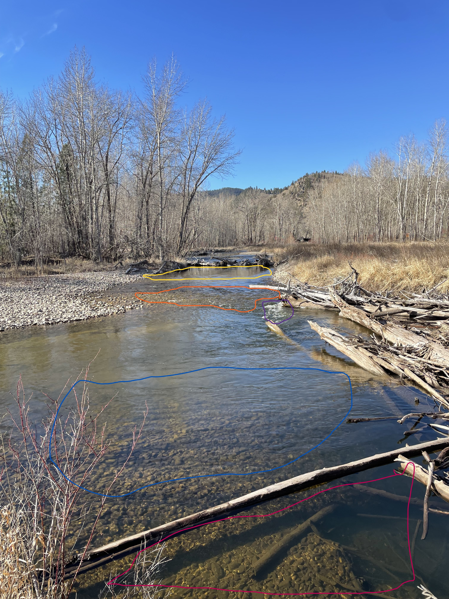
```

```{r flowtypes2, echo = F, fig.cap="A zoomed in photo of the top portion of this section of river. ", out.width="100%", fig.align='center'}
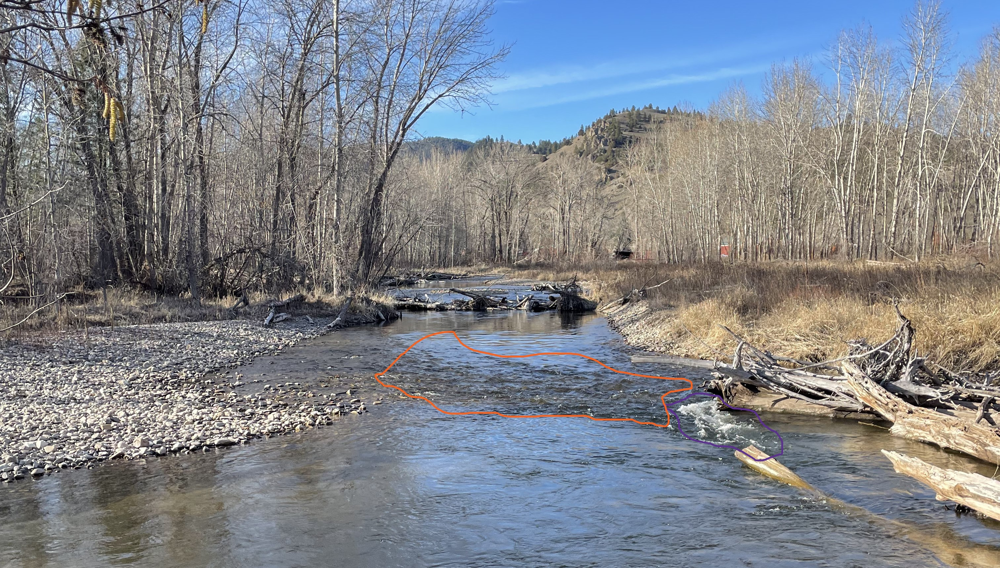
```

Downstream, there were more examples. In the photo below (Fig. \@ref(fig:flowtypes3)), a really clear run can be seen circled in blue. The ripples are nicely symmetrical here, where the relative roughness is low. Further upstream, the influence of the downed tree can be seen with extremely slow flow and mostly smooth surface. I threw a stick in this part of the channel, and it took a long time before it entered the run below. 

```{r flowtypes3, echo = F, fig.cap="Downstream were more areas of rippled and smooth surface flow. ", out.width="70%", fig.align='center'}
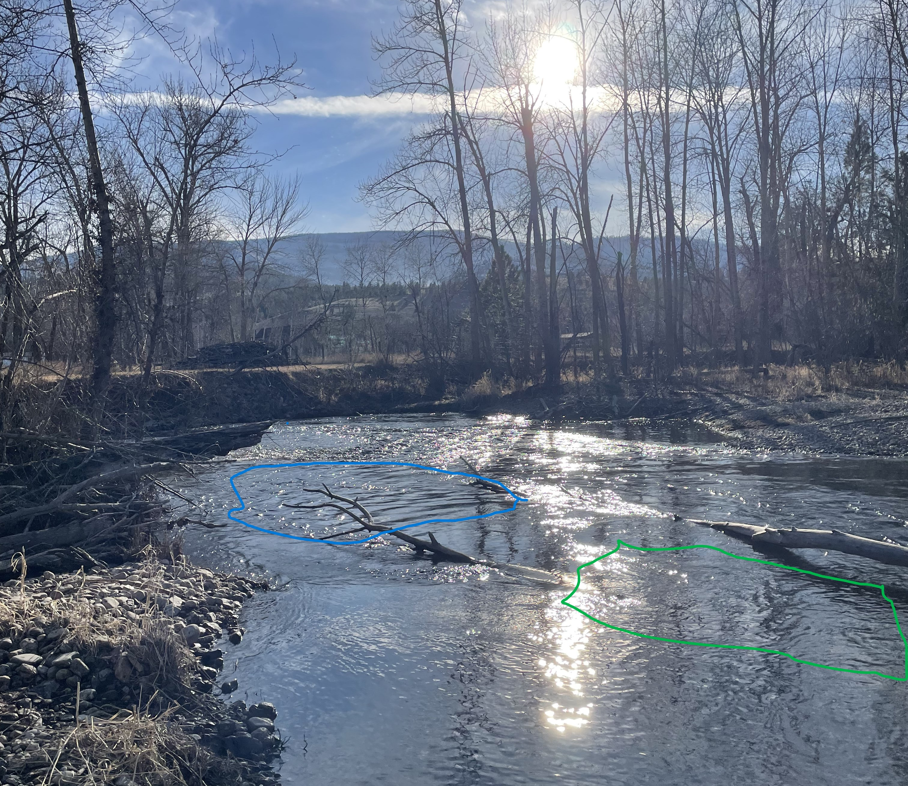
```

# Estimated discharge

I measured the average velocity by pacing out 10 m along the bank. I then threw a stick into the center of the channel and timed how long it took to move that distance (15 s). I did this a couple times, and found the same answer, leading me to calculate the discharge to be about 0.67 m per second. For area, I estimated the width and average depth at the same location as Cross-section B (see below). The width was roughly 17 m across, and 0.75 m deep, giving an area around 12.75 m^2. 

Using these measurements, I estimate the discharge to be around 8.5 cubic meters per second. 

# Cross sectional diagrams

I drew two cross-sectional diagrams, at points labelled A and B in Fig. \@ref(fig:crosssectionA). The first (Fig. \@ref(fig:)) is just above where the channel diverges around the downed tree. Here I show the deepest water is close to the bank, where water moving around the tree has carved out a deep pool. The fastest moving water was on the far side of the channel. 

```{r crosssectionA, echo = F, fig.cap="Cross-section A looking upstream, where diverging flow around the downed tree has carved out a deep pool on the near bank. ", out.width="70%", fig.align='center'}
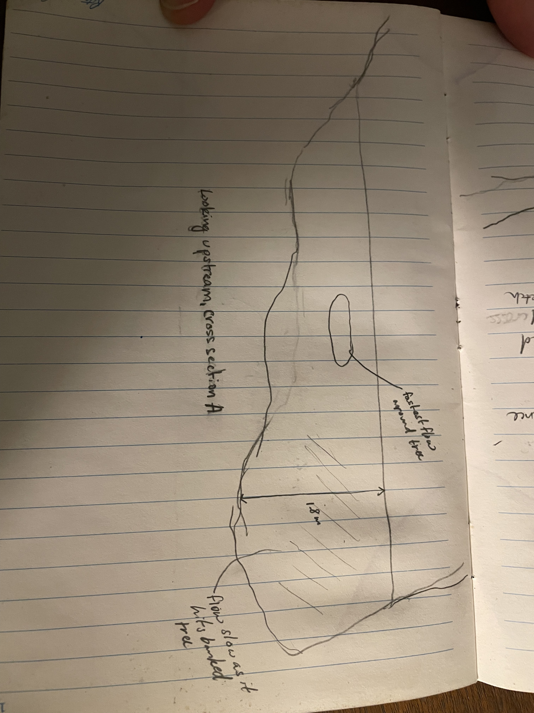
```

The second cross-section was taken after the initial divergence of the channel (\@ref(fig:crosssectionB)). The water closest to me, on the right side of the image was slow moving, with a gentle slope where slower moving water has deposited sediment on the bank. 

```{r crosssectionB, echo = F, fig.cap="Cross-section B looking upstream, showing channel shape where the downed log had changed flow. ", out.width="70%", fig.align='center'}

```

# Hydraulic Jump

The hydraulic jump I noted occurred before and after a riffle in the river. On either side of the riffle, we see smooth flowing water. These areas are going to be the subcritical zone, where any wave introduced will be able to travel upstream. In the riffle, we see more turbulent water where the velocity of flow has increased to the point where any waves will not be able to travel upstream. In the video below, I said this whole area is the hydraulic jump, but I think the jump occurs where the flow from the riffle runs into the slower zone below it (Fig. \@ref(fig:hydraulicjump))

```{r hydraulicjump, fig.show='hold', fig.cap='Unannotated and annotated photo of hydraulic jump. Yellow outlines highlight areas of subcritical flow before and after a riffle. Red outlines the riffle, in this case an area of supercritical flow. The purple line is drawn where supercritical, fast moving flow runs into slower subcritical flow - a hydraulic jump. ', out.width="50%", echo=F}
knitr::include_graphics("./images/Module5/HydraulicJump.jpg")
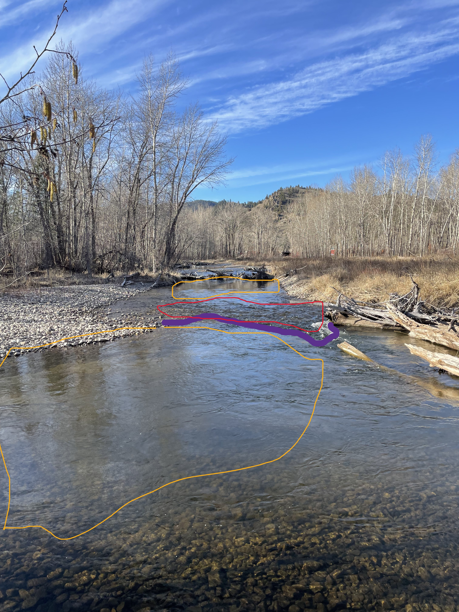
```

## Narrated Video

```{r hydraulicjumpvid, echo = F, warning=F, fig.align='center'}
library(voice)
embed_video(src = "./images/Module5/HydraulicJump.mp4", type = "mp4", width = 650)
```
