# Flume Controls

Flume controls are shown in the image below. 

```{r flumecontrol, echo=F, fig.cap='Flume controls. The blue arrow shows discharge. In orange is the slope. Sediment charge is shown in pink with amount of sediment falling through the trap. Green shows the height of the drain which controls the base level. ', out.width="75%"}

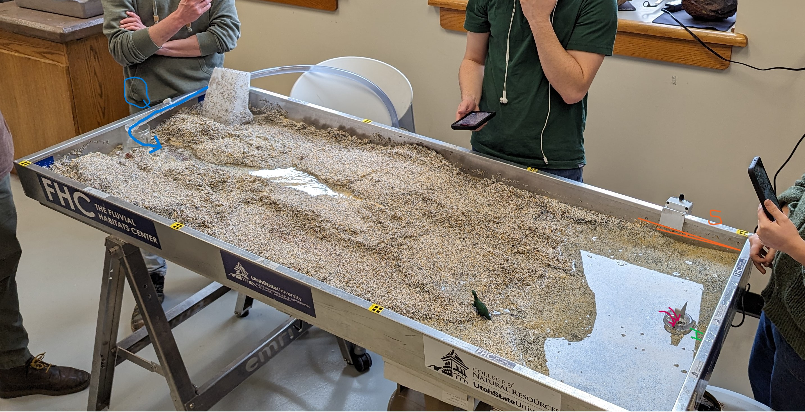
```

## Q: Water Discharge

Water discharge is the amount of water flowing through the flume. This is controlled by the water coming from the pump at the top of the flume. 

## S: Slope

Slope of the river overall is controlled by the angle of the table. Shifting and piling the sediment in the table can also cause there to be higher or lower slope locally, but the table angle is the ultimate control.

## Qs: Sediment Discharge

Sediment discharge is the amount of sediment moving through the system and ultimately being released. This would be the amount of sediment per unit time falling through the trap at the low end of the flume. 

## Profile

The longitudinal profile of the system is the change in the height of sediment over the length of the flume. This changes over time as the force of the river attempts to return to base level. 

## Base Level

Base level is the height to which the water in the flume is attempting to return. This is controlled by the level of the drain at the end of the flume. If the flume drain is high, the water builds up at the end in a pool, and the height of that pool defines the base level for the water moving through it. 

# Fluvial Geomorphic Processes

## Bed Erosion

Bed erosion occurs in the bottom of the channel, where the discharge of the river is strong enough to entrain material from the bottom in its flow. I see more concentrated bed erosion where the local slope is higher or where local discharge in a particular channel increases. In the video below, see how the closing off of one channel increases the discharge in a smaller, high slope channel. 

```{r bederosion, echo = F, warning=F, fig.align='center'}
library(voice)
embed_video(src = "./images/Module6/Bed Erosion.mp4", type = "mp4", width = 650)
```

## Bank Erosion

Bank erosion occurs when the water flow entrains sediment from the sides of the channel. This is particularly pronounced in the outside bends of meanders, or where the flow is directed more perpendicularly into the side of the stream. In the video below, yellow lines and arrows mark where bank erosion occurs, making a straight section slowly become increasingly meandering. 

```{r bankerosion, echo = F, warning=F, fig.align='center'}
embed_video(src = "./images/Module6/Bank Erosion.mp4", type = "mp4", width = 650)
```

## Deposition

Deposition occurs when the discharge drops to the point where entrained sediment begins to fall out of flow, leading to a build up of sediment. This happens where flow velocity is suddenly reduced, either by a lower local slope, or on the inside of meanders. Larger grains fall out of flow more quickly than smaller grains. 

```{r deposition, echo = F, warning=F, fig.align='center'}
embed_video(src = "./images/Module6/Deposition.mp4", type = "mp4", width = 650)
```

## Sediment Transport

Sediment transport is when sediment is already entrained in the water flow and is transported downstream. The stream power has to be great enough to keep the available sediment either moving as bedload or suspended in the discharge itself. In the video of the flume, sediment transport increases greatly with more discharge, particularly when the flume is flooded. 

```{r Transport, echo = F, warning=F, fig.align='center'}
embed_video(src = "./images/Module6/Transport.mp4", type = "mp4", width = 650)
```

# Fluvial Geomorphic Mechanisms

## Grain size sorting

Grain-size sorting occurs in the flume where the transport capacity is at a threshold where some grains fall out disproportionately. This results in the occurrence of more concentrated large, or small grain sizes. This happened in a few different places. During flood events, I could particularly see where the threshold was just above that which could move the largest grains. These grains were the fastest to fall out, resulting in more yellow grains being left behind on the floodplain reached only by the largest flows. Deposition of yellow grains in the channel also had the most capacity to change the flow of the river as discharge declined. Where yellow grains settled, the channel quickly redirected itself around them. Behind objects (like a pencil placed in the flow) more small grains tended to concentrate, as the flow decreased behind the object, preventing these grains from becoming entrained. The majority of the sediment movement in channels was made up of the black and white grains. Red was hard to track. Occasionally it became concentrated in particular areas, but then was gone as quickly as it appeared. 

```{r grainsorting, fig.show='hold', fig.cap='During a big flood, the yellow grains were finally moved, but deposited quickly. The channel quickly moved to go around them as they settled in its path', out.width="70%", echo=F}
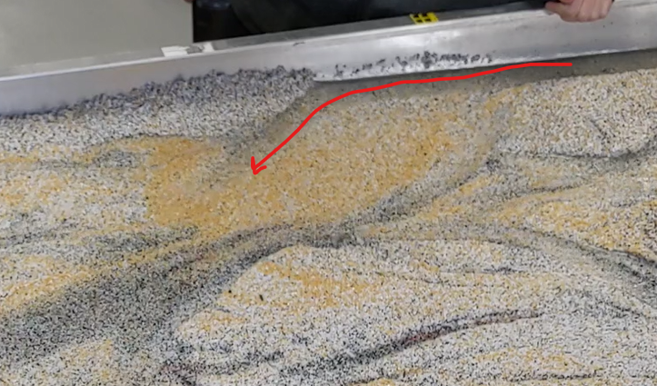
```

## Meandering

Meandering occurs where a river begins to bend and curve. This starts as the stream power decreases such that deposition occurs on one side of the river. The flow then begins to curve to avoid the deposited sediment, resulting in flow eroding the opposite bank. 

```{r meander, fig.show='hold', fig.cap='A developing meander. Zones of deposition are highlighted in yellow. Zones of erosion are highlighted in pink. ', out.width="33%", echo=F}
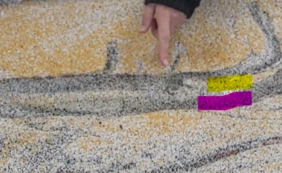
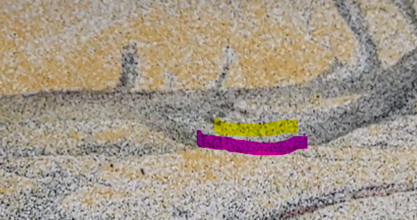
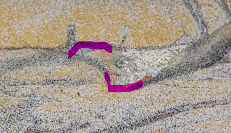
```

## Braiding

Braiding occurs where deposition leads to the development of one or more mid-channel islands. Once deposition begins, the island grows downstream, as flow is forced to either side, and deposition occurs on the inside of both side channels. 

```{r braid, fig.show='hold', fig.cap='A braiding channel. Blue arrows shows where flow has been split, causing erosion on the outside bends and deposition on the downstream side of the developing island. ', out.width="50%", echo=F}
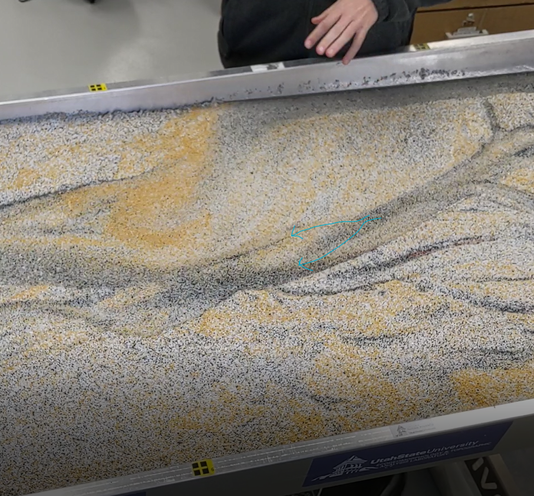
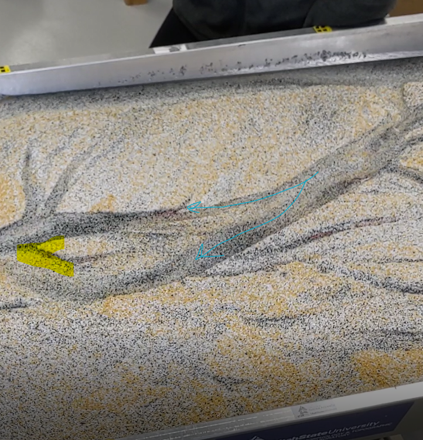
```

## Avulsion

Avulsion is the process by which a river abandons a lower slope channel in favor of a higher slope channel. This happens as the sediment build-up from deposition in the first channel becomes great enough that the stream forges a new path. Once a more efficiently sloped channel is cut, the original one is abandoned. In the below screenshots, the tunnel around one channel collapses, resulting in a new channel with a higher slope being cut. 

```{r avulsion, fig.show='hold', fig.cap='The collapse in sediment blocking the flow of the main channel (red) results in the flow being redirected over higher slope terrain. ', out.width="33%", echo=F}
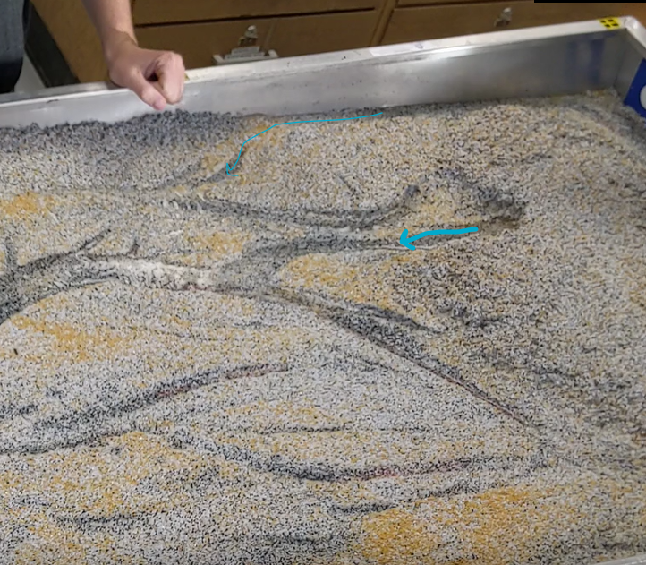
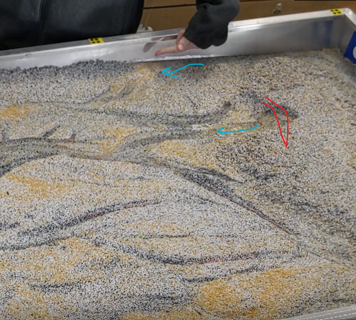
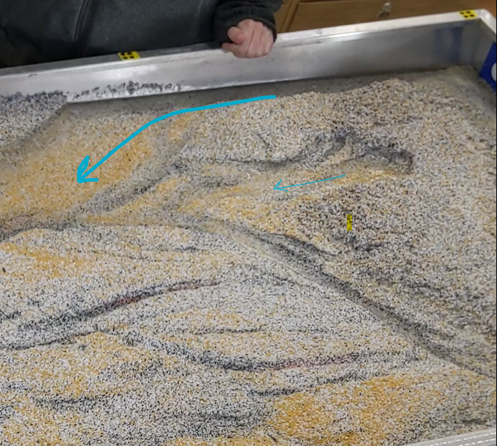
```

## Chute Dissection

Chute dissection is where meanders are cut off, as the velocity of the flow is such that it fully erodes through the floodplain on the outside of the meander. In the below screenshots, see a section before and after a flood. Initially there is a meandering stream. During the flood, the floodplain maintaining the meanders is eroded. Even after the flood recedes, the stream left over appears straighter.

```{r dissection, fig.show='hold', fig.cap='Before and after a flood, see how floodplain erosion in a meandering section results in a straighter river after the flood recedes. ', out.width="33%", echo=F}
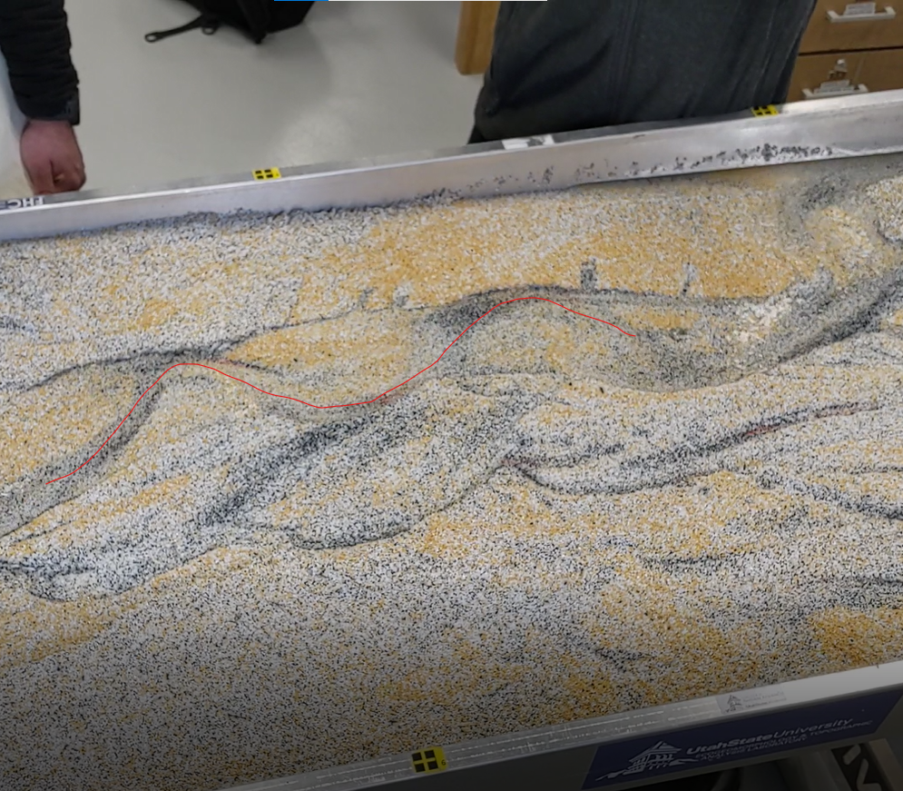
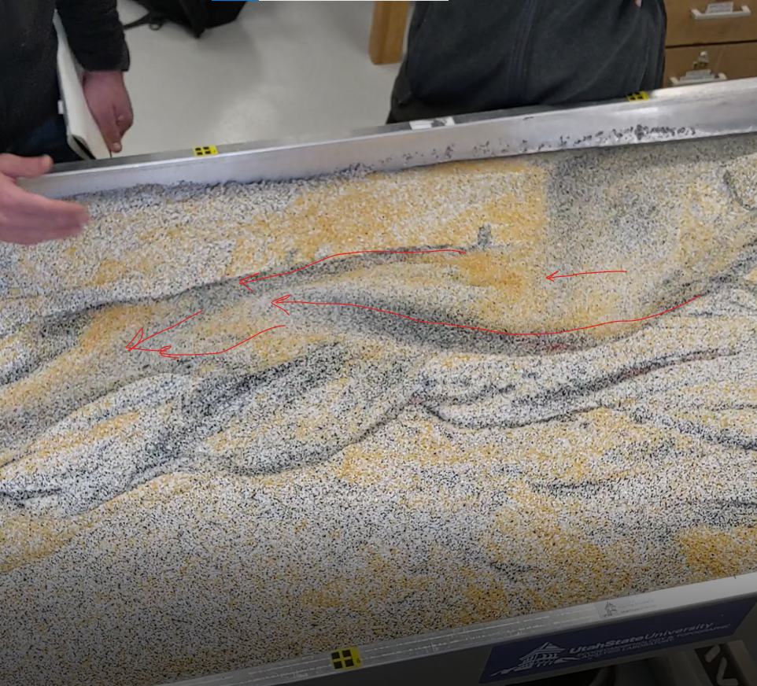
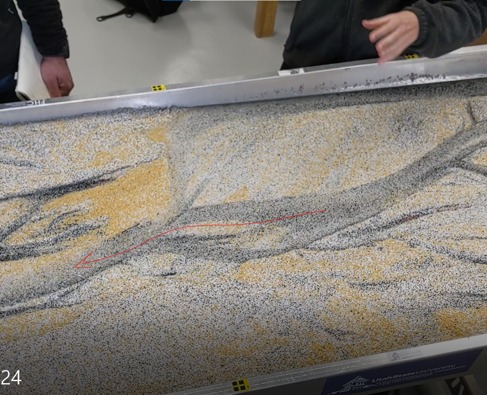
```

## Structural Forcing

Structural forcing occurs when objects, such as dams or vegetation change the pattern of flow. In this example, a branch cuts off the flow of a channel. The flow changes to move around it, leading to erosion on the right side of the downstream flow and deposition of sediment in front of the vegetation.

```{r forcing, fig.show='hold', fig.cap='Flow is shown in red. After the physical obstruction is added, redirected flow results in deposition (highlighted in yellow) and erosion on the right side looking downstream. ', out.width="33%", echo=F}
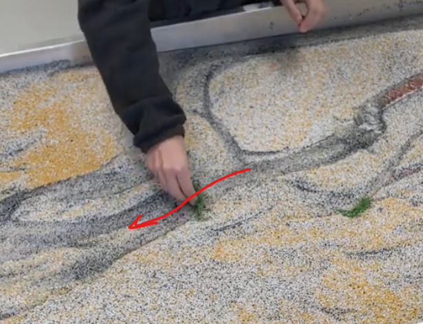
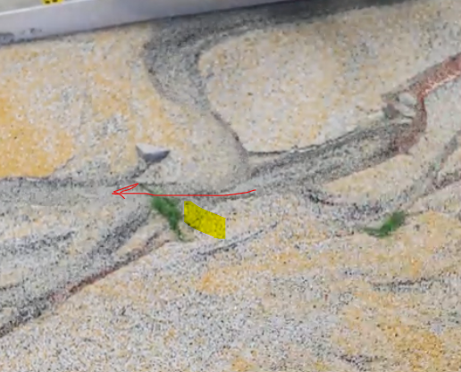
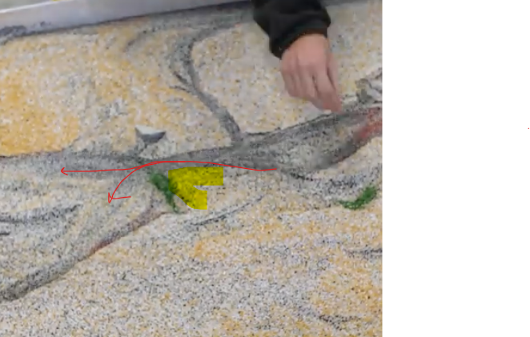
```

## Single thread meandering channel

In the photos and videos I saw, I didn't see a single thread, meandering channel. This must result from a careful balance of erosional and depositional forces. These balances are difficult to maintain. If deposition becomes too strong, additional, smaller channels begin to develop. If erosion becomes too strong, the meanders get cut off. Too much stream power can easily throw off the balance of these forces. Riparian vegetation as well as grain cohesion would help maintain the balance more easily, but without those stabilizing factors, slight changes quickly result in redirected channel(s). 

# Events

## Small Flood

With a small flood, smaller channels become wider and more straightened as the banks are eroded laterally. However, smaller floods were not always enough to fully reroute the channel paths. This would be even more true in a true channel, where stabilizing vegetation and cohesion would better counteract the additional erosive factors of the larger stream power. 

```{r smallflood, fig.show='hold', fig.cap='A small flood resulted in channel widening and straightening, with significant erosion in the beds. However, the general paths of the preexisting channels remained. ', out.width="50%", echo=F}
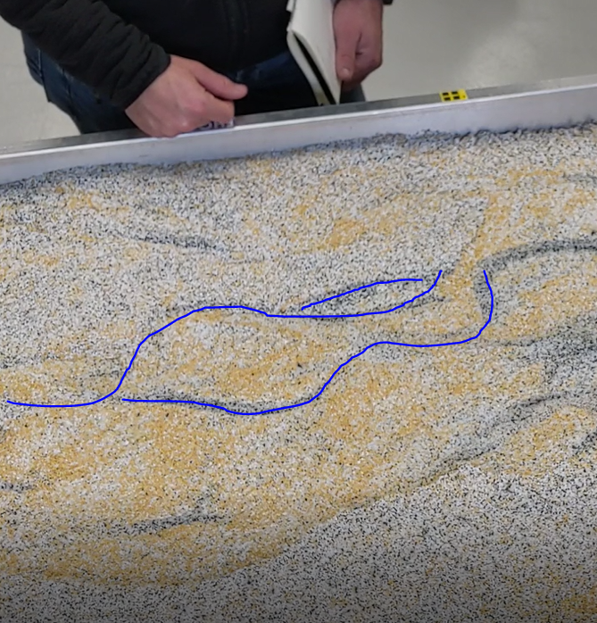
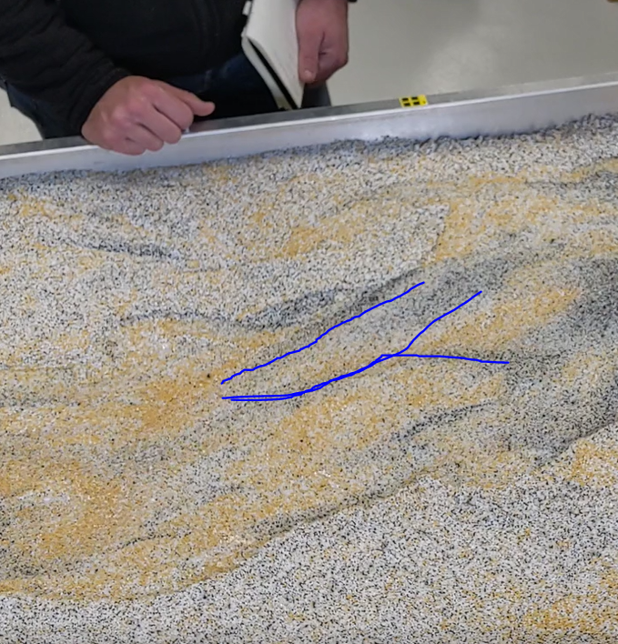
```

In the following video, watch as this initial small flood, turns into a much bigger flood. 
```{r flood, echo = F, warning=F, fig.align='center'}
embed_video(src = "./images/Module6/SmallThenBigFlood.mp4", type = "mp4", width = 650)
```

## Big flood

After a big flood, all the channels were fully reworked. The preexisting channels disappeared in favor of one straight, wide channel taking its quickest path to the drain. The below example was taken right after the smaller flood. You can see how side channels become fully abandoned, as both bed and bank erosion resulted in a channel with higher slope and more direct access to the drain. Even after flows receded, they did not return to the abandoned channels on the lower side of the photos. 

```{r bigflood, fig.show='hold', fig.cap='A small flood resulted in channel widening and straightening, with significant erosion in the beds. However, the general paths of the preexisting channels remained. ', out.width="50%", echo=F}
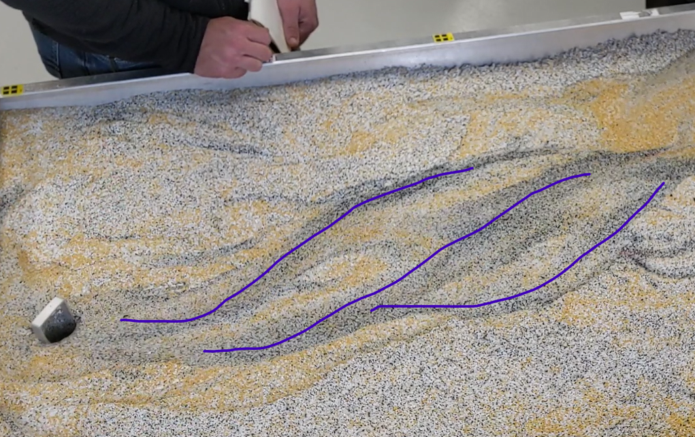
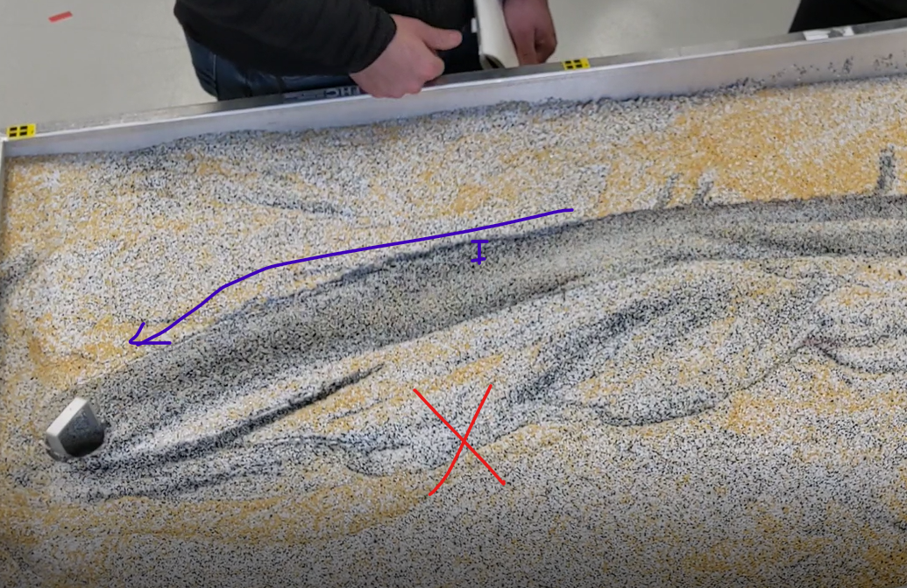
```

## Channel Realignment (Grading)

Channel realignment occurred at the end of the video where vegetation was placed in the channel to reintroduce bends in the flow (see Fig. \@ref(fig:forcing)). In the video of the flood, only minimal realignment is possible within the bounds of the inset channel. As flow decreases, it can't maintain the full channel, leading to deposition on one side of the larger channel, and curving of the flow to recreate a smaller meander. To get back out of the large channel from the flood, a little more reworking of the sediment is required.

## Impacts of small and big floods

From watching the videos online, I can see that both small and large floods do a lot of work to erode the banks and move sediment downstream. With the small flood, this resulted in more channels with more spread out flood as previously abandoned reaches are rewetted. While erosion occurred, there was also deposition leading to more braiding and the formation of islands as the flood receded slightly The large flood fully transformed the flume, resulting in a much more straight channel. It was harder for subsequent flooding to overcome the erosion done by the larger flood. While the channel reintroduced a meander, the bends were still constricted to the inset valley. 

## Overbank, Bankfull, or Base Flow?

The type of flow observed in the flume would depend on what we're interpreting as bankful in this particular flume. I would think of the large flood as having overbank flooding, where the previously established channels are overflowing and flowing across the "floodplain". Bankfull flows would be where the flow is at the top of the established channels, but not yet overflowing. Baseflow would be at times when the flow was above the top of the established channels. However, it's a little difficult to define these specifically in the flume, observed over just a few minutes, as baseflow and bankfull are typically determined over much longer timescales. 

## Hyporheic flow

In the flume, there were times where I could see a section where the channel grew from the downstream side. As water flowed through the sediment and eventually into the downstream channel, erosion occurred at the downstream side first, then eroding a channel, until the upstream sediments were not supported anymore.

```{r hyporheicflow, echo = F, warning=F, fig.align='center'}
embed_video(src = "./images/Module6/Hyporheic Flow.mp4", type = "mp4", width = 650)
```

## Recession Limb Flows

Recession limb flows are typically more confined to the deeper channels cut by large flooding events. As they can't maintain the full width, deposition in the larger channel begins to cut off sections of the larger flow, resulting in in-stream channel bars which redirect flows. 