# Introduction

```{r feshieoverview, fig.cap='A photo overlooking the Feshie, the stream in focus for this module. ', out.width="100%", echo=F}
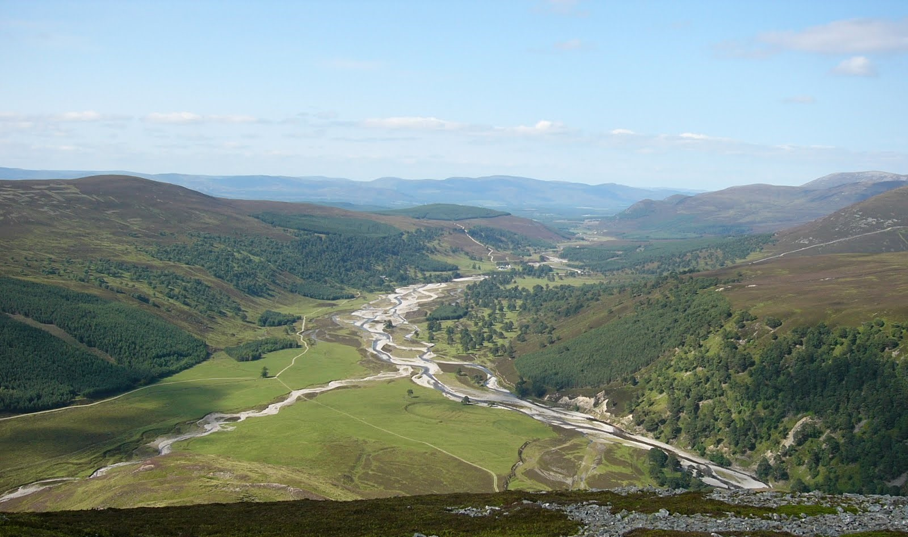
```

This week's assignment brings us to the Feshie in Scotland. For this assignment, I used GCD software to perform a basic budget segregation analysis. I had two time periods I looked at: 2003 - 2004 and 2004-2005. For each time period, I traced one area that represented each of four types of changes to elevation: Bank Erosion, Channel Bed Lowering, Channel Bed Rising, and Bar Development. Note: I came up with a plan for how to execute this assignment, and then afterwards realized a lot of the screenshots would probably have been more useful zoomed out. Sorry about that!

In 2003 to 2004, channel locations changed some, resulting in a large amount of area that changed, but much of this area cancelled out, with just 9.37% of the total area showing detectable change. The net change in volume was -816.8 ± 926 cubic meters, with total surface raising volume of 1106 ± 463 cubic meters and total surface lowering volume of 1923 ± 802 cubic meters. 

Changes from 2004 to 2005 were much larger, with the total thresholded area with detectable change of 22.8% - over double the area change from 2003-2004. The volume of material was also much greater - a net change of -738 ± 2207 cubic meters, with volume of surface raising of 4841 ± 1444 cubic meters and a volume of surface lowering of 5579 ± 1669 cubic meters. While the net change is not necessarily that different from the year before, the volume moved is close to 3 times as much (Fig. \@ref(fig:volumewholereach)). 

```{r volumewholereach, fig.show='hold', fig.cap='Volumetric change across the whole reach of the Feshie from 2003-2004 (left) and 2004-2005 (right). ', out.width="50%", echo=F}
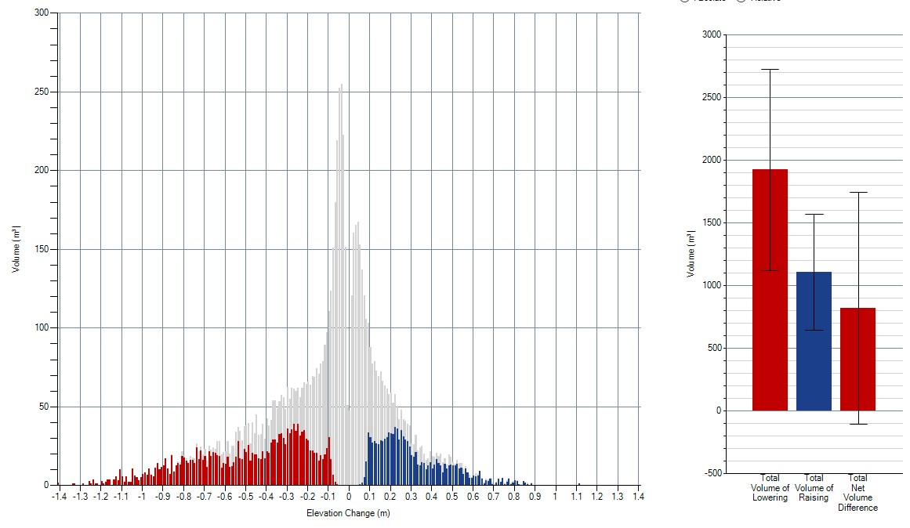
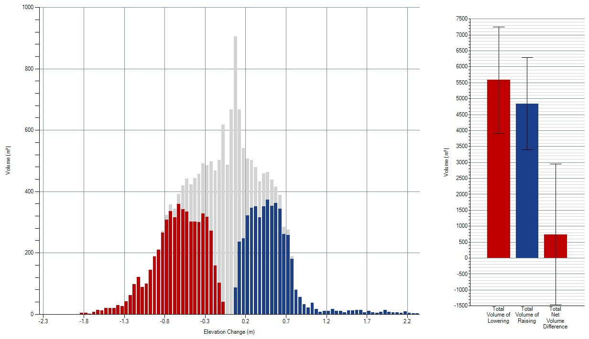
```

# Bank Erosion

## Bank Erosion in 2003 to 2004

My example of Bank Erosion in this year was a thin sliver of bank that shifted slightly to the left across an area of 249 m^2. Total volume removed was 127±51 cubic meters. Average depth of lowering was 0.65 m. See the comparison in the images below (Fig. \@ref(fig:bankerosion20032004)). Looking at the DEM, this section has a clear pattern consistent with bank erosion - where the channel likely scoured the outside bend of a curve. The result is a sliver of lost elevation. 

```{r bankerosion20032004, fig.show='hold', fig.cap='Bank Erosion from 2003 to 2004. See the DEM from 2003 (left), 2004 (middle), and the change detected (right). The polygon used to perform the analysis is shown in black. ', out.width="25%", echo=F, fig.align='center'}
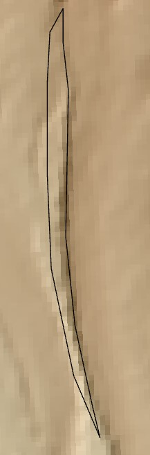
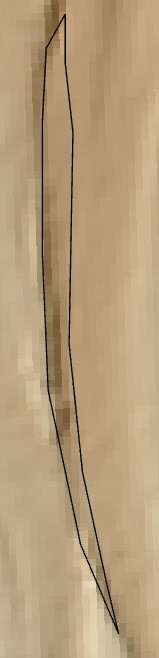
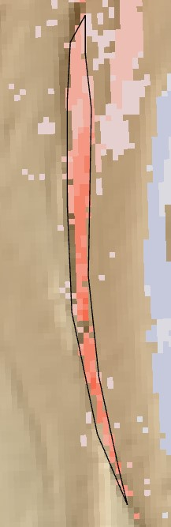
```

## Bank Erosion in 2004 to 2005

My example of Bank Erosion in this year was another, slightly larger section (340 m^2) of bank that shifted slightly to the left. Total volume removed was 318±79 cubic meters. Average depth of lowering was 0.99 m, demonstrating the larger magnitude of bed and bank shifts during this time compared with the 2003-2004 timeframe. See the comparison in the images below (Fig. \@ref(fig:bankerosion20052004)). 

```{r bankerosion20052004, fig.show='hold', fig.cap='Bank Erosion from 2004 to 2005. See the DEM from 2004 (left), 2005 (middle), and the change detected (right). The polygon used to perform the analysis is shown in black. ', out.width="25%", echo=F}
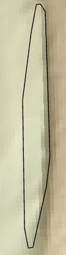
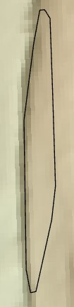
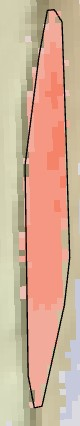
```

In this case, the larger flows upstream appear to have changed the direction of flow slightly so that this particular bank is now on the outside of a slight curve, rather than the inside of a curve like it was the year before (Fig. \@ref(fig:bankerosionflowdirection)). 

```{r bankerosionflowdirection, fig.show='hold', fig.cap='The change in flow direction between 2004 and 2005 is shown using the blue arrows', out.width="30%", echo=F, fig.align='center'}
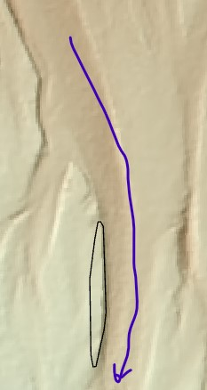
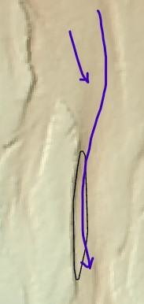
```

# Channel Bed Lowering (incision)

## Channel Incision in 2003 to 2004

My example of channel incision in this year was a fairly large area (1718 m^2) of a wider section of the channel. Total volume removed was 634±239 cubic meters. Average depth of lowering was 0.43 m. See the comparison in the images below (Fig. \@ref(fig:channelincision20042003)). Looking at the DEM, it's clear that while the area is large, there's not as pronounced a loss of elevation, except on the left side towards the bottom where I accidentally included some bank erosion as well. This fits with what I would expect from channel incision across a wider portion of the channel: slight changes across a broader area. 

```{r channelincision20042003, fig.show='hold', fig.cap='Channel incision from 2003 to 2004. See the DEM from 2003 (left), 2004 (middle), and the change detected (right). The polygon used to perform the analysis is shown in black. ', out.width="25%", echo=F, fig.align='center'}
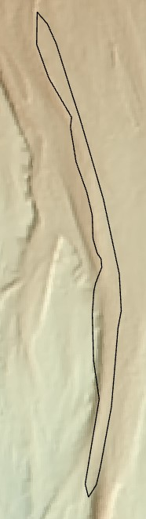
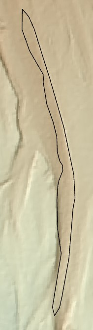
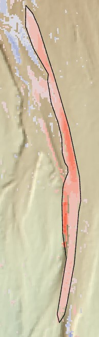
```

We can also see a peak in the volume loss at a fairly low elevation loss in the histogram below. 

```{r channelincision20042003hist,fig.cap='Histogram of the volume change from 2003 to 2004 in this section of channel incision. Note the peak of volume loss at a comparatively low elevation loss.', out.width="60%", echo=F, fig.align='center'}
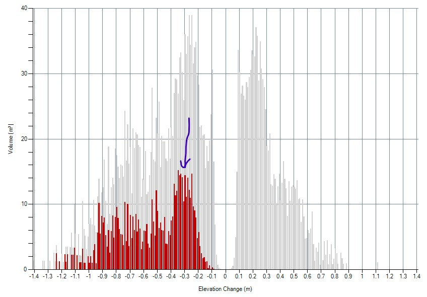
```

## Channel Incision in 2004 to 2005

My example of channel incision in this year was an area (709 m^2) of a wider section of the channel. Total volume removed was 323±108 cubic meters. Average depth of lowering was 0.52 m. Again, though this section is smaller than my focal area from the previous timeframe, a greater average depth across that area was observed. See the comparison in the images below (Fig. \@ref(fig:channelincision20042003)). Looking at the DEM, this seems like a case of the whole channel shifting over such that the location of the inside bend is now in this section. This is accompanied by channel aggradation to the left in an area that has now become the outside bend of the channel. It is a little hard to tell whether this is bank erosion or channel incision, but in the below DEM of 2004, some slight shadows above this section made me suspect this area is still part of the channel bed, though still it's a little hard to tell for sure. 

```{r channelincision20052004, fig.show='hold', fig.cap='Channel incision from 2004 to 2005. See the DEM from 2004 (left), 2005 (middle), and the change detected (right). Arrows in the left photo highlight shadows in the DEM that made me think this was channel incision rather than bank erosion. The polygon used to perform the analysis is shown in black. ', out.width="33%", echo=F}
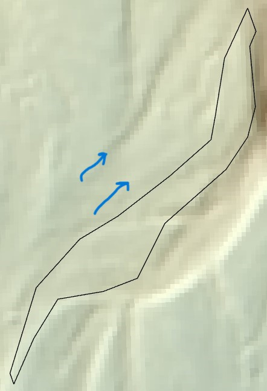
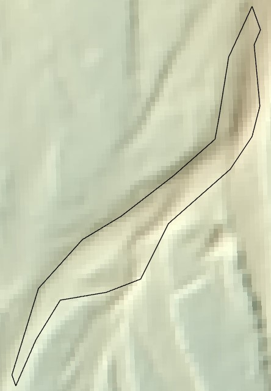
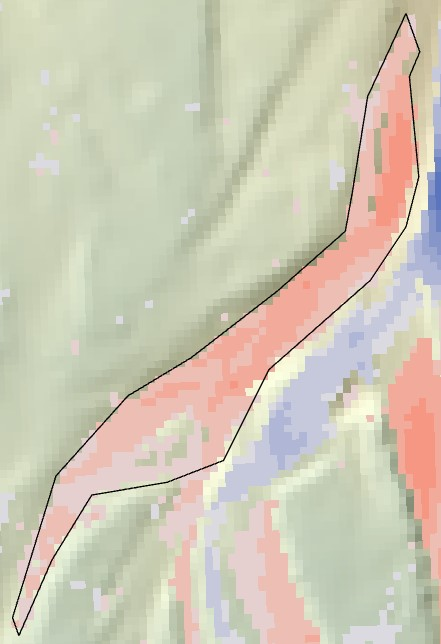
```

# Channel Bed Rising (aggradation)

## Channel Aggradation in 2003 to 2004

My example of channel aggradation in this year was a small area on the inside of a bend in the channel. Total volume added was 61±20 cubic meters. Average depth of raising was 0.39 m. See the comparison in the images below (Fig. \@ref(fig:channelaggradation20042003)). The location makes sense for channel aggradation - on the inside of a curve where the slower moving water is likely to deposit some sediment, resulting in the bed rising. 

```{r channelaggradation20042003, fig.show='hold', fig.cap='Channel aggradation from 2003 to 2004. See the DEM from 2003 (left), 2004 (middle), and the change detected (right). The polygon used to perform the analysis is shown in black. ', out.width="25%", echo=F, fig.align='center'}
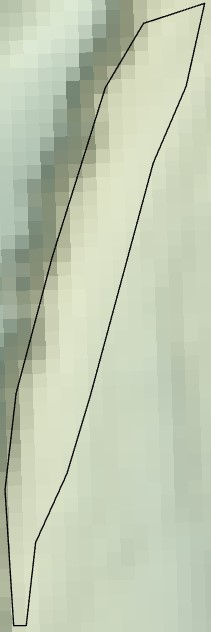
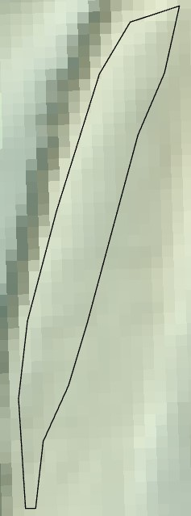
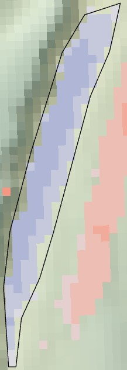
```

## Channel Aggradation in 2004 to 2005

My example of channel aggradation in this year was a small area in the middle of a channel. Magnitude of change here was small, but unlike other areas, there isn't a clear pairing of neighboring erosion and deposition. Instead, it appears this particular channel just raised slightly (Fig. \@ref(fig:channelaggradationzoomout)). 

```{r channelaggradationzoomout, fig.show='hold', fig.cap='See how this particular polygon is on the periphery, and is not accompanied by an adjacent channel degradation. ', out.width="60%", echo=F, fig.align='center'}
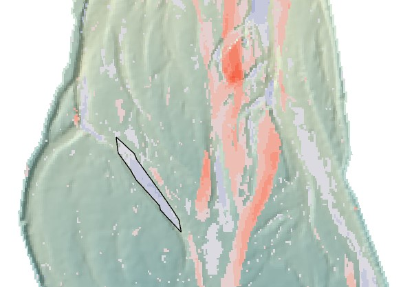
```

Total volume added was 108±36 cubic meters. Average depth of raising was 0.4 m, making this one of the smaller magnitude areas of change. See the comparison in the images below (Fig. \@ref(fig:channelaggradation20052004)). I'm guessing the high flows led to more concentrated flow in the center of the river valley, leading to slightly lower flows in this side channel compared with other years, resulting in some aggradation. 

```{r channelaggradation20052004, fig.show='hold', fig.cap='Channel aggradation from 2004 to 2005. See the DEM from 2004 (left), 2005 (middle), and the change detected (right). The polygon used to perform the analysis is shown in black. ', out.width="33%", echo=F}
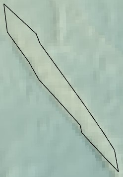
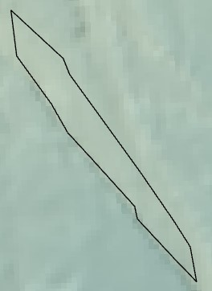
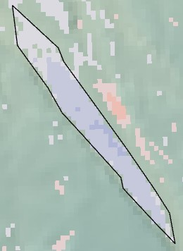
```

# Bar Development

## Bar Development in 2003 to 2004

My example of bar development in this year was a small area where the channel appeared to lower to the sides of a feature that increased in elevation between them. Total volume added was 57±21 cubic meters. Average depth of raising was 0.35 m. See the comparison in the images below (Fig. \@ref(fig:bardevelopment20042003)). Looking at the DEM, this section has a clear pattern consistent with bar development, particularly with the erosion happening north and south of where the bar is raising. 

```{r bardevelopment20042003, fig.show='hold', fig.cap='Bar development from 2003 to 2004. See the DEM from 2003 (left), 2004 (middle), and the change detected (right). The polygon used to perform the analysis is shown in black. Arrows point to areas where the channel eroded around the developing bar. ', out.width="33%", echo=F}
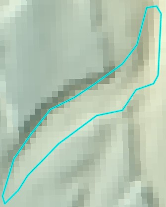
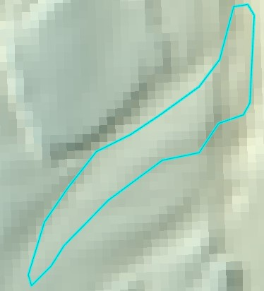
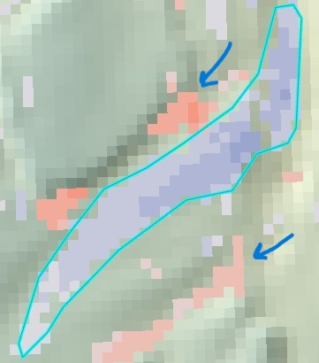
```

## Bar Development in 2004 to 2005

My example of bar development in this year was a small area where the channel appeared to lower to the sides of a feature that increased in elevation between them. Total volume added was 78±23 cubic meters. Average depth of raising was 0.28 m. See the comparison in the images below (Fig. \@ref(fig:bardevelopment20052004)). This particular area has defined channels on either side of a rising bar. The DEM's don't look all that different between the two years, with the channels staying in place, but the bar does appear to rise somewhat. 

```{r bardevelopment20052004, fig.show='hold', fig.cap='Bar development from 2004 to 2005. See the DEM from 2004 (left), 2005 (middle), and the change detected (right). The polygon used to perform the analysis is shown in black.', out.width="33%", echo=F}
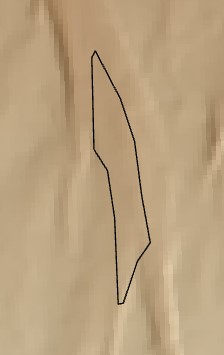
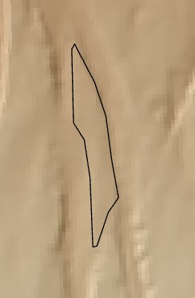
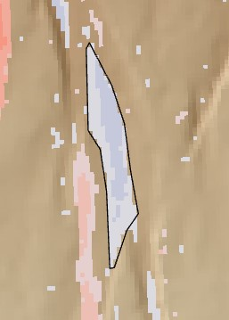
```
