# Willow Springs, OR Geomorphic Units Mapping

## Creating the geomorphic extents layer

For this assignment, I first needed to map geomorphic units on a stretch of Wychus Creek in Sisters, OR. This stretch had obviously recently undergone a restoration project inputting a number of piles of woody debris, channel-spanning dams, and other structural elements into the creek. This resulted in fairly complex geomorphic units. 

I started by mapping the mid-channel and bank-attached bars. These were fairly easy to find, though their precise boundaries were more challenging, since their outermost boundaries likely are under the current water flow. Another challenge was the trees and shrubs that overhang the channel, making it hard to see the boundaries. 

Then I started to go back and try filling in more of the stream. Here, I ran into a lot of issues. First, some features were hard to find or define the margins. Pools, since they are under the water, were particularly difficult to map. In many instances, I had to intuit a pool rather than map what I could see in the stream reach itself (Fig. \@ref(fig:poolithink)). 

```{r poolithink, fig.show='hold', fig.cap='This location made sense for there to be a pool - It is located on the outside of a curve, with a bar on the inside of the riverbend. However, I could only just make it out in the imagery. The boundaries (right) were a guess. ', out.width="40%", echo=F, fig.align='center'}
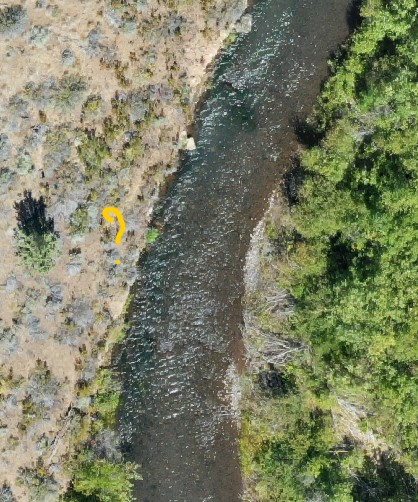
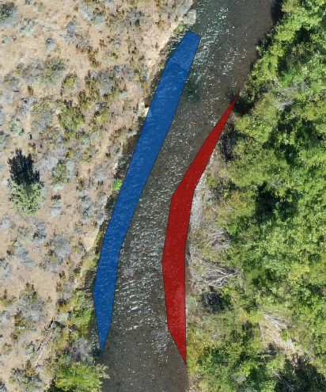
```

The newly installed woody debris also felt challenging. The debris was obvious, as was the change to the way the water moved around it, however, changes to the geomorphic surfaces seem to only just be forming. It's unclear at what scale I should be mapping these - are they all a part of one feature, or are they multiple mid channel bars in a row? The underlying processes also didn't really apply since they are human-installed. In the example below, there are a chain of woody debris piles, but the process creating them, while common for all them, is not a geomorphic one. Humans installed them. Behind a few of them, we can see how sediment is moving differently behind them, but that hasn't yet led to a change in the elevation of the channel bed, at least not obviously (Fig. \@ref(fig:humaninstalled)). 

```{r humaninstalled, fig.show='hold', fig.cap='A series of midchannel woody debris. Arrows point where sediment is clearly moving differently behind them, but resulting geomorphic units have yet to form. ', out.width="60%", echo=F, fig.align='center'}
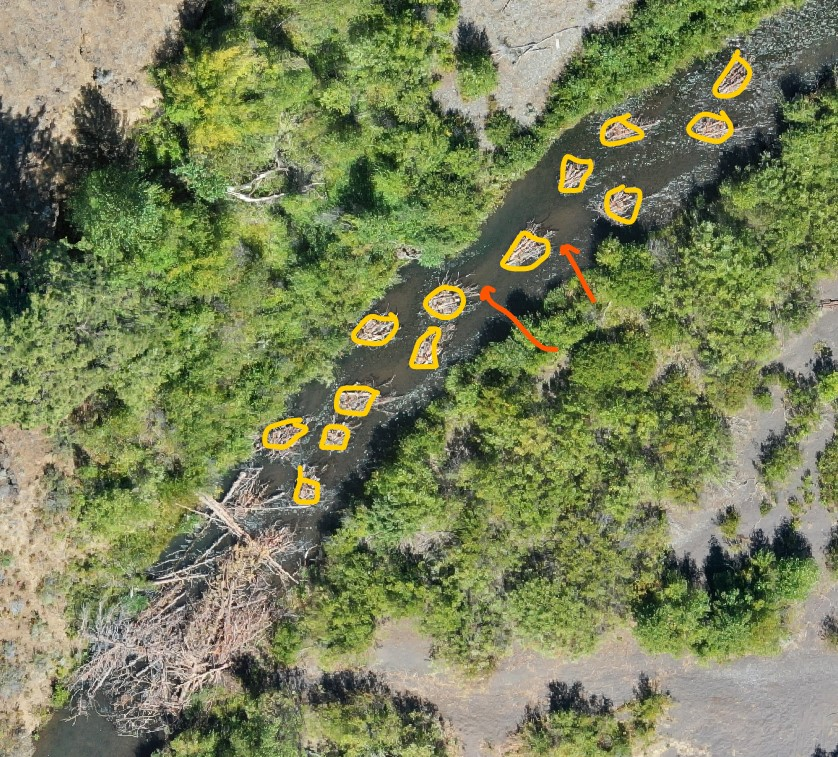
```

Some areas didn't clearly fit into a category in my mind - take this stretch where flow was being concentrated by a series of bars (Fig. \@ref(fig:concentratedflow)): Is this a chute or a run/glide? Can the thalweg be in a chute? How can I tell without knowing the underlying surface? I can see the water flow being concentrated such that the water surface is showing waves, and I'd think that the increased water flow might mean a pool could be carved here, but at what point does a chute become a pool? I'm not sure how to interpret this into one of the available categories. Similarly, several channel-spanning dams of woody debris didn't feel like they fit into any of the provided categories.

```{r concentratedflow, fig.show='hold', fig.cap='An area where flow is being concentrated by the berms of woody debris, but it is not clear to me what this geomorphic unit would be. ', out.width="60%", echo=F, fig.align='center'}
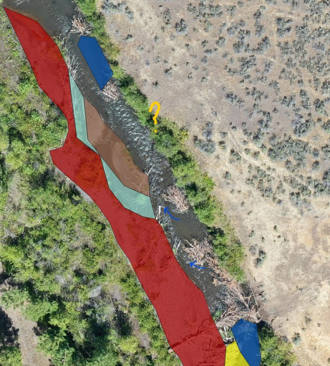
```

Finally, I ended up with a lot of in-between spaces, two examples below. In the left, a pool is obvious on the outer bend. A bank-attached bar is obvious on the right side, but what is the space in between these? I often ended up using glides/runs as my catch-all. With such a varying reach, it seems like it's difficult to understand where the inflection points are which define the different geomorphic units. 

```{r inbetween, fig.cap='An example of in-between spaces. Here is an area between a pool and a bank-attached bar ended up being classified as a run. I do not think that is right, but I am not sure how else to classify.', out.width="40%", echo=F, fig.align='center'}
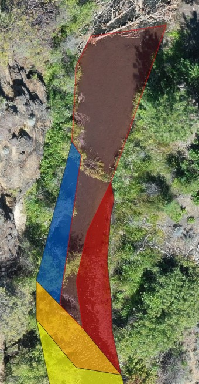
```

Here's my finished reach. By the end, I was creating pretty general shapes, but still I got an idea of how complex this reach was.  

```{r myreach, fig.cap='Here is the majority of the section I was able to map. ', out.width="50%", echo=F, fig.align='center'}
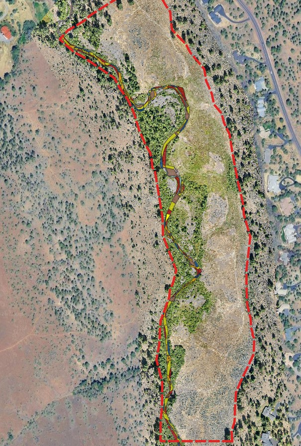
```

## Calculating relative proportions of geomorphic surfaces

After delineating the various geometric units, I calculated the density, count, and area of mid-channel bars, pools, and riffles. I calculated the same metrics for geomorphic units mapped using imagery from June 2023. Below are the results. 

```{r stattable, tab.cap='Calculated metrics for geomorphic units delineated on the same reach in June of 2023 and August of 2024. 2023 units were delineated for me, while 2024 units were hand-delineated by me. ', echo=F}
stats <- data.frame(Metric = c("Mid Channel Bar Count", 
                               "Mid Channel Bar Area", 
                               "Mid Channel Bar Density", 
                               "Pool Count", 
                               "Pool Area", 
                               "Pool Density", 
                               "Riffle Count", 
                               "Riffle Area", 
                               "Riffle Density"), 
                    June2023 = c(11.9, 856.4, 0.011, 42.0, 1960.9, 0.039, 23,	1364.4, 0.021), 
                    Aug2024 = c(53.0, 1807.7, 0.049, 32.0, 1538.4, 0.03,	34.0, 1537.9,	0.031))

knitr::kable(stats)
```

From these metrics, I can see that mid channel bar count drastically increased, as did area and density. This is likely due to the added complexity from the added woody debris piles. In general, I'd expect that all three features would increase with how much woody debris was added to the channel, causing slows to be pushed to one side or another, scouring out pools and making preexisting mid channel bars more dramatic. However pools decreased in number, density and area. I suspect this is due to user error rather than true declines. Riffles also increased in 2024 compared with 2023, though less so than the mid channel bars. This all makes sense to me - I started with the mid channel bars because they were the easiest to call out. It makes sense then that the impacts were greatest in this category. 

I do wonder whether this would be true anyway - Because the August 2024 snapshot was so immediately after the restoration project, the mid channel bars were directly created by the project itself, whereas the pools and riffles are more likely to form as the project becomes more established, and the change in flow patterns begin to produce more pronounced changes in sediment deposition and erosion. 

# Field Geomorphic Unit Mapping

For the field geomorphic unit mapping, I returned to the same site on Lolo Creek south of Missoula (Fig. \@ref(fig:maps)). This stretch of river is accessible a multiple points, and is a size that it's easy to see multiple geomorphic units without walking too far. 

```{r maps, echo=F, fig.cap='Maps showing the location of Traveler\'s Rest State Park in the Bitterroot Valley in Western Montana. The map on the right shows the more precise point on Lolo Creek that I conducted my geomorphic unit mapping assignment. ' , fig.show='hold', out.width=c('29%','71%')}

knitr::include_graphics("./images/Module5/TravelersRestSP_Map.png")
knitr::include_graphics("./images/Module5/TravelersRestSP_MapCloseup.png")
```

Still, when I arrived, the area I had looked at during Module 5 was inaccessible due to flooding (Fig. \@ref(fig:floodingcomparison)). At first I was struck by how much more difficult it was going to be to map units with the harder water levels - areas I would have called riffle before had enough water that riffle no longer felt right, which brought me to question how to map an area when it's clearly above bankfull. 

```{r floodingcomparison, echo=F, fig.cap='A view from the same bridge overlooking Lolo Creek on March 1st (left) and April 12th (right). The section I had used for my hydraulics assignment was at the top of this reach, but the flooding banks in April made it inaccessible. Instead I focused downstream of this reach. ' , fig.show='hold', out.width='50%'}

knitr::include_graphics("./images/Module8/Mar1.jpg")
knitr::include_graphics("./images/Module8/April12.jpg")
```

After trying the original spot from Module 5, I then went downstream and found a better area to work with (Fig. \@ref(fig:imageryoverview)). 

## Vantage point 1

Starting with at the bridge, I first mapped what I could see from there looking downstream, however it was a pretty simple portion of channel (Fig. \@ref(fig:Drawing1). 

```{r imageryoverview, echo=F, fig.cap='A screenshot of imagery where I conducted my geomorphic mapping. In purple was where I completed Module 5. This area was inaccessible at the current water level. My two vantage points for this module are highlighted in yellow and orange. ' , out.width='80%'}

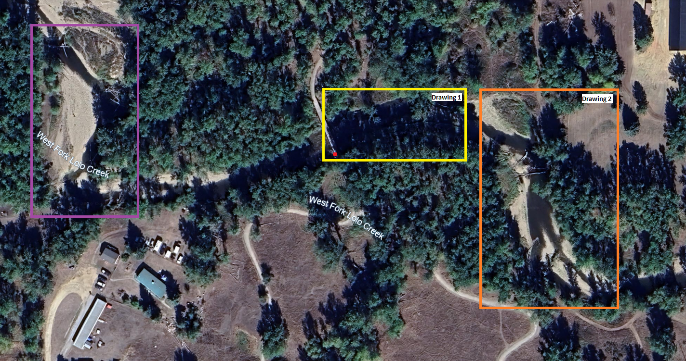
```

```{r Drawing1, echo=F, fig.cap='My first section of mapped geomorphic units. This area was simple, and if there was more happening, it was difficult to see from my vantage point. ' , out.width='80%'}

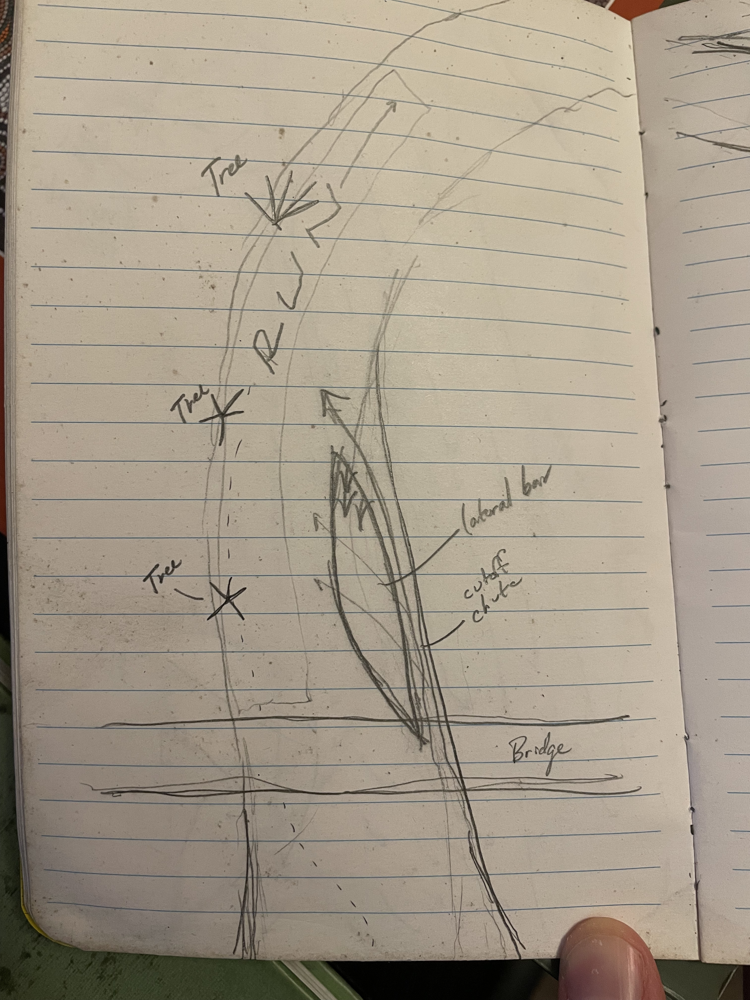
```

From the bridge, looking downstream, the first stretch had few features I could identify. Just below the bridge, there was an area of the currently active channel that had been exposed weeks earlier (Fig. \@ref(fig:diagonalbar1)). There was a little vegetation on the downstream side, and some clear waterflow horizontally, as water from the cutoff chute rejoined the main channel. I called this a bank-attached lateral bar, but if the cutoff chute is flowing even when the river is below bankfull, a diagonal bar might be more appropriate. In any case, this feature seems to form as the river becomes narrower going around the curve.  

```{r diagonalbar1, echo=F, fig.cap='The first diagonal bar underneath the bridge. While it was submerged at this visit, I have seen it exposed at other times. A cutoff chute is shown in blue. ' , out.width='80%'}

knitr::include_graphics("./images/Module8/DiagonalBar1.jpg")
```

Other than that, this section had a run or glide on the farside of the channel, but all other features were difficult to see from the vantage point I had. 

## Vantage point 2

My second viewpoint picked up just around the corner from where I could see from the bridge (Fig \@ref(fig:Drawing2)).

```{r Drawing2, echo=F, fig.cap='My second section of mapped geomorphic units. This area had a lot going on as the main channel curved around two corners. ' , out.width='80%'}

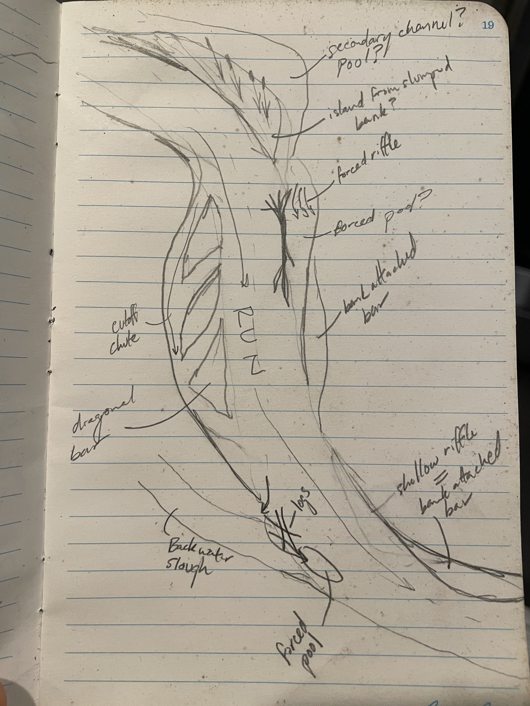
```

At the top of this section was an island located on the outside bend of the river (Fig. \@ref(fig:island)). The island was full of cattail and reed grass. Behind the island looked like calm waters with a sheer bank. My guess is this island is the result of a slumped bank after the force of the curving flow carved out the bottom of the bank. I'm guessing the water connects through a side channel, but flow is slow. 

```{r island, echo=F, fig.cap='An island that appears to have developed from the slumping bank of the outside curve. ' , out.width='80%'}
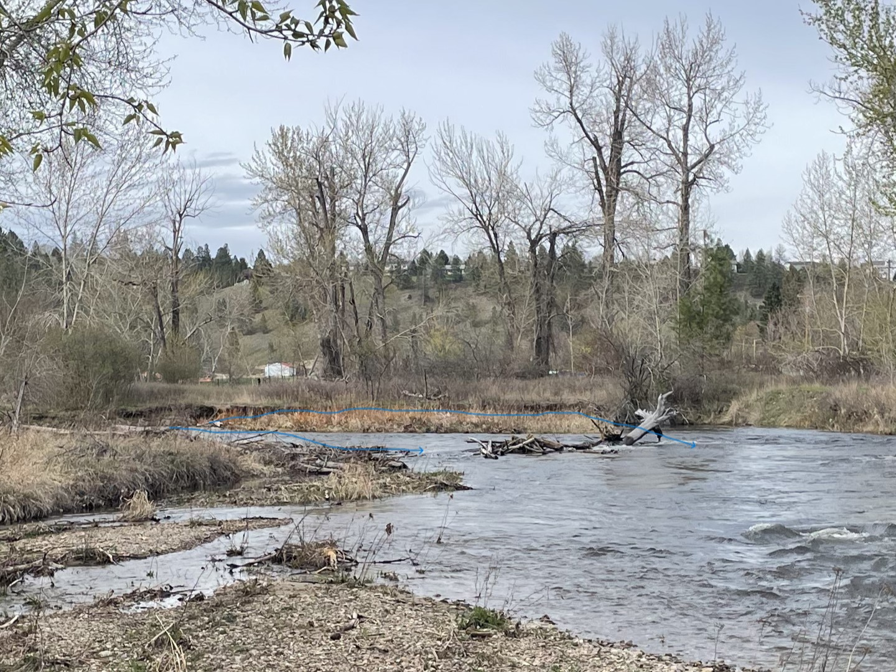
```

From there, flow jutted across the channel, getting caught behind some woody debris, where a forced riffle had formed. To the left of this area, a true lateral bar was at an elevation that was just above the current water level, full of growing plants (Fig. \@ref(fig:forcedriffle)).

```{r forcedriffle, echo=F, fig.cap='A forced riffle could be seen at the base of the fallen trees here (blue arrow). Adjacent to that, there was a lateral bar attached to the far side of the stream. ' , out.width='80%'}
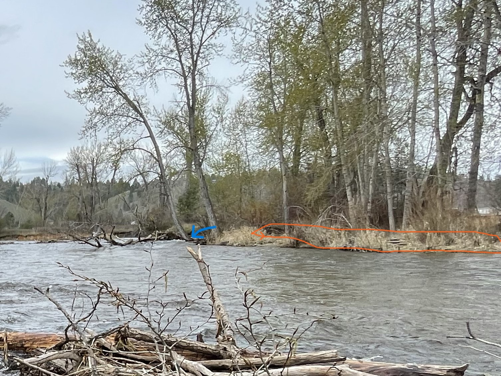
```

On the inside bend of the curve was another diagonal bar, forming where flow is partially blocked by the tight curve (Fig. \@ref(fig:DiagonalBar2). A cutoff chute can also be seen. Another run is in the middle of the main channel. 

```{r DiagonalBar2, echo=F, fig.cap='Another diagonal bar, with and without markup. Blue lines highlight the diagonal bar. Purple shows the chute cutoff. ' , fig.show='hold', out.width='50%'}
knitr::include_graphics("./images/Module8/DiagonalBar2.jpg")
knitr::include_graphics("./images/Module8/DiagonalBar2_markup.jpg")
```

Finally, another area that was more easily accessible showed another structurally forced set of units (Fig. \@ref(fig:forcedriffle2)). Mid channel woody debris was forcing water into a secondary channel/chute. As the water flowed down over the bank, it then created a structurally-forced pool. A ledge also showed here, where the water was carving into the floodplain. Also connecting to the river here is a backwater slough with algae across some of its surface. Again the main channel has a run continuing around the bend here.  

```{r forcedriffle2, echo=F, fig.cap='A second patch of woody debris is causing several different geomorphic units. In purple is a secondary channel (forced side channel?). This runs into a forced pool as the water comes down off the floodplain and back into the main channel (green). In blue, a small ledge is circled. A back channel is highlighted in pink. ' , out.width='80%'}

```

Below is a video of my observations from my second vantage point. 

```{r video, echo = F, warning=F, fig.align='center'}
library(voice)
embed_video(src = "./images/Module8/VantagePoint2.mp4", type = "mp4", width = 650)
```

## Conclusions 

Overall, mapping the geomorphic units in the field was more fun and for the ones I saw, I felt more confident about reading the way the river movement was creating them. Tree cover was less of a problem. However, I could get close to very limited portions of the channel with my muck boots, and without a tall vantage point, there was still a lot of guesswork based on the surface of the water and the location of various features. Similar to the desktop exercise, I had questions about what the channel would look like during different flow stages and still had trouble seeing into the pools to be able to identify them. Both exercises gave me appreciation for how difficult this kind of mapping is. 