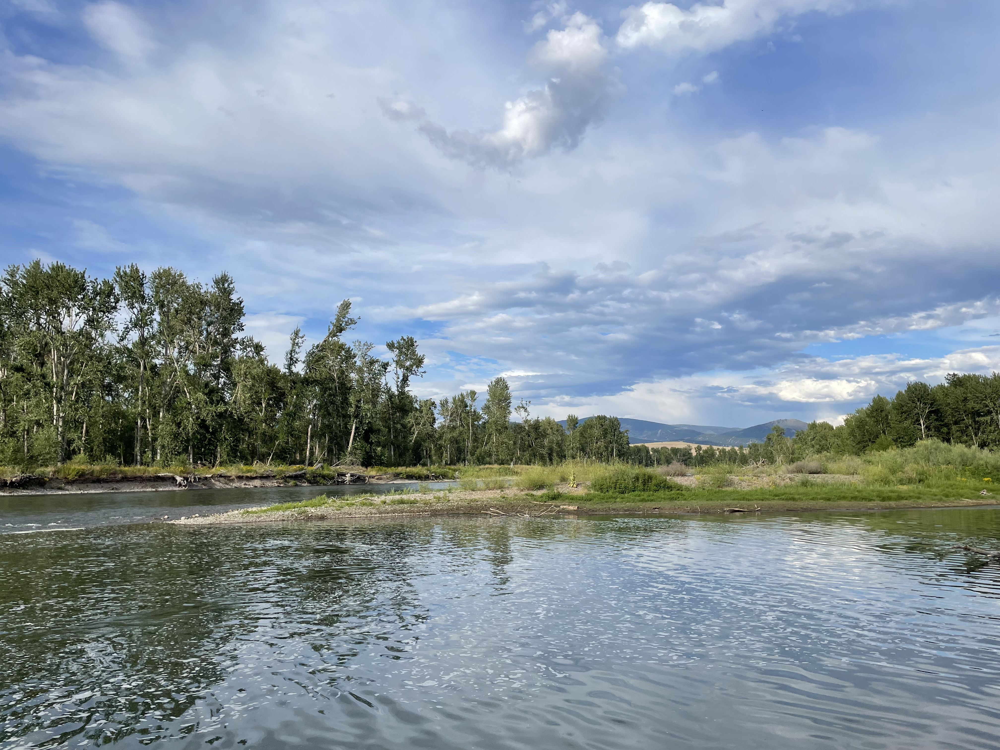

```{r echo = F, warnings = F}
library(cowplot)
library(ggplot2)
```

# Module 1: Field Observations from the Clark Fork River



For this first assignment, I chose to look digitally at a spot on the Clark Fork River where I regularly take my dog for swimming during the summer. This spot overlooks the Clark Fork River in Missoula just before the Bitterroot River runs into it. For my river analysis, I'll try and break it into the same four steps. 

## 1. Locate geomorphic landforms. 

From imagery, I first noted a few things: In-Channel point bars/islands, some side channels in what is a very braided channel. Some Overflow channels and sloughs. The river in the imagery was full to the brim, with even older sloughs filled up with water. 


I also pulled up a couple photos I took over the summer. I can particularly see the bank on the north side of the river which slowly transitions from an erosional bank with nearly undercut banks into a depositional bank with low slope into the river. 

```{r, echo = F, caption = "The Clark Fork from the starred location in the imagery. The photo on the left is looking downstream to the west. The photo on the right is looking upstream. These photos particularly highlight the transition of the bank."}
p1 <- ggdraw() + draw_image("./images/Notebook/ClarkFork_SummerPhotoUpstream.jpg")
p2 <- ggdraw() + draw_image("./images/Notebook/ClarkFork_SummerPhotoDownstream.jpg")

plot_grid(p1, p2)
```

## 2. Understand process-form linkages

Looking at that same imagery, I can start to think through the connections beginning to form the features I'm seeing:
- During high flow events, side and overflow channels are created as the higher force water can't be contained by the mainstem channel. The erosional forces excavating some of the material out, leaving them lower, and more able to flood during smaller events. 
- Large wood contributed from the surrounding forest may lead to random changes in the way the river flows. 
- As the river winds around the bend it simultaneously erodes the southern bank and leaves sediment behind on the inside of the curve. 
- the back side of islands accumulate sediment as the water slows on the downstream side. 

## 3. Consider the controls and boundaries

- Houses and settlements are not far from the floodplain, so some human prevention is surely going on. 
- This area doesn't have a high slope. Even with a lot of water moving through, it only has so much force. 

## 4. Place it into context

This section of the Clark Fork is just before the Bitterroot River flows into it from the south. Before coming here, the river comes into the Missoula valley through a narrow canyon before opening up into this wider floodplain. This river then flows north - it narrows again into a thin floodplain winding through mountainous terrain. This section is likely a slightly lower slope than where it came from, allowing the river to take it's time winding through this valley.